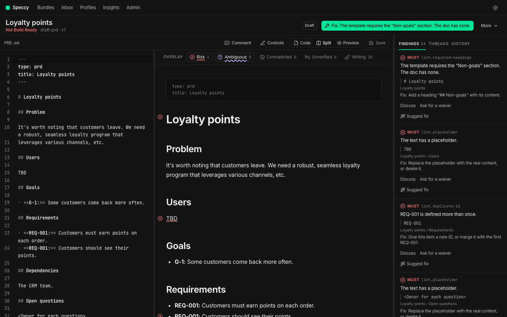
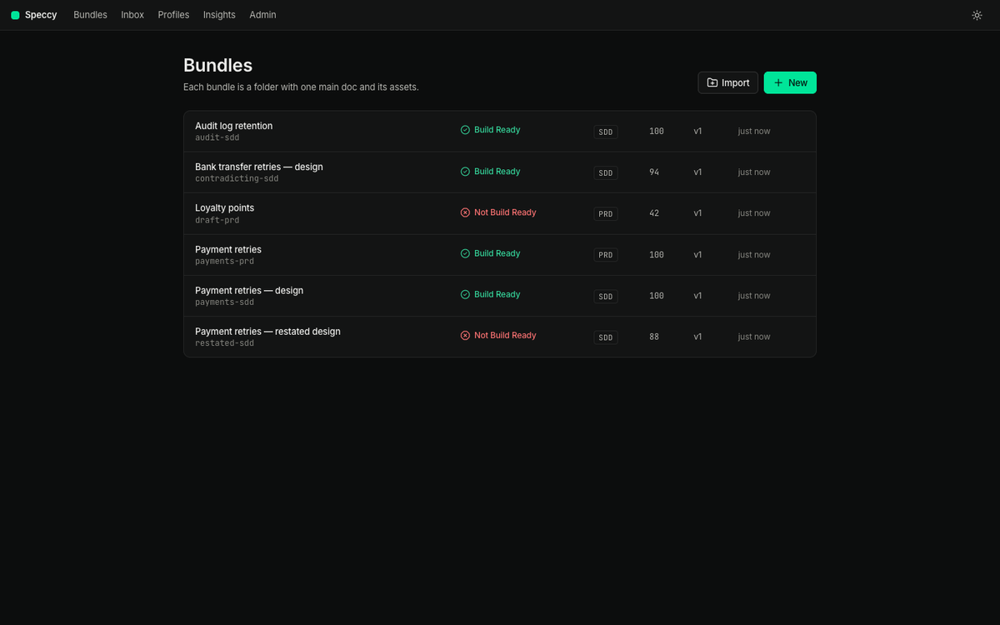
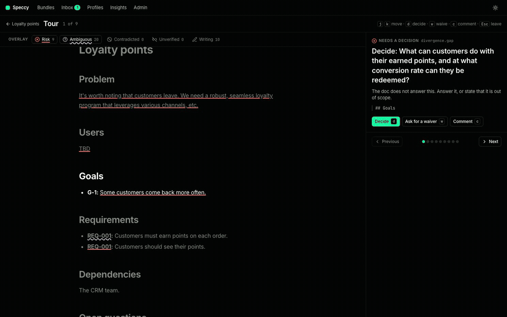
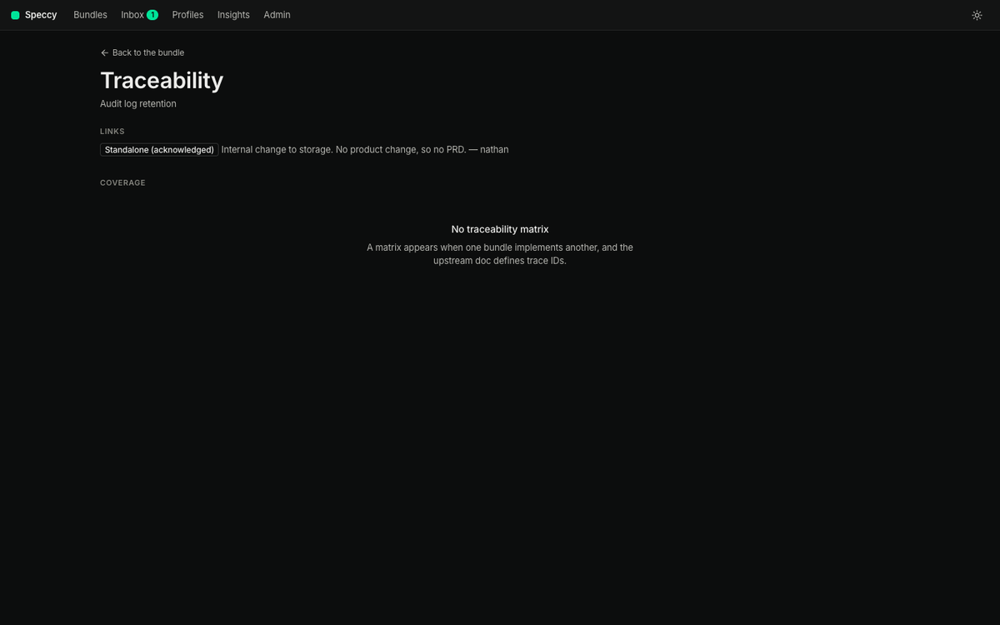
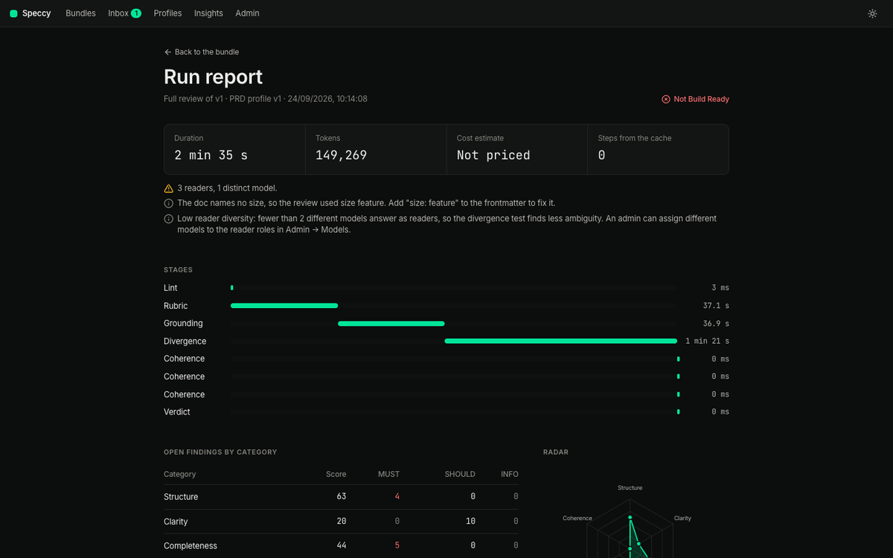

# Speccy

Speccy reviews markdown spec bundles and returns one verdict: Build Ready or Not Build Ready.



Speccy is at release 0.1.0. In local mode you can create, edit, import, compare, and export bundles. Lint and the linked-doc checks run on every save. **Run review** adds the AI rubric checks, fact checks, the divergence test, and a check for conflicts with linked docs. The overlay marks the text of each finding, and the **Tour** lists the points that need a human decision. **Traceability** shows which upstream IDs each downstream doc covers. Hosted mode serves a team with accounts, roles, and share links. Teams discuss the doc in threads, ask the AI, waive checks under a policy, and approve Build Ready docs. `speccy review` reviews bundles in a terminal or in CI, `speccy tui` is the terminal UI, and `speccy mcp` lets coding agents review and fix docs.

## Quick start

You need Go, Node 24 or later, and `just`. `just test-pg` and `just verify` also need Docker.

```sh
git clone https://github.com/alternayte/speccy && cd speccy
just build
./bin/speccy
```

`speccy` starts local mode on the current folder and opens your browser. Add `--dir <folder>` to serve another folder, and `--no-open` to stop the browser from opening.

A bundle is a folder with one markdown file that has a `type` field in its frontmatter:

```markdown
---
type: sdd
title: Payment retries
---
```

Speccy keeps a version of each bundle every time a file changes, in the app or on disk. It stores its state in `.speccy/state/`. Do not commit that folder.

To work on Speccy, run `just dev` and open http://127.0.0.1:5173.

| Bundles | Bundle |
|---|---|
|  |  |
| **Tour** | **Traceability** |
|  |  |
| **Run report** | **Terminal UI** |
|  |  |

## Documentation

| Document | What it holds |
|---|---|
| [docs/guide.md](docs/guide.md) | One doc end to end: start Speccy, make a bundle, write, review, take the tour, send it to a reviewer, reach Build Ready, hand it to a builder. |
| [docs/cli-and-tui.md](docs/cli-and-tui.md) | Every command, the terminal UI and its keys, connected mode, and the MCP server. |
| [docs/configuration.md](docs/configuration.md) | Local mode flags, `.speccy.yaml`, the GitHub Action, hosted mode, accounts, roles, and sharing. |
| [docs/decisions.md](docs/decisions.md) | Each design decision, its alternative, and its reason. |

## Guarantees

This table lists only the guarantees whose tests pass today.

| Guarantee | Test |
|---|---|
| An open MUST finding gives Not Build Ready. | [`TestVerdict_OpenMustBlocks`](internal/engine/verdict/verdict_test.go) |
| A valid waiver on the only MUST finding gives Build Ready. | [`TestVerdict_WaivedMustPasses`](internal/engine/verdict/verdict_test.go) |
| An open blocking thread gives Not Build Ready. | [`TestVerdict_BlockingThreadBlocks`](internal/engine/verdict/verdict_test.go) |
| A verdict for an old version reads as stale. | [`TestVerdict_OldVersionIsStale`](internal/engine/verdict/verdict_test.go) |
| A waiver becomes invalid when its section changes. | [`TestWaiver_InvalidatedOnSectionEdit`](internal/app/collab_test.go) |
| The waiver policy is enforced for each policy value. | [`TestWaiverPolicy_Table`](internal/features/waiver/waiver_test.go) |
| The author cannot approve their own bundle. | [`TestApproval_AuthorCannotApprove`](internal/app/collab_test.go) |
| A content change revokes approvals. | [`TestApproval_EditRevokes`](internal/app/collab_test.go) |
| SHOULD findings never change the verdict. | [`TestVerdict_ShouldNeverBlocks`](internal/engine/verdict/verdict_test.go) |
| The verdict function is pure: same input, same output. | [`TestVerdict_Deterministic`](internal/engine/verdict/verdict_test.go) |
| Lint finishes a 10,000-word doc in under 1 second. | [`BenchmarkLint_10kWords`](internal/engine/lint/lint_test.go) |
| A mapped file with no frontmatter is reviewed with the mapped profile; frontmatter `type` wins. | [`TestConfig_PathMapping`](internal/features/review/review_test.go) |
| A relaxed check reports as INFO and never blocks; removing it restores its level. | [`TestAdoption_RelaxedCheck`](internal/features/review/review_test.go) |
| Both store engines pass the same conformance suite. | [`TestStoreConformance`](internal/store/conformance/conformance_test.go) |
| A concurrent append with a stale version is rejected. | [`TestEventStore_ConcurrentAppendRejected`](internal/es/es_test.go) |
| Projections update in the same transaction as the append. | [`TestEventStore_InlineProjectionAtomic`](internal/es/es_test.go) |
| Invalid model JSON is retried once, then the step fails. | [`TestModel_InvalidJSONRetryOnce`](internal/model/model_test.go) |
| Injected instructions in a doc do not change the verdict. | [`TestInjection_DocCannotChangeVerdict`](internal/features/review/pipeline_test.go) |
| Injected instructions in an MCP result do not change the verdict. | [`TestInjection_MCPResultIsData`](internal/features/review/pipeline_test.go) |
| An unverified claim is a SHOULD finding; a contradicted claim is MUST. | [`TestGrounding_Labels`](internal/features/review/pipeline_test.go) |
| An unchanged section is not sent to a model again. | [`TestCache_UnchangedSectionReused`](internal/features/review/pipeline_test.go) |
| Every run records the profile version it used. | [`TestRun_PinsProfileVersion`](internal/features/review/pipeline_test.go) |
| A split in reader answers creates a divergence finding. | [`TestDivergence_SplitIsFinding`](internal/features/review/divergence_test.go) |
| All `NOT SPECIFIED` on a MUST question creates a MUST gap finding. | [`TestDivergence_GapOnMust`](internal/features/review/divergence_test.go) |
| An answer with an invented quote is treated as `NOT SPECIFIED`. | [`TestDivergence_InventedQuoteRejected`](internal/features/review/divergence_test.go) |
| One model for all readers gives "low reader diversity" and does not block. | [`TestDivergence_LowDiversityFlagged`](internal/features/review/divergence_test.go) |
| Readers never receive other readers' answers or the rubric. | [`TestDivergence_ReaderIsolation`](internal/features/review/divergence_test.go) |
| An uncovered upstream REQ is a MUST finding. | [`TestCoherence_UncoveredReqIsMust`](internal/features/review/coherence_test.go) |
| A standalone acknowledgement makes coherence not applicable. | [`TestCoherence_StandaloneAck`](internal/features/review/coherence_test.go) |
| An upstream edit marks downstream verdicts stale. | [`TestCoherence_UpstreamEditStales`](internal/features/review/coherence_test.go) |
| Restatement above the threshold is a SHOULD finding. | [`TestCoherence_RestatementShingles`](internal/features/review/coherence_test.go) |
| A link rule creates a link only when both files exist. | [`TestConfig_LinkRules`](internal/features/review/coherence_test.go) |
| Secrets are not stored in plain text. | [`TestSecrets_EncryptedAndHashedAtRest`](internal/features/admin/admin_test.go) |
| Local mode refuses a non-loopback address. | [`TestLocalMode_LoopbackOnly`](internal/http/server_test.go) |
| Each endpoint enforces its role table. | [`TestAuthz_EndpointRoleTable`](internal/http/authz_test.go) |
| A guest cannot edit or ask the AI. | [`TestGuest_Restrictions`](internal/hostauth/hostauth_test.go) |
| Anchors follow edits, or become detached. They never point at the wrong text. | [`TestAnchor_Reanchor`](internal/engine/anchor/reanchor_test.go) |
| Speccy never changes a doc without an accept. | [`TestSuggestFix_RequiresAccept`](internal/features/review/fix_test.go) |
| CLI exit codes match SDD §12.2. | [`TestCLI_ExitCodes`](cmd/speccy/review_test.go) |
| `speccy review --summary` works with no server and no `speccy init`. | [`TestCLI_SummaryNoSetup`](cmd/speccy/review_test.go) |
| In advisory mode, a verdict never fails the Action's job. | [`TestAction_AdvisoryNeverFails`](internal/action/action_test.go) |
| Inline comments go only on changed lines, keep to the limit, and are not posted twice. | [`TestAction_InlineComments`](internal/action/action_test.go) |
| Suggestion blocks are only for fixes that need no model. | [`TestAction_SuggestionsDeterministicOnly`](internal/action/action_test.go) |

## How the verdict works

A review has six stages: lint, rubric, grounding, divergence, coherence, and the verdict.

- **Lint** checks the writing with fixed rules: placeholders, missing required sections, broken links, duplicate IDs, filler phrases, vague words, long sentences, and more. It runs on every save and takes well under a second.
- **Rubric** asks the reviewer model each yes-or-no check of the doc type, with quotes as evidence.
- **Grounding** finds the doc's factual claims and checks each against a source: the model's web search, or an MCP search connection. A claim with no source is unverified. Start a sentence with "Assumption:" to state something you cannot source.
- **Divergence** asks the reviewer for 10 to 20 build questions. Three readers answer each question from the doc alone. Each answer must quote the doc; Speccy checks each quote. A judge groups the answers by meaning. When the readers give different answers, the doc is ambiguous. When no reader finds an answer, the doc has a gap.
- **Coherence** compares linked docs. Each upstream requirement must be referenced downstream, or acknowledged in the frontmatter. A paragraph that repeats the upstream doc gets "link, do not repeat". The reviewer looks for statements that conflict between the docs. When a linked doc changes, the verdict becomes stale.

A model never sets the verdict. Speccy computes it from the checks. Doc text and search results go to the model as marked data, never as instructions.

Each check has a level: MUST, SHOULD, or INFO. The doc is **Build Ready** only when no MUST finding is open and any required upstream link exists. SHOULD and INFO findings never change the verdict. A verdict for an old version is **stale**.

The **score** is passed checks divided by applicable checks. It is for tracking, not a gate.

## Modes

| Mode | Command | Status |
|---|---|---|
| Local | `speccy` | Edit, import, compare, and export bundles on 127.0.0.1. |
| Hosted | `speccy serve --hosted` | Accounts from invite links, admin and member roles, private and shared bundles, guests, and API tokens. Needs Postgres. See [configuration](docs/configuration.md). |
| Headless | `speccy review <path…>` | Review bundles in a terminal or in CI, and print text, JSON, or markdown. |
| Terminal UI | `speccy tui` | Bundles, verdicts, findings, and the tour in the terminal. `e` opens a finding in `$EDITOR`. |
| Agents | `speccy mcp` | An MCP server over stdio. Hosted mode also serves MCP at `/mcp` with an API token. |

`speccy review` exits with 0 for Build Ready, or for any verdict in advisory mode; 1 for Not Build Ready with `--enforcement blocking`; 2 for a usage or configuration error; and 3 when a review fails. With no model assigned, it runs lint only and says so.

## Try it on your existing specs

Run `speccy --dir <your repo>`. Speccy finds every folder with a main doc. To review docs that have no frontmatter, add a `.speccy.yaml` at the root:

```yaml
map:                      # single files, with assets in <name>.assets/
  - glob: docs/**/prd-*.md
    profile: prd
  - glob: docs/**/sdd-*.md
    profile: sdd
link_rules:               # a link exists only when both files exist
  - "docs/sdd-{name}.md implements docs/prd-{name}.md"
adoption:                 # these checks report as INFO for now
  relaxed: [links.has-upstream, lint.required-headings]
```

A relaxed check stays relaxed until a maintainer takes it out of the list. When one of them passes on every mapped doc, the summary comment of the next pull request says so and offers the reply that removes it:

```text
/speccy enforce links.has-upstream
```

Or review them all in one command. It needs no server and no setup:

```sh
speccy review docs/ --summary
```

It prints one line per bundle, with the verdict, the score, and the top three failing checks, then the checks that fail most often. Add `--format md` for a pull request comment, or `--format json` for a script. `speccy init` writes a commented `.speccy.yaml` and adds `.speccy/state/` to `.gitignore`. `speccy init --github` adopts a whole repo in one command: it guesses a profile for each spec, writes the mappings, puts the checks that fail today in adoption mode, and writes the workflow below.

## GitHub Action

The Action reviews the bundles that a pull request changes. It posts one summary comment and updates it on each push. It posts MUST findings on the lines that the pull request changed, and resolves its own comments when their findings are gone. Where the fix is certain, such as a trace ID or `MUST` in capitals, the comment has a suggestion that you commit with one click. Each bundle gets a check named `speccy: <bundle>`.

```yaml
# .github/workflows/speccy.yml
name: Speccy
on:
  pull_request:
    paths: ["docs/**", ".speccy.yaml"]
permissions:
  contents: write        # commit a decision that a reply asked for
  pull-requests: write   # the summary and inline comments
  checks: write          # one check per bundle
jobs:
  review:
    runs-on: ubuntu-latest
    steps:
      - uses: actions/checkout@v4
      - uses: alternayte/speccy@v0.1.0
        with:
          models: all=anthropic:<model>             # leave out for lint checks only
          anthropic-api-key: ${{ secrets.ANTHROPIC_API_KEY }}
```

The Action is advisory by default: a Not Build Ready verdict shows in the comment and the check, and the job still passes. Set `enforcement: blocking`, or `enforcement: blocking` in `.speccy.yaml`, to fail the job. The HTML report of each bundle is an artifact of the run.

**Waivers in CI.** A waiver is an entry under `waivers:` in the doc's sidecar, `.speccy/decisions/<doc path>.yaml`. Reply to a Speccy comment in the pull request to ask for one:

```text
/speccy waive The provider sets this limit, and the design cannot change it.
/speccy ack REQ-002 The mail service sends it.
```

The next run commits the entry to the pull request's branch and resolves that comment. Speccy approves nothing of its own: the commit is reviewed like any other change, so the approval comes from branch protection. Require a review from the code owners of your spec folders.

```text
# .github/CODEOWNERS
/docs/ @acme/spec-maintainers
```

While a waiver is in the pull request and not merged, the comment gives both verdicts, so a self-granted waiver does not read as an agreement. A pull request from a fork gives the Action no write token, so the comment prints the sidecar to paste instead.

In connected mode (`mode: connected` and `server:` in `.speccy.yaml`, and a `token:`), the Speccy server reviews the files with its own models and its linked docs. The server changes no bundle. It keeps each review for 90 days, and the summary comment links each bundle to its report on the server. Members of the workspace can open the report.

## Models

Open **Admin** to add a backend and assign it to the review roles. A backend is one of:

- An API key for Anthropic, OpenAI, OpenRouter, or DeepSeek. Speccy encrypts it with a key in `.speccy/state/key`.
- An agent CLI you already use, on your subscription: `claude`, `cursor-agent`, `opencode`, or `pi`, or your own command. Speccy runs it in a temporary folder that holds only the bundle.

Use **Test** to check a backend and model with one short call. Set a monthly token budget to cap spend; when it is spent, AI stages stop and lint still runs.

## Configuration

See [docs/configuration.md](docs/configuration.md) for the flags of local mode, and the environment, accounts, roles, and sharing of hosted mode.

## Licence

AGPL-3.0. See [LICENSE](LICENSE).
