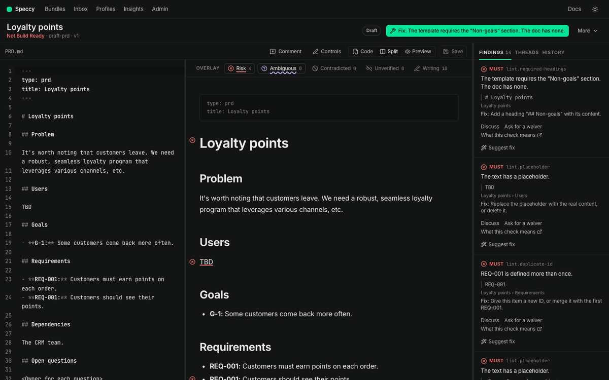

# Speccy

**Speccy checks a PRD or an SDD before anyone approves it or builds from it. It gives each doc one verdict: Build Ready or Not Build Ready.**

Build Ready means a team, or a coding agent, can build the thing from the doc without coming back to ask what the author meant.



**Documentation: [speccy-docs.pages.dev](https://speccy-docs.pages.dev)**

## The problem

Many teams require a PRD or an SDD before work starts. AI now writes most of these docs, and few authors check what it wrote. The docs are long and hard to read. They leave out facts that the builders need.

Approvers cannot read every doc closely. Some do not have the experience for the area, and some ask AI to review it. The doc waits in a pull request, or the comments go back and forth with no shared standard. Each person has a different idea of a good doc.

When the team builds from an unclear doc, each builder fills the gaps in a different way. A coding agent does not stop to ask. It guesses.

## What Speccy does

**It runs one set of rules for everyone.** A profile holds the checks for one doc type, such as `prd` or `sdd`. The profile is a file in the repo. The author's machine, the approver's machine and CI read the same file. When a rule is wrong, change it in a pull request like any other change.

**It lets the author get to Build Ready alone.** The GitHub Action reviews each pull request that changes a spec doc. It puts each finding as a comment on the line it is about, and it gives the doc a check with the verdict. The author fixes the findings and pushes again. An approver reads the doc when it is Build Ready, not before. In blocking mode, a doc that is Not Build Ready fails the job.

**It remembers decisions.** Sometimes a finding is correct but the author has a reason to leave the doc as it is. The author replies `/speccy waive <reason>` to the comment. The next run writes a waiver into a file next to the doc in the repo. Later reviews do not raise that finding again. When someone changes that section, the waiver ends and the check runs again.

**It calculates the verdict.** Models find the problems. A fixed rule turns the findings, the waivers and the links into the verdict. The same findings and waivers always give the same verdict, so a CI gate can depend on it. No model decides Build Ready.

**It shows where a builder would have to guess.** Speccy writes the questions that a builder must answer to build the thing. Three separate model sessions answer each question from the doc only. When their answers differ, the doc is ambiguous. When none of them finds an answer, the doc has a gap. Each finding points to the text and says what is missing.

**It checks the code after the build.** `speccy verify` reads the code at one commit. For each requirement in the doc, it finds the code and the tests that implement it, or the place where the code contradicts it.

## Install

```sh
curl -fsSL https://raw.githubusercontent.com/alternayte/speccy/main/install.sh | sh
```

The script picks the release for your machine, checks it against the published checksum, and puts `speccy` on your PATH. The [releases page](https://github.com/alternayte/speccy/releases) has the archives for installing by hand and for Windows.

## Review pull requests from your machine

```sh
speccy review-prs --repo acme/specs
```

Speccy reviews each open pull request that changes a spec doc, 3 at a time. It posts the result of each one as a pending review that only you see. Each comment starts with a question or a fix for the author. Edit or delete the comments on GitHub, then submit the review. A pull request with no new commit since your last review is skipped.

Add your own concern as a precise question on the right line:

```sh
speccy ask https://github.com/acme/specs/pull/42 "retries unclear when the provider times out"
```

If the doc already answers the concern, Speccy shows you the answer and posts nothing. `speccy pending list`, `delete` and `discard` clear what you do not want. See [Review many pull requests](https://speccy-docs.pages.dev/how-to/review-many-pull-requests/).

## Write a doc

```sh
cd <the folder with your specs>
speccy
```

That opens the app on 127.0.0.1. Speccy reviews a markdown file that names its type:

```markdown
---
type: sdd
title: Payment retries
size: feature
---
```

A doc you already have needs no change first. `speccy review docs/payments.md` picks the profile from the headings. See [Review docs you already have](https://speccy-docs.pages.dev/how-to/review-docs-you-already-have/), or follow the Guide, [From a blank page to a build packet](https://speccy-docs.pages.dev/tutorials/blank-page-to-build-packet/).

## Use it from a coding agent

The app is optional. Add Speccy to your agent as an MCP server, in the folder with your docs:

```sh
claude mcp add speccy -- speccy mcp
```

The agent can then review a doc on disk or a GitHub URL, read the findings, and fix them. It can also review a batch of pull requests, ask authors your questions, and clear your pending reviews. Each finding says whether its fix changes only the words, or needs a fact from the author. For a fact, the finding holds the question for the agent to ask you. The app, the CLI and the agent share the same reviews. See [MCP tools](https://speccy-docs.pages.dev/reference/mcp-tools/).

## Add the gate to a repo

```sh
speccy init --github
```

Run it in a clone. It writes `.speccy.yaml`, which maps the docs to their profiles, and the workflow for the Action. It changes no doc. Lint checks that fail on the docs you already have start as relaxed, so the gate does not block the team on the first day. See [Keep the verdict in CI](https://speccy-docs.pages.dev/how-to/keep-the-verdict-in-ci/).

## Documentation

| Section                                                                                   | What it holds                                                                                   |
| ----------------------------------------------------------------------------------------- | ----------------------------------------------------------------------------------------------- |
| [Tutorials](https://speccy-docs.pages.dev/tutorials/blank-page-to-build-packet/)          | One doc from a blank page to a build packet, and a PRD with the SDD that implements it.         |
| [How-to guides](https://speccy-docs.pages.dev/how-to/review-docs-you-already-have/)       | Adopt a repo, close a coverage gap, ask for a waiver, hand a spec to a coding agent, run in CI. |
| [Concepts](https://speccy-docs.pages.dev/concepts/verdict/)                               | The verdict, the review pipeline, profiles, waivers, traceability, and the guarantees.          |
| [Reference](https://speccy-docs.pages.dev/reference/checks/)                              | Every check, command, key, Action input, MCP tool and API operation.                            |
| [Operations](https://speccy-docs.pages.dev/operations/back-up-and-restore/)               | Back up and restore, upgrade, the master key, and the model budget.                             |

[docs/decisions.md](docs/decisions.md) records each design decision, its alternative, and its reason.

## Contributing

You need Go, Node 24 or later, and `just`. `just test-pg` and `just verify` also need Docker.

```sh
git clone https://github.com/alternayte/speccy && cd speccy
just dev        # the Go server and Vite together, on http://127.0.0.1:5173
just docs-dev   # the docs site, on http://127.0.0.1:4321
just verify     # the gate a pull request must pass
```

`just build` writes `bin/speccy`.

## Licence

AGPL-3.0. See [LICENSE](LICENSE).
