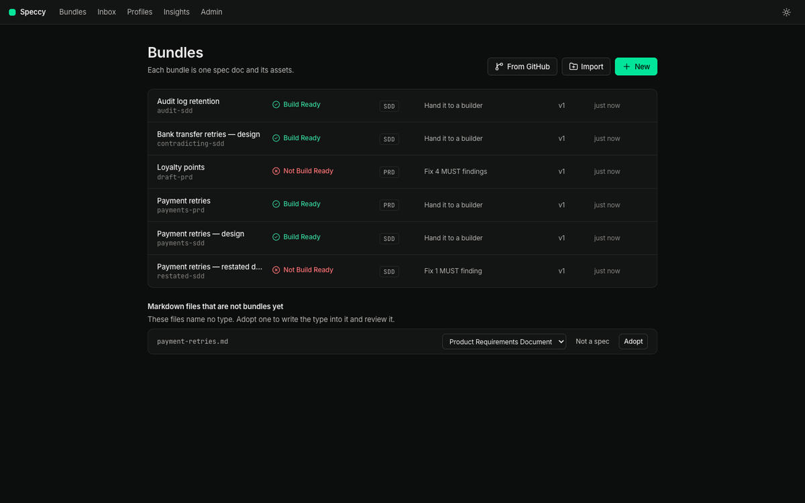
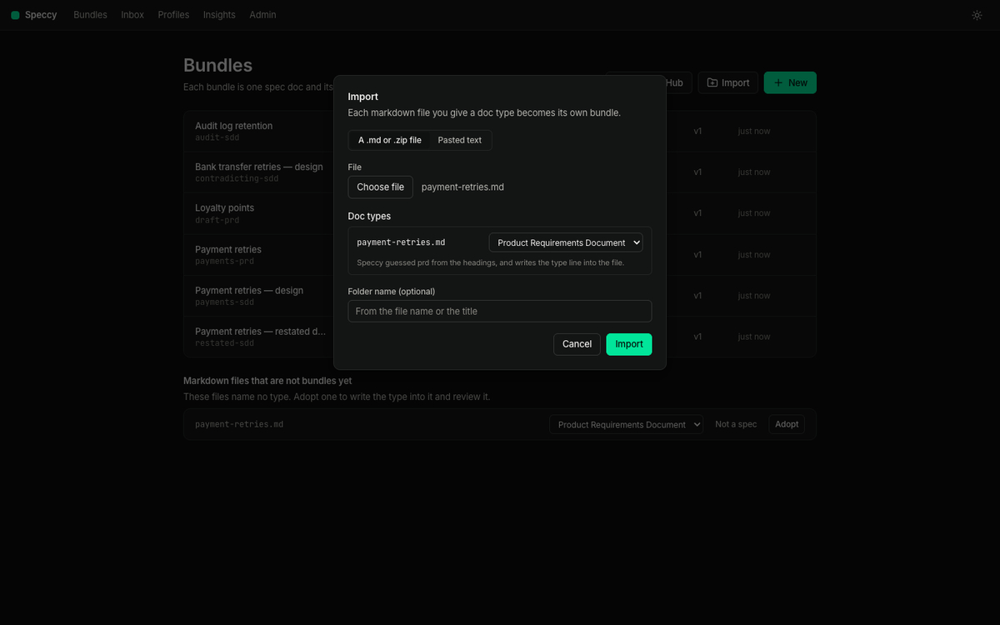

# Adoption: docs you already have

Speccy reviews the docs you wrote before you had Speccy. Nothing asks you to rewrite them, and nothing asks you to change your repo before you see a verdict. This document covers every way in, for a doc on your disk, a doc in a repo, and a repo you want your whole team to review in.

The [guide](guide.md) covers one doc end to end. Read it if you want the daily loop first.

## 1. Which way in

| Where your doc is | The way in | What changes |
|---|---|---|
| A folder on your disk | Drag it onto the bundles screen, or **Adopt** it | One line, `type: <key>`, at the top of the file |
| One doc in GitHub, on any branch | Paste its URL | Nothing. Speccy holds the type |
| A folder or a repo in GitHub | Paste its URL, then accept a type per doc | Nothing. Speccy holds the types |
| A repo your team reviews in | `speccy init --github` in a clone | One pull request: `.speccy.yaml` and the Action |

The rule under all four: Speccy never writes to your repo on its own. It proposes, and you merge.

## 2. A doc on your disk

The bundles screen lists the markdown files in the served folder that name no type. **Adopt** writes the type into one, and the doc becomes a bundle.



`speccy init` does the same in a terminal, and Enter takes the guess.

**Import** takes a file, a .zip or a dropped folder from anywhere. It lists every markdown file with a doc type picker, prefilled with the type the file names or the profile its headings fit, and a "Not a spec" choice. Each file you give a type becomes its own bundle. Speccy writes one line, `type: <key>`, into it and changes nothing else. A PRD and an SDD side by side get the link between them offered, prechecked, and written into the SDD on import.



A drag of a folder or a file onto the bundles screen does the same. A folder with several markdown files, or a file whose type Speccy cannot guess, opens that dialog with the files in it.

A folder on disk or in a repo that holds two docs with a type gives one bundle per doc. When you accept a type for a doc in a repo source, Speccy offers the link to the one doc in the same folder that it builds on. Speccy keeps that link, as it keeps the type: the repo takes no commit, and a link the repo names itself replaces it.

### A file that is not a spec

Most folders hold markdown that is not a spec: a readme, a changelog, notes from a meeting. **Not a spec** takes that file out of the list. The section then keeps one line with the count, and **show** lists what you marked, each with **Undo**.

The mark lives in Speccy, for your workspace. The file takes no change, and neither does the repo. Accepting a type later clears the mark. A team that wants the rule for everyone writes a glob in `.speccy.yaml` instead.

## 3. One doc in GitHub

Paste the doc's URL. A branch URL works, so a spec that is still in a pull request reviews the same as one on the default branch:

```sh
speccy add https://github.com/acme/payments/blob/feature/retries/docs/sdd-retries.md --profile sdd
```

The same thing is on the bundles screen, under **From GitHub**. Speccy shows the repo, the branch and the doc, asks for the doc type when the doc names none, and makes the source on confirm.

Speccy holds that type itself. Your repo takes no commit, and the branch you read from never moves. Speccy re-reads the source every 5 minutes.

## 4. A folder or a repo in GitHub

Paste the folder's URL the same way. Speccy reads the tree and lists every markdown file that names no type, with a guessed type where the headings say enough.


Accept the ones you want. Each becomes a bundle at once, with a review and a verdict, and your repo still takes no commit. **Not a spec** takes a row out of the list, with the same count and **Undo** as the list on disk. Above 200 files the list says how many more there are: narrow the source to a folder.

**The repo always wins.** The day a doc gains `type:` in its frontmatter, or `.speccy.yaml` gains a mapping that covers it, the repo's answer takes over and Speccy drops the type it held. The bundle keeps its ID, its threads and its waivers, so nothing moves under you.

### Make it permanent

The types you accepted live in your workspace. Your team's Action does not read them. **Write the mapping to the repo** opens one pull request that adds the same answers to `.speccy.yaml`:

```yaml
map:
  - glob: docs/*.md
    profile: sdd
```

It writes one mapping per folder only when you accepted every doc there, with the same type. A folder you accepted part of gets one mapping per doc, so the glob never takes in a doc you left alone. It changes no doc, and it writes no workflow.

## 5. A repo your team reviews in

Run this once in a clone:

```sh
speccy init --github
```

It reads every markdown file, guesses a doc type from the headings, and writes `.speccy.yaml`, the checks that fail on the repo today in `adoption.relaxed`, and `.github/workflows/speccy.yml`. One pull request adopts the repo. [github.md](github.md) follows that path, and the decisions a reviewer makes in a pull request.

Adoption mode is what makes the first verdict useful on a repo that was never written for Speccy: the checks that fail today report at INFO until a maintainer turns one back on with `/speccy enforce <slug>`.

## 6. Where each surface stands

| Surface | What it does here |
|---|---|
| The web app | Every way in: Import, Adopt, From GitHub, accepting a source's docs, and the mapping pull request |
| The CLI | `speccy init`, `speccy add <url>`, `speccy init --github`, `speccy review` |
| The TUI | Reviews only: the list, the verdict, the findings, the tour. It adds no source |


## Where next

- The [guide](guide.md) — one doc from a blank page to a build packet.
- [github.md](github.md) — the same checks on a pull request, and the replies that decide them.
- [linked-docs.md](linked-docs.md) — two docs that must agree, and links to issues and code.
