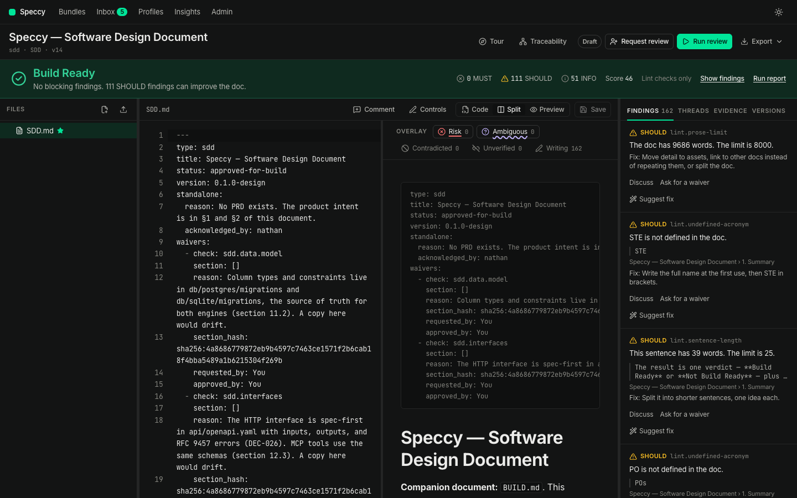

# Writing a doc in Speccy

Speccy edits the markdown that is on disk. It never rewrites a file you did not touch, so `git diff` stays readable.

## Three views

| View | What it is for |
|---|---|
| Code | The markdown, with syntax highlighting and the overlay's line marks. |
| Split | The code and the preview side by side, scrolled together. |
| Preview | The rendered doc. Click any text to edit it. |

Drag the divider between two panes to set their widths, or focus it and use the arrow keys. A double click resets it. Each width stays in that browser.

## The editable preview

Click a paragraph, a heading, a list item, a quote, or a table cell. The block's markdown opens where you clicked, and the caret lands on the word you clicked. `Esc` leaves the block as it was.

A code block, a diagram, an image, and the frontmatter open as their raw markdown, with the fence and the marks. Speccy does not render those back from the preview, because the exact text matters.

An edit marks the file dirty. **Save** or ⌘S writes it as one version, and lint runs again. Nothing saves by itself: a version is what a verdict and a waiver point at.

## The control bar

**Controls** shows the bar above the preview. It has two groups.

The markdown group writes plain markdown into the block you are editing: heading, bold, italic, inline code, link, bullet list, numbered list, task, quote, table, and code block. The table control opens a grid: sweep it to pick the size.

The profile group applies what the profile knows:

| Control | What it does |
|---|---|
| Missing heading | Lists the headings the profile template marks as required and the doc does not have. One click writes the heading where the template puts it. |
| `REQ-000` | Writes the next free trace ID of the prefix the doc uses most. |
| Requirement | Writes a requirement with a trace ID and an acceptance criterion. |
| To assets | Replaces the block with a link to `assets/`, and copies the block to the clipboard for the new file. |

Every control is an ordinary edit. Undo it, or change it, before you save.

## Files and assets

The explorer makes files, renames them, and deletes them. Drag files or folders from Finder or Explorer onto the explorer to add assets. They land in the folder under the pointer, or beside the open file.

When a dropped file has the name of a file in the bundle, Speccy asks once: **Replace**, or **Keep both**. A replaced file lands in the next version, so the diff and the verdict show it.

## Docs that started outside Speccy

Speccy reads what is already on disk. In local mode the folder is the truth, and a file that changes on disk becomes a new version. For a repo with specs in several places, `.speccy.yaml` maps the paths, and adoption mode reports the checks you have not adopted yet as INFO. See [configuration.md](configuration.md).
