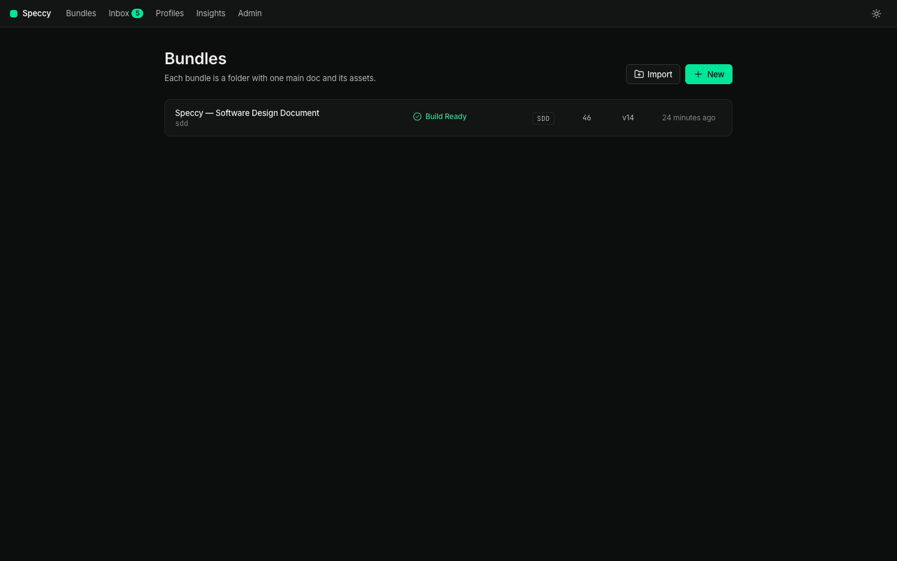

# Getting started

This page takes you from a clone to a first verdict.

## 1. Build and start

You need Go 1.26, Node 24 or later, and [just](https://just.systems).

```sh
git clone https://github.com/alternayte/speccy && cd speccy
just build
./bin/speccy --dir ~/work/specs
```

`speccy` serves the folder you name and opens your browser. `--no-open` starts it without the browser. The state lives in `.speccy/state/` beside your docs. Do not commit that folder; `speccy init` writes a `.gitignore` entry for it.

## 2. Make a bundle

A bundle is a folder with one main doc and its assets. The main doc is the one markdown file whose frontmatter has a `type`:

```markdown
---
type: sdd
title: Payment retries
---
```

Three ways to start one:

- **New** on the bundles screen writes the profile's template.
- **Drag a folder** from Finder or Explorer onto the bundles screen. Speccy makes one bundle per folder, and a single-file bundle per loose markdown file.
- **`speccy init`** in a repo that has specs already, then set the paths in `.speccy.yaml`.



## 3. Write

Open the bundle. The preview is editable: click any text and type. **Controls** turns on the control bar, which writes markdown and applies the fixes the profile knows about, such as a missing required heading or the next free trace ID.

Lint runs on every save, so the first findings appear at once. See [authoring.md](authoring.md).


## 4. Add a model

Lint alone gives a lint-only verdict. The AI stages need a backend. Open **Admin → Models** and add one of:

- an API key for Anthropic, OpenAI, OpenRouter, or DeepSeek;
- an agent CLI you already pay for: `claude`, `cursor-agent`, `opencode`, or `pi`.

Assign a backend and a model to each role: the reviewer, the readers, the judge, and the writer. **Test** checks a backend with one short call.

## 5. Review

**Run review** runs every stage: lint, the rubric, grounding, the divergence test, and coherence with linked docs. The verdict bar answers one question: Build Ready or not.

Read [reviews.md](reviews.md) for what each stage does, and how waivers and approvals work.

## 6. Keep it in CI

`speccy review docs/specs/*` gives the same verdict in a terminal. The GitHub Action posts the findings on the pull request. See [cli-and-tui.md](cli-and-tui.md) and [configuration.md](configuration.md).
