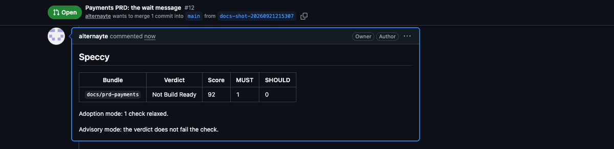
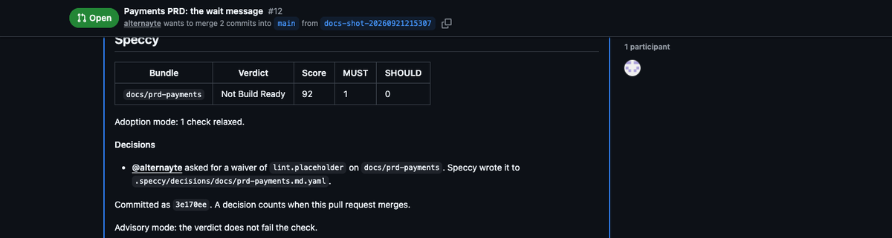

# GitHub: review specs where you review code

A team that reviews PRDs and SDDs in pull requests gets a verdict there, and decides there. This document follows one repo in both directions: the repo tells Speccy a doc changed, and Speccy gives the repo a decision it can merge.

The [guide](guide.md) covers one doc end to end, and [linked-docs.md](linked-docs.md) covers two docs that must agree. Read either first.

## 1. Adopt the repo

Run this once in a clone of a repo that already holds specs:

```sh
speccy init --github
```

It reads every markdown file, guesses a doc type from the headings, and writes three things:

- `.speccy.yaml`, with one mapping per folder whose docs agree on a type, else one per file. A mapped file needs no frontmatter, so no doc changes.
- The checks that fail on the repo today, in `adoption.relaxed`. They report at INFO until a maintainer turns one back on, so the first verdict names the checks your team opted into, not every finding in the repo.
- `.github/workflows/speccy.yml`, which needs no secret and fails no job.

```text
Wrote .speccy.yaml: 2 mappings for 7 docs.
Adoption mode: 4 checks fail today, so they report as INFO: links.has-upstream, lint.placeholder, …
A reply of /speccy enforce <slug> in a pull request turns one back on.
Wrote .github/workflows/speccy.yml. It needs no secret and fails no job.
```

Open a pull request with those files. That is the whole adoption.

## 2. The comment on a pull request

The Action reviews the bundles the pull request changes. It posts one summary comment and updates it on each push.



The comment holds the verdict, the score and the counts for each bundle, the adoption mode note, the findings that are not on a changed line, and a link to the full report. In standalone mode the report is an artifact of the run; in connected mode it is a page on your Speccy server.

MUST findings on lines the pull request changed go inline, up to 15 per bundle. Each one says the level, the check and what to do. A deterministic fix comes with a suggestion block you commit in one click: a trace ID, the case of `must`, `should` or `may`, and a broken relative link with one obvious target.


On each push the Action resolves its own comments whose findings are gone, and never posts a second copy of one that is still open.

## 3. Decide in the pull request

Reply to a Speccy comment to settle the finding it points at.

```text
/speccy waive The provider sets this limit, and the design cannot change it.
/speccy ack REQ-003 The checkout page shows this message.
```

The next run writes the entry into the doc's sidecar, `.speccy/decisions/<doc path>.yaml`, commits it to the pull request's branch, and resolves that comment. The doc itself does not change.




Speccy approves nothing of its own. The commit is reviewed like any other change, so your branch protection and your CODEOWNERS decide who may merge it:

```text
# .github/CODEOWNERS
/docs/ @acme/spec-maintainers
```

While a waiver is in the branch and not in the base branch, the comment gives both verdicts:

```text
docs/prd-payments: Build Ready. 1 waiver in this pull request is not merged yet.
Without them: Not Build Ready.
```

A pull request from a fork gives the Action no write token, so it prints the sidecar to paste instead of committing it.

| Reply | Where | What the next run writes |
|---|---|---|
| `/speccy waive <reason>` | On a Speccy inline comment | A waiver for that check and that section, with a hash of the section text. |
| `/speccy ack <reason>` | On a `links.has-upstream` finding | A `standalone` acknowledgement: this doc has no upstream doc, for that reason. |
| `/speccy ack <ID> <reason>` | On a `trace.coverage` finding | A `trace` acknowledgement for that upstream ID, as `out_of_scope`. |
| `/speccy enforce <slug>` | In the pull request's conversation | The check leaves `adoption.relaxed` in `.speccy.yaml`. |

A reason shorter than 20 characters is refused, and so is a command whose finding is gone. The summary comment says why.

## 4. Leave adoption mode

A relaxed check stays relaxed until a maintainer takes it out. Each run tests the relaxed checks against every mapped doc, including the ones the pull request did not change, and the summary comment offers the ones that now pass everywhere:

```text
These relaxed checks now pass on every mapped doc. Reply to turn one back on:

/speccy enforce links.has-upstream
```

Reply in the conversation, and the next run commits the change to `.speccy.yaml`. Nothing turns on by itself.

## 5. Read the repo from Speccy

The other direction: give Speccy the address of a repo, a folder, or one doc, on the bundles screen or in a terminal.

```sh
speccy add https://github.com/acme/specs/blob/main/docs/prd-payments.md
```

Speccy shows the repo, the branch, the doc and the type it will use, and makes the source on confirm. It reads through the GitHub API, writes no file into your folder, and never changes the source branch. Local mode uses the token of your `gh` login, so run `gh auth login` first; with no `gh`, paste a fine-grained token in **Admin → GitHub**. Hosted mode uses the workspace token an admin sets there.

Speccy re-reads each source every 5 minutes. An edit in Speccy is a draft until **Publish**, which opens a pull request with your change, and with any decision the app approved. The branch you read from never moves under you.

## 6. The workflow

```yaml
# .github/workflows/speccy.yml
name: Speccy
on:
  pull_request:
    paths: ["docs/**", ".speccy.yaml"]
permissions:
  contents: write        # commit a decision that a reply asked for
  pull-requests: write   # the summary and inline comments
  checks: write          # one check per bundle
jobs:
  review:
    runs-on: ubuntu-latest
    steps:
      - uses: actions/checkout@v4
      - uses: alternayte/speccy@v0.1.0
        with:
          models: all=anthropic:<model>             # leave out for lint checks only
          anthropic-api-key: ${{ secrets.ANTHROPIC_API_KEY }}
```

| Permission | Why |
|---|---|
| `contents: write` | The Action commits the sidecar entry a reply asked for, and the `.speccy.yaml` change of `/speccy enforce`. Without it, replies are refused and the comment says so. |
| `pull-requests: write` | The summary comment, the inline comments, and resolving them. |
| `checks: write` | One check run per bundle, named `speccy: <bundle slug>`. |

With no model key the Action runs the lint checks only, and the comment says what the model stages would add. Enforcement is advisory by default: a Not Build Ready verdict shows in the comment and the check, and the job still passes. Set `enforcement: blocking` in the workflow, or in `.speccy.yaml`, to fail the job instead.

## Where next

- [linked-docs.md](linked-docs.md) — the checks that read two docs against each other.
- [configuration.md](configuration.md) — `.speccy.yaml` in full, and hosted mode.
- [cli-and-tui.md](cli-and-tui.md) — every command, including `speccy review --summary` for a repo-wide table.
