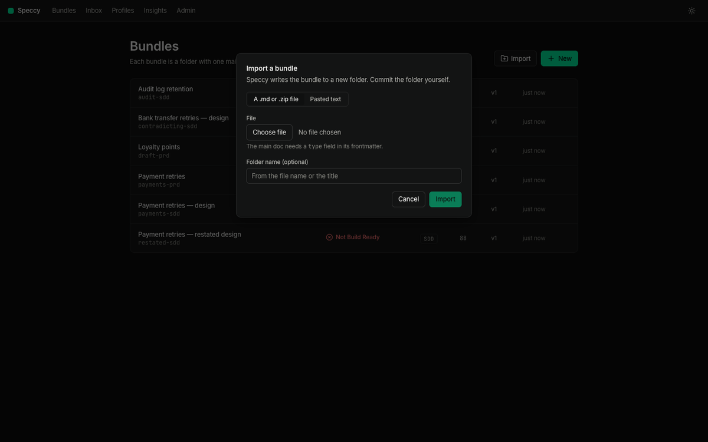
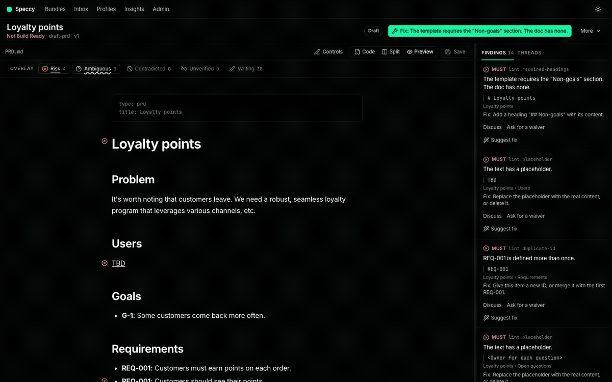
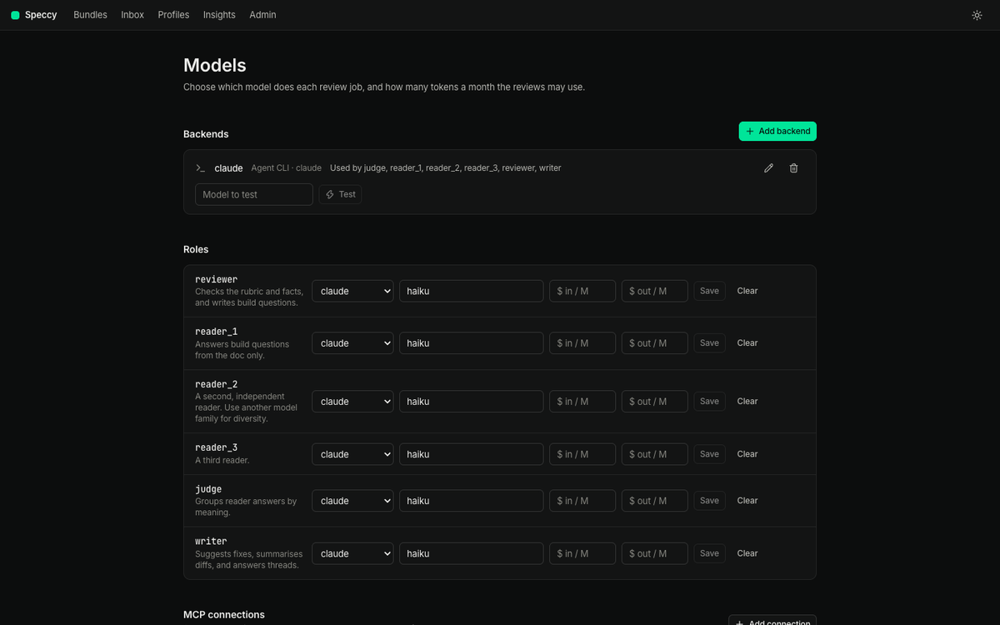
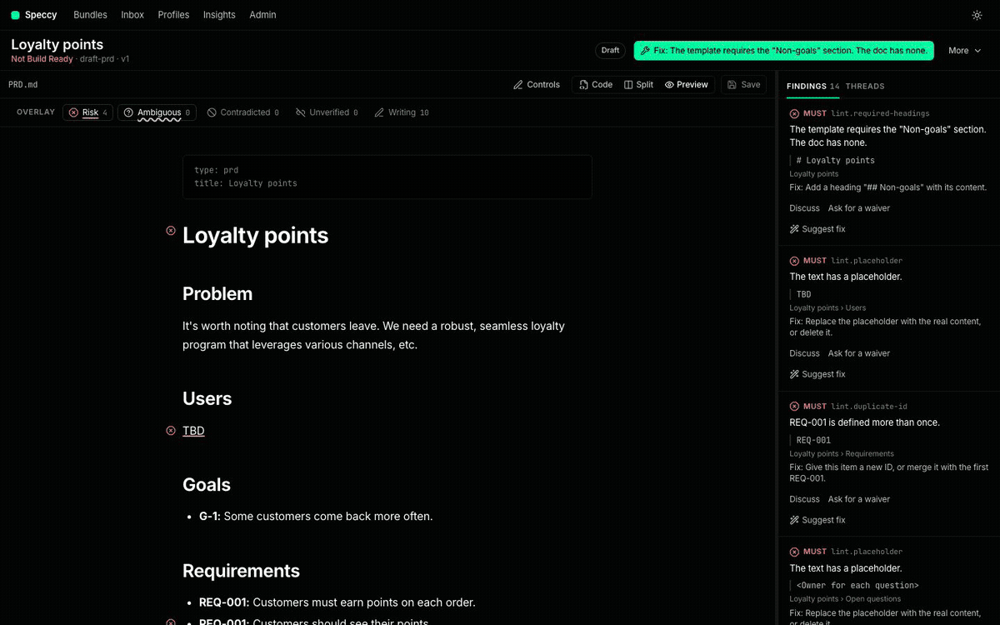
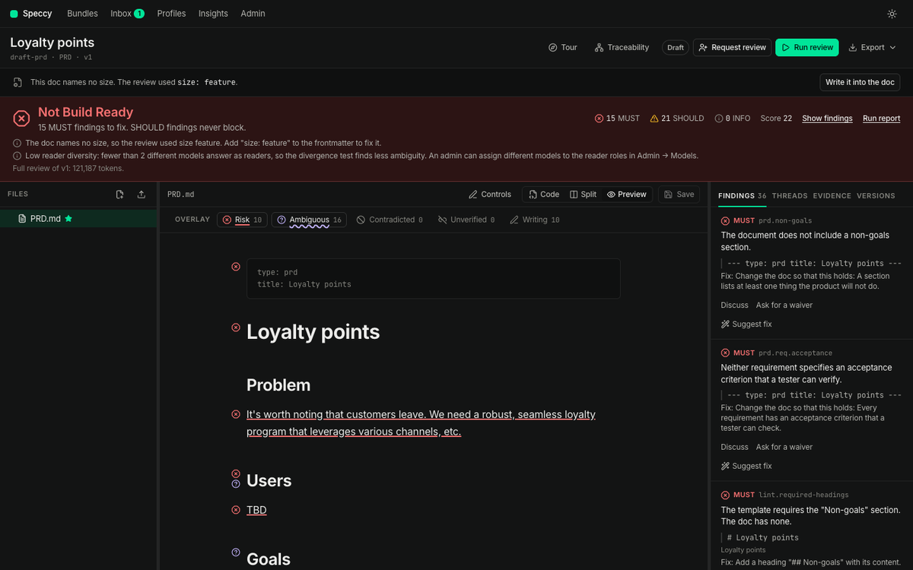
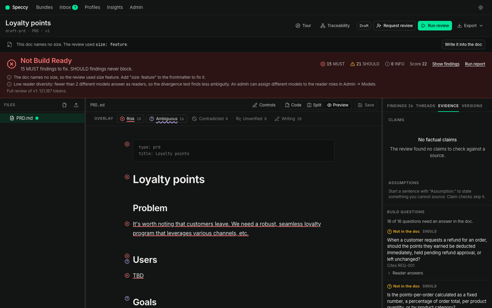
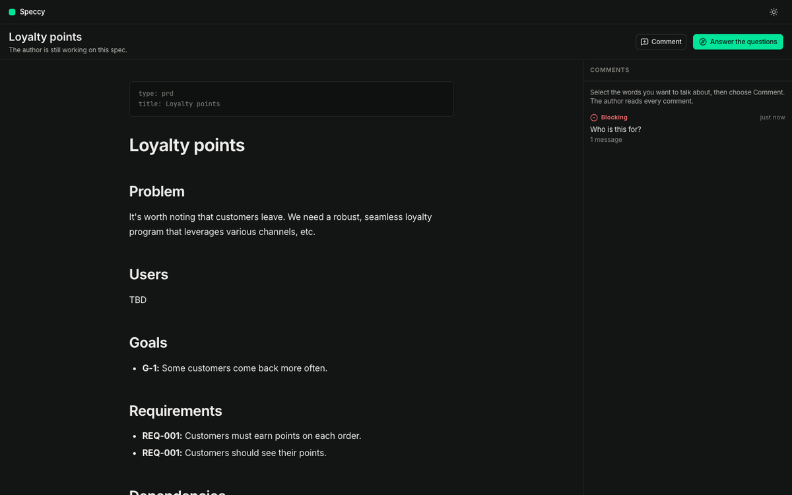
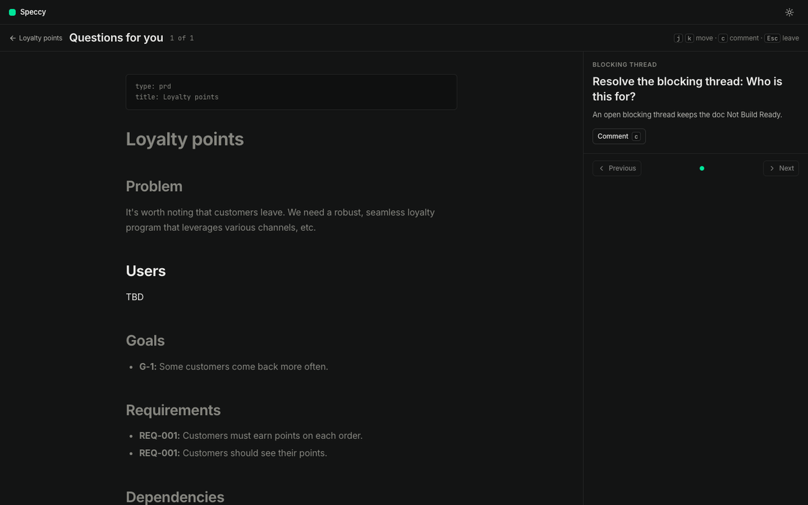
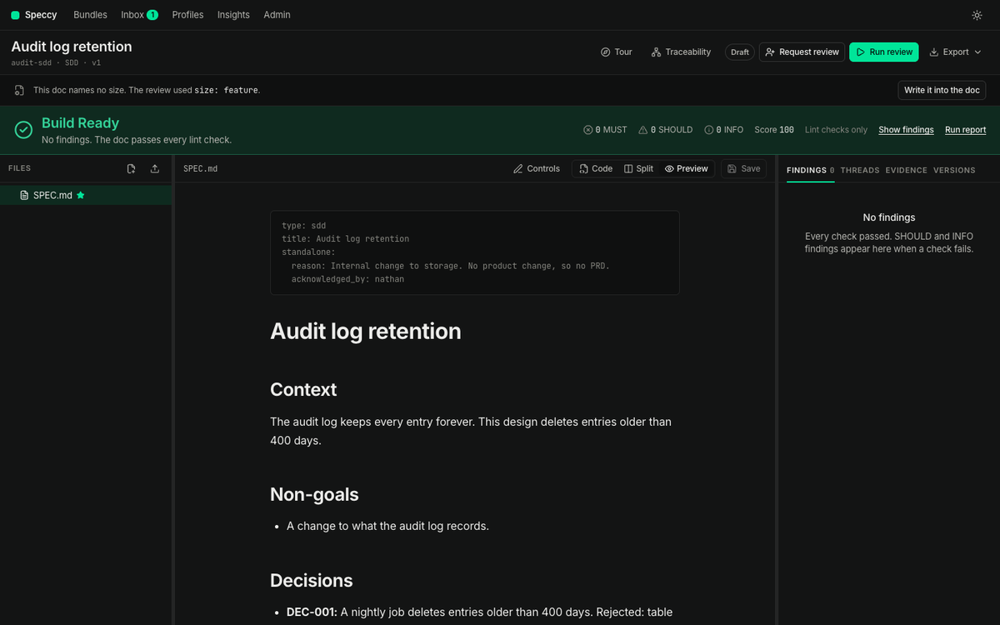
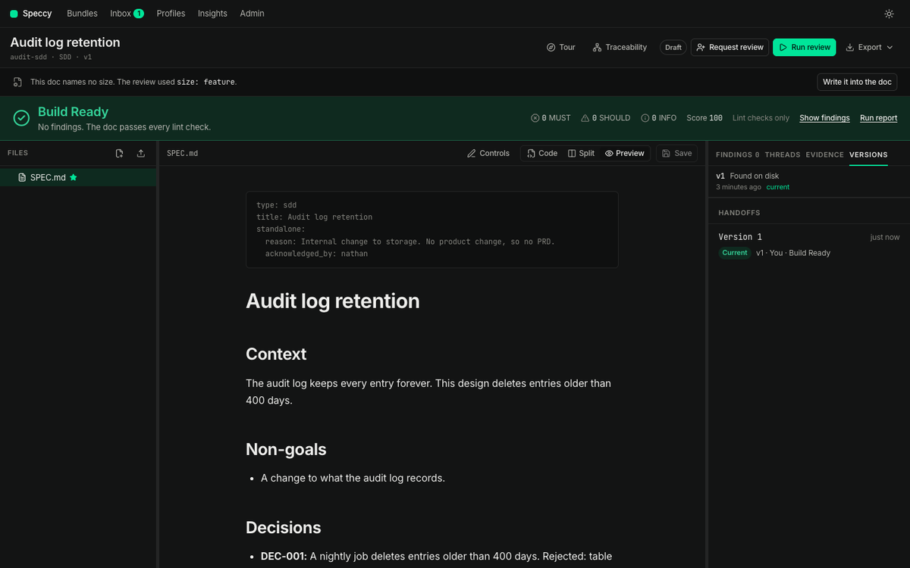

# The guide: one doc, from a blank page to a build packet

This guide follows one bundle end to end. It uses the payments PRD that ships in `testdata/bundles`. Every picture comes from the real app. `just docs-shots` captures them again.

Speccy answers one question about a doc: Build Ready, or Not Build Ready. Build Ready means an implementer can build the thing without asking you what you meant.

## 1. Start Speccy

You need Go 1.26, Node 24 or later, and [just](https://just.systems).

```sh
git clone https://github.com/alternayte/speccy && cd speccy
just build
./bin/speccy --dir ~/work/specs
```

Speccy serves the folder you name and opens your browser. `--no-open` starts it without the browser. The state lives in `.speccy/state/` beside your docs. Do not commit that folder. `speccy init` writes a `.gitignore` entry for it.

The bundles screen lists every bundle in the folder, with its verdict.


## 2. Make a bundle

A bundle is a folder with one main doc and its assets. The main doc is the one markdown file whose frontmatter has a `type`:

```markdown
---
type: prd
title: Payment retries
size: feature
---
```

Three ways to start one:

- **New bundle** writes the profile's template.
- Drag a folder from Finder or Explorer onto the bundles screen. Speccy makes one bundle per folder, and a single-file bundle per loose markdown file.
- `speccy init` in a repo that holds specs already. Then set the paths in `.speccy.yaml`. See [configuration.md](configuration.md).



Pick the size the doc covers: a feature, an app, or an initiative. The profile asks for less of a feature doc than of an initiative doc.

## 3. Write the doc

Open the bundle. The split view puts the markdown beside the rendered doc, scrolled together. Drag the divider to set the widths. Code and Preview show one pane alone.


The preview is editable. Click a paragraph, a heading, a list item, a quote, or a table cell, and the markdown of that block opens where you clicked. `Esc` leaves the block as it was. ⌘S writes the file as one version.



A code block, a diagram, an image, and the frontmatter open as raw markdown, with the fence and the marks, because the exact text matters.

**Controls** shows the control bar above the preview. Its markdown group writes headings, lists, links, tables, and code blocks. Its profile group applies what the profile knows: a missing required heading, the next free trace ID, a requirement with an acceptance criterion, or a move of a long block into `assets/`.

Lint runs on every save, so the first findings appear before any model does.

## 4. Add a model

Lint alone gives a lint-only verdict. The other stages need a model. Open **Admin → Models** and add one of:

- an API key for Anthropic, OpenAI, OpenRouter, or DeepSeek;
- an agent CLI you already pay for: `claude`, `cursor-agent`, `opencode`, or `pi`.

Give each role a backend and a model: the reviewer, the three readers, the judge, and the writer. **Test** checks a backend with one short call.



## 5. Run the review

**Run review** shows the estimated cost first, then runs every stage.

| Stage | What it asks | Needs a model |
|---|---|---|
| Lint | Is the writing clear, and are the headings, links, and trace IDs in order? | No |
| Rubric | Does the doc answer what its profile requires? | Yes |
| Grounding | Does each factual claim hold, and what says so? | Yes |
| Divergence | Do independent readers get the same meaning from each build question? | Yes |
| Coherence | Does the doc agree with the docs it links to, and cover their IDs? | Yes |



The verdict bar is the answer. Build Ready means: no open MUST finding, every required link or acknowledgement is there, no blocking thread is open, and the run is on the current version. The score beside it is passed checks divided by applicable checks. It is for metrics. It never decides the verdict.



An older version's verdict is stale. Speccy says so and asks for a new run.

## 6. Read the findings

Each finding anchors to the text that failed a check. The overlay marks that text in the preview, one layer per kind. Risk and Ambiguous are on by default. The rest are one click away.


A finding carries a fix when the fix is certain, such as a missing trace ID, or a broken link to a file that exists under another name.

The **Evidence** tab holds the build questions: what an implementer must know to build the thing. A gap means every reader answered that the doc does not say. A divergence means the readers answered differently.



The run report shows the stages, their timings, and the findings by category.


## 7. Take the tour

**Tour** lists the points that need a person, in order: a blocking thread, a divergence, a gap, a contradiction, an open decision. The doc dims around the section in question.


`j` and `k` move. `d` records a decision. `w` asks for a waiver. `c` opens a comment. `Esc` leaves.

A waiver is an approved exception for one check in one section, with a reason of at least 20 characters. The profile's waiver policy says who may approve: any member, a non-author, N distinct non-authors, a profile maintainer, or nobody. An approved waiver is written into the main doc's frontmatter, so it travels with the doc in git. Any edit of that section ends the waiver, and the check runs again.

An acknowledgement uses the same mechanism for a link or a trace item that is intentionally absent.

## 8. Send it to a reviewer

**Share** makes a link. A person who opens it reads the spec, and answers the questions you have for them. They see no findings, no waivers, and no author tools.



They select any words and press **Comment** to start a thread on that text. **Answer the questions** walks them through the points that wait for them.



To see the same screen yourself, add `?as=reviewer` to the bundle's URL.

## 9. Reach Build Ready

Fix what the findings and the tour raised. Save. Run the review again. Build Ready means the doc is ready to hand over.



**Traceability** shows every upstream ID, and whether this doc references it, covers it elsewhere, or leaves a gap.


A bundle reaches `approved` when it has a current Build Ready verdict and the approvals its profile requires. An author cannot approve their own bundle. Any change to the main doc or its assets revokes the approvals, and the bundle returns to `in_review`.

## 10. Hand it to a builder

A build packet is the main doc, its assets, the linked bundles' main docs, the trace IDs, and the build questions with their agreed answers. A coding agent takes the packet, and Speccy records the handoff with the verdict at that moment. `HANDOFF.md`, the re-entry prompt, lets the agent resume after it loses its context.



The agent sends back a build report. A blocked report says it cannot build a section without an answer, and it opens a blocking thread. A note says it built the section, but the doc was unclear. A note changes no verdict.

For one profile, the false-ready rate is the share of Build Ready handoffs that came back blocked. **Insights** shows it.

## 11. Keep the verdict in CI

`speccy review docs/specs/*` gives the same verdict in a terminal. The GitHub Action posts the findings on the pull request. See [cli-and-tui.md](cli-and-tui.md) and [configuration.md](configuration.md).
