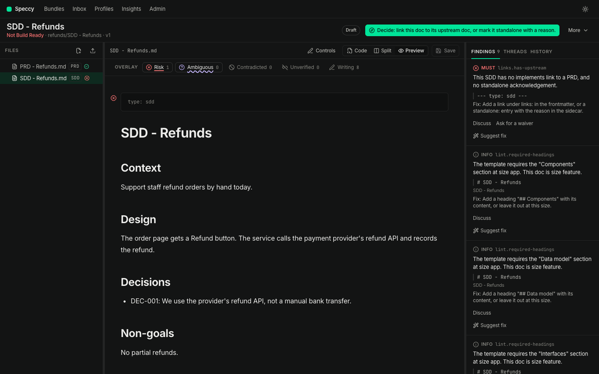
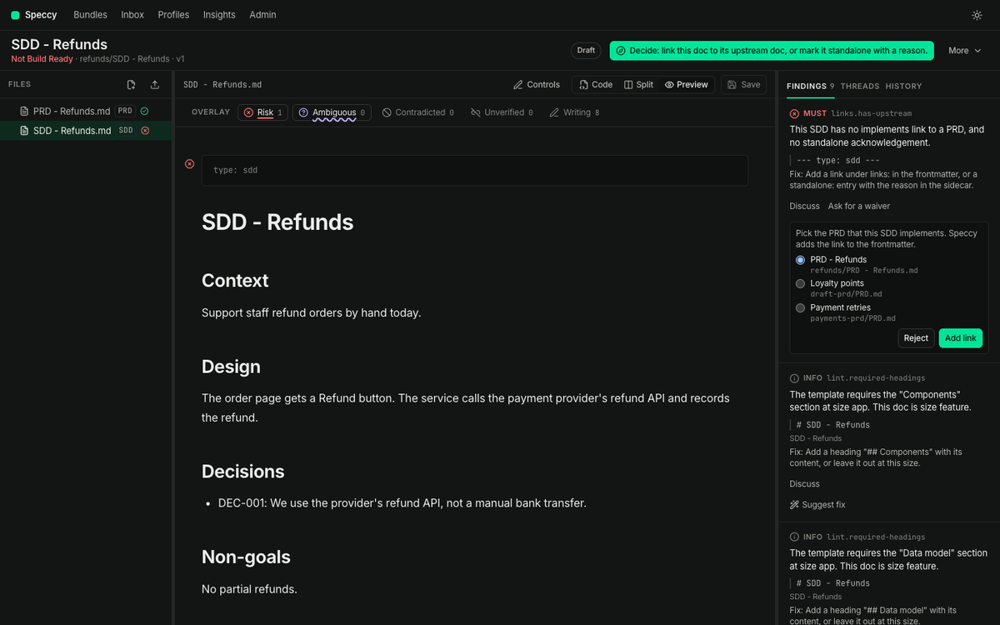
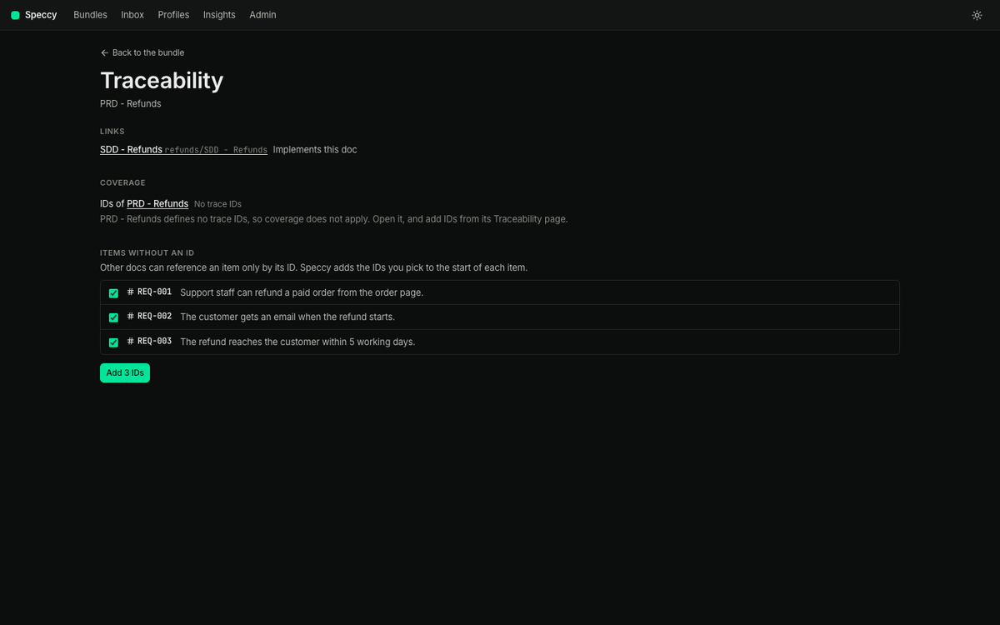

# Linked docs: traceability and coherence

A PRD says what to build. An SDD says how. Speccy reviews each one on its own, and it also checks that the SDD answers for every requirement of the PRD. This document follows one PRD and one SDD in one folder, from the link to the handoff. Every picture comes from the real app. `just docs-shots linked` captures them again.

The [guide](guide.md) covers one doc end to end. Read it first.

## 1. Put the PRD and the SDD in one folder

A folder is a bundle. A folder with `PRD - Refunds.md` and `SDD - Refunds.md` is one bundle with two spec docs. Each one has its own profile, findings and verdict. The file tree lists both, and a click on one opens it.



Each doc names its type in its frontmatter, `type: prd` and `type: sdd`. A doc with no type waits under **Markdown files that are not spec docs yet** on the bundles page. Pick a type for each doc, then click **Adopt all picked types**.

## 2. Link the SDD to the PRD

The SDD profile requires an upstream link, so an SDD without one fails `links.has-upstream`. Open the finding and click **Suggest fix**. Speccy lists the PRDs the link can name, with the PRD in the same folder first. Pick one, and click **Add link**. Speccy writes the link into the SDD's frontmatter:

```yaml
links:
  - kind: implements
    target: PRD - Refunds.md
```



The target is the path of the PRD, relative to the SDD. For a doc in a GitHub source, Speccy keeps the link, and the repo takes no commit. A doc with no upstream doc says so once, in its sidecar, and the check passes:

```yaml
standalone:
  reason: Internal change to storage. No product change, so no PRD.
  acknowledged_by: nathan
```

## 3. Give the PRD trace IDs

A trace ID is a stable name for one requirement, such as `REQ-001`. The SDD answers for each ID of the PRD. Speccy reads an ID in any of these places:

| Where | Example |
|---|---|
| The start of a heading | `### REQ-001 Refund a paid order` |
| The first cell of a table row | `\| REQ-001 \| Refund a paid order. \|` |
| The start of a list item or a paragraph, with a colon or a dash after it | `- **REQ-001:** Refund a paid order.` |

The prefix comes from the profile: `REQ` and `NFR` for a PRD. A number can have any number of digits. An ID-like word with another prefix, such as `FR-001`, gets the INFO finding `trace.unknown-prefix`. Add the prefix to `trace.prefixes` in the profile, or use one the profile reads.

A PRD with no IDs is not wrong, and it can be Build Ready. It gets the INFO finding `trace.no-ids`, because no SDD can say which of its items it covers. Open **More → Traceability** on the PRD. Speccy suggests an ID for each item under a requirements heading. Click **Add IDs**. Speccy writes them in as a new version, and it says how many it added.



## 4. Read the matrix

**Traceability** shows each PRD ID against each doc that implements it.


A cell says one of four things:

- **Referenced** — the SDD names the ID. The number is how many times.
- **Covered by another doc** — an approved acknowledgement names the doc that covers it.
- **Out of scope** — an approved acknowledgement says this doc does not cover it, with a reason.
- **Not covered** — none of the above. This is a gap, and it blocks the verdict.

When the PRD defines no IDs, the matrix says **No trace IDs**, and coverage does not apply to the SDD.

## 5. Close each gap

Each gap is a MUST finding `trace.coverage` on the SDD, and the next action asks about it: "Decide: does this doc cover REQ-001?" The tour and the finding's **Answer the gap** offer three answers.


**This doc covers it.** Pick the section that covers it. Speccy adds the line `Covers REQ-001.` at the end of that section, as a new version. The ID is then in the doc, where a builder reads it. You can also name the ID anywhere in the SDD by hand.

**Another doc covers it.** Pick the doc, and give a reason.

**Out of scope.** Give a reason.

The last two are acknowledgements. They follow the profile's waiver policy, so a maintainer approves a MUST gap. The request waits in the approver's inbox and in the tour. On approval, Speccy writes it to the SDD's sidecar, `.speccy/decisions/<doc path>.yaml`, and the SDD text does not change:

```yaml
trace:
  - id: REQ-002
    status: out_of_scope
    reason: The mail service sends every customer email.
    acknowledged_by: nathan
```

An acknowledgement is about the ID, so an edit to the SDD does not end it. The matrix shows each answer, with its reason.


## 6. Do not repeat the PRD

An SDD that copies its PRD drifts from it the first time either one changes. `coherence.restatement` is a SHOULD: it fires when a paragraph's 8-word runs overlap a PRD paragraph by more than half.


The fix is a reference, not a copy: name the ID, and keep only what the SDD adds.

## 7. Contradictions

A full review reads the SDD and the PRD with a model and looks for statements that conflict. A conflict is the MUST finding `coherence.contradiction`, anchored in both docs. The **Contradicted** overlay marks the statements it hit.


A contradiction needs a decision, not a waiver: one of the two docs is wrong. The finding names the other doc and quotes the line it conflicts with.

## 8. A PRD edit makes the verdict stale

A verdict is about one version of one doc, read against the versions of its linked docs. Change the PRD, and the SDD's verdict no longer describes anything that exists.


A lint verdict costs nothing, so Speccy lints the SDD again at once, and a new PRD ID is a new gap. A full verdict holds its model results and goes stale instead, with the reason `upstream_changed`. Run the review again to replace it.

## 9. Hand the SDD to a builder

When the SDD is Build Ready, a coding agent takes its build packet, as [the guide](guide.md#11-hand-it-to-a-builder) shows. The packet holds the SDD, its assets, and the PRD it links to. `HANDOFF.md` lists the SDD's own trace IDs as the units of work. Each PRD ID the SDD covers is named in the SDD text, so the builder reads the requirement next to the design that meets it.

## 10. Link to an issue, a page, or the code

A doc also links to things outside Speccy. The target carries a scheme that says which system holds it:

```yaml
links:
  - kind: implemented-by
    target: github:acme/payments#internal/pay
  - kind: references
    target: jira:PAY-412
  - kind: references
    target: https://company.atlassian.net/wiki/spaces/ENG/pages/4210
```

`implemented-by` names the code that builds this doc. A short key becomes a URL through a pattern in `.speccy.yaml`:

```yaml
link_patterns:
  jira: https://company.atlassian.net/browse/{key}
```

A full URL needs no pattern. A target that Speccy cannot parse fails lint, and the finding names what to write instead.

### What Speccy reads

Speccy stores no tracker password and calls no vendor API of its own.

**Code.** Speccy reads the newest commit that touched the path, with the credential it already holds: the machine's `gh` login in local mode, the source's token in hosted mode. A repo that credential cannot read stays unchecked.

**An issue or a page.** An admin adds an MCP connection in Admin → MCP, lists the hosts it reads, and marks the tool that reads one page. Speccy matches a link to a connection by host. No model chooses the connection or the tool, so a doc cannot steer Speccy into another system.

### The four states

The traceability screen holds one table of these links.

| State | Means | What you do |
|---|---|---|
| Aligned | Speccy read the target, and it agrees with the doc. | Nothing. |
| Drifted | The code changed after this version of the doc. | Read the commit. Verify the build at it, then update the doc, or waive the drift with a reason. |
| Conflicting | The issue or the page states something the doc contradicts. | Decide which of the two is right, and change that one. |
| Unchecked | No credential and no connection reads that target. | Add the MCP connection for the host, or leave it: an unchecked link is not a failure. |

Drift and conflict are SHOULD checks. Neither blocks Build Ready: the code moving is news about the doc, not a defect in it. A new version of the doc clears a drift, because the version is the record of a person reading it.

### In the build packet

The packet lists each external link with its kind and URL, and the commit of a code target. `HANDOFF.md` carries the same lines, so a coding agent knows which path to change and which issue to read. Speccy fetches no issue content into the packet.

## 11. The checks

| Check | Level | What it means | What you do |
|---|---|---|---|
| `frontmatter.readable` | MUST | Speccy cannot read the frontmatter: it does not parse, it sits in a comment Speccy does not read, or `links` is not a list of `kind` and `target` pairs. | Fix the block. The finding gives the form Speccy reads. |
| `links.has-upstream` | MUST | The doc's profile requires an upstream link, and the doc has none. | Suggest fix, and pick the doc it implements, or add a `standalone` reason in the sidecar. |
| `links.has-children` | MUST | A doc of this size covers work that other bundles hold, and it links to none. | Link the bundles it covers, with `references` or `refines`. |
| `trace.coverage` | MUST | An upstream ID is not referenced in this doc, and not acknowledged. | Answer the gap: this doc covers it, another doc covers it, or it is out of scope. |
| `trace.no-ids` | INFO | A requirements, decisions or non-functional section has no trace ID. | Add IDs from Traceability, or leave it: no doc can reference the items. |
| `trace.unknown-prefix` | INFO | An ID-like word starts an item, but the profile does not read its prefix. | Use a prefix of the profile, or add this one to `trace.prefixes`. |
| `coherence.restatement` | SHOULD | A paragraph repeats an upstream paragraph. | Replace it with a reference to the ID, and keep what this doc adds. |
| `coherence.contradiction` | MUST | Two linked docs state things that conflict. | Decide which doc is right, and change that one. |
| `links.external-target` | MUST | An external link target has no scheme, no pattern, or a malformed repo path. | Write it as `github:owner/repo#path`, as a scheme with a pattern, or as a full URL. |
| `links.code-drift` | SHOULD | The code a doc points at changed after this version. | Read the commit, then update the doc or waive the drift. |
| `coherence.external` | SHOULD | The doc states something a linked issue or page contradicts. | Decide which of the two is right, and change that one. |

A stale verdict is not a finding. It is the verdict of a version that no longer stands, and only a new run replaces it.

## Where next

- The [guide](guide.md) — one doc from a blank page to a build packet.
- [github.md](github.md) — the same checks on a pull request, and the replies that decide them.
