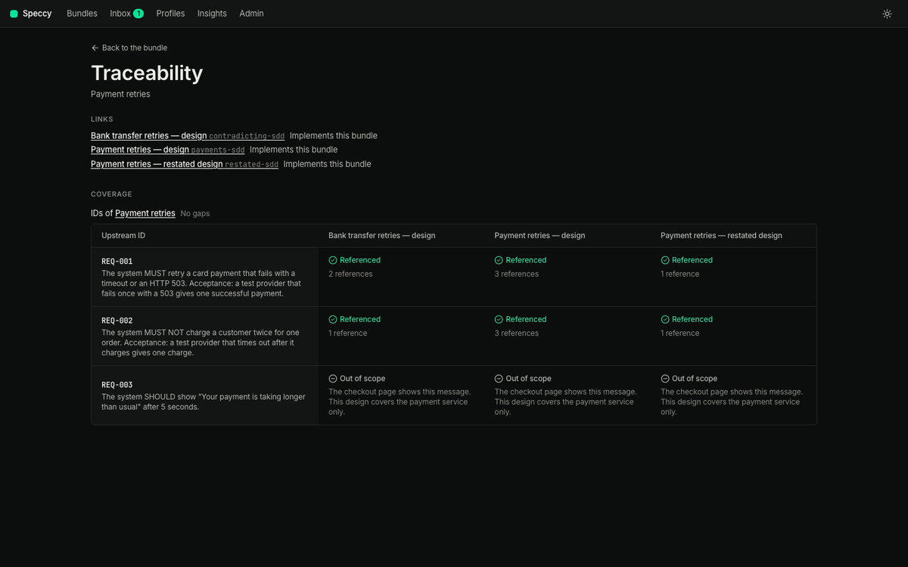
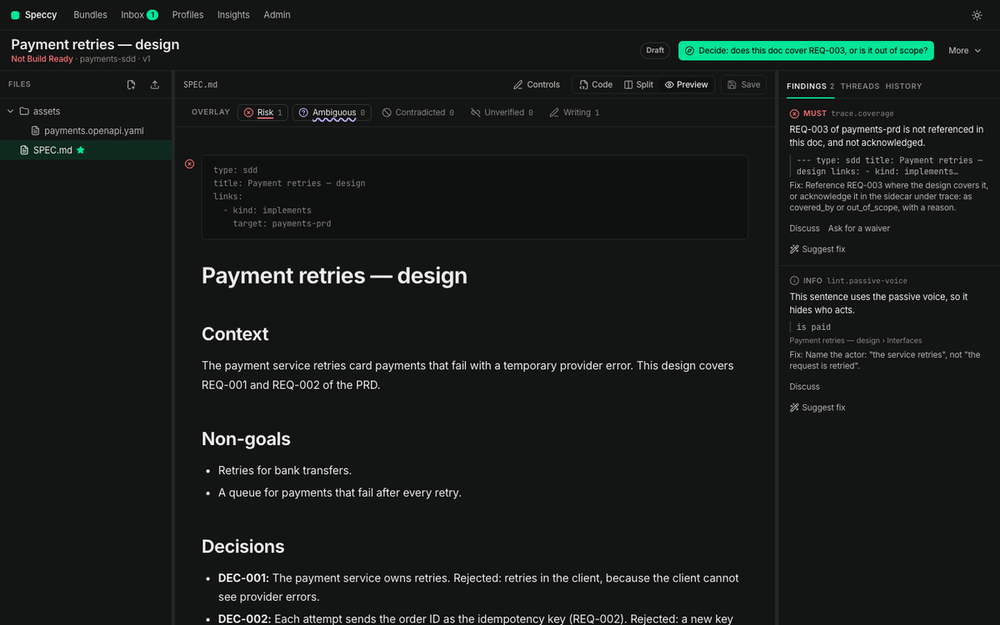
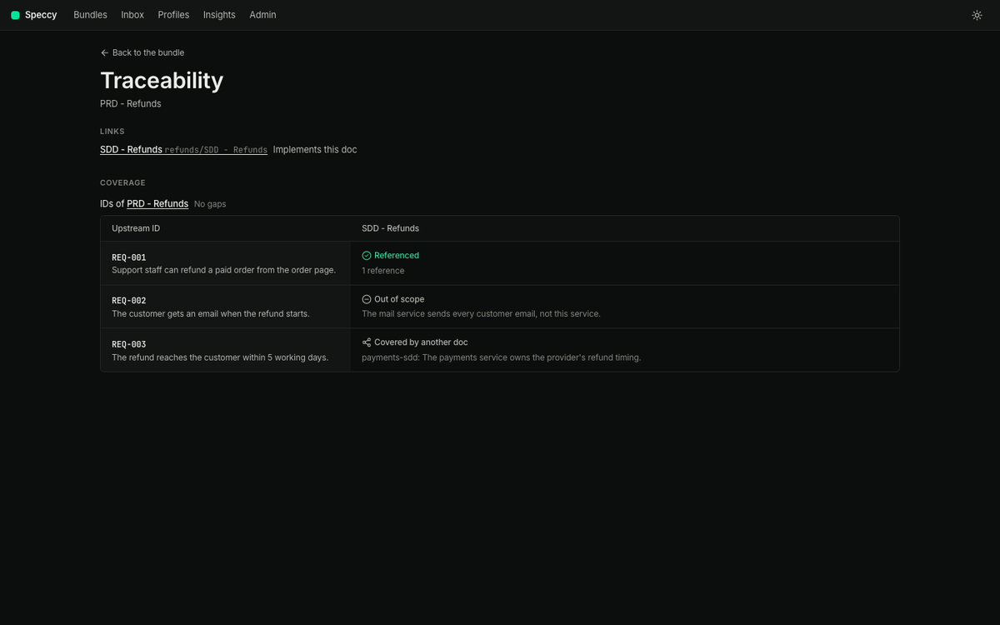
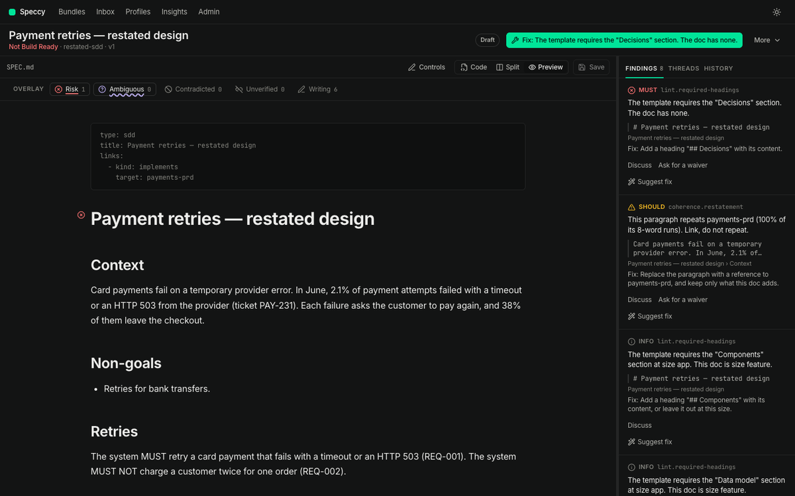
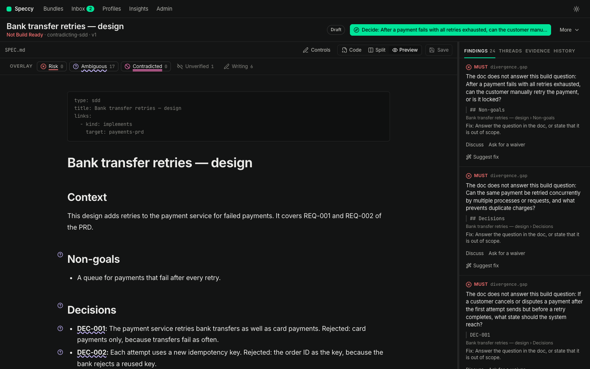
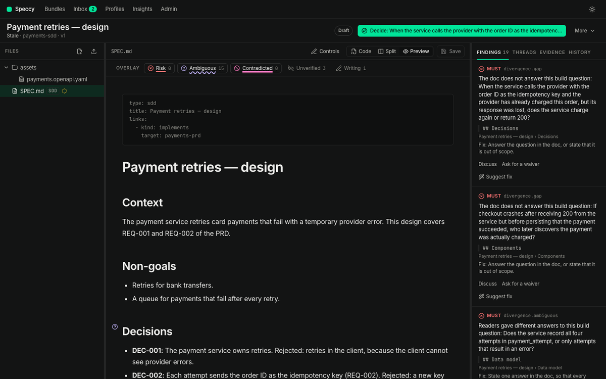

# Linked docs: traceability and coherence

A PRD says what to build. An SDD says how. Speccy reviews each one on its own, and it also reviews whether the two still agree. This document follows the payments PRD and the SDD that implements it, both in `testdata/bundles`. Every picture comes from the real app. `just docs-shots` captures them again.

The [guide](guide.md) covers one doc end to end. Read it first.

## 1. Link the two docs

A link is a typed relation between two bundles. Write it in the frontmatter of the downstream doc:

```yaml
---
type: sdd
title: Payment retries — design
links:
  - kind: implements
    target: payments-prd
---
```

A wiki renders frontmatter as text. To hide it, put the block inside an HTML comment, with `<!--` and `-->` each on its own line at the start of the file. The block can be YAML or JSON. Speccy reads it, and writes it back in the same form:

```markdown
<!--
---
{
  "type": "sdd",
  "title": "Payment retries — design",
  "links": [{ "kind": "implements", "target": "PRD - Payments.md" }]
}
---
-->
```

When Speccy cannot read the block, `frontmatter.readable` fails and names the cause. `links` must be a list of `kind` and `target` pairs. A map, or a pair with `type` in place of `kind`, is not a link.

On a doc with no upstream link, Suggest fix on `links.has-upstream` lists the docs the link can name. Pick one, and Speccy writes the link. For a doc in a repo source, Speccy keeps the link, and the repo takes no commit.

Three kinds carry the checks in this document:

| Kind | Means | Used by |
|---|---|---|
| `implements` | This doc builds what the target asks for. | coverage, restatement, contradiction |
| `refines` | This doc adds detail to the target. | restatement, contradiction |
| `references` | This doc depends on the target. | contradiction |

A repo whose docs Speccy did not write names no links. Write link rules by path convention in `.speccy.yaml` instead, and a link exists when both files exist:

```yaml
link_rules:
  - "docs/sdd-{name}.md implements docs/prd-{name}.md"
```

The SDD profile requires an upstream link: `links.has-upstream` is a MUST. A doc with no upstream doc says so once, in its sidecar, and the check passes:

```yaml
standalone:
  reason: Internal change to storage. No product change, so no PRD.
  acknowledged_by: nathan
```

## 2. Give the upstream doc trace IDs

A trace ID is a stable ID in a doc, such as `REQ-012` or `DEC-004`. The profile names the prefixes it reads, and the prefixes it covers downstream:

```yaml
trace:
  prefixes: [REQ, DEC, NFR]     # the IDs this doc type defines
  cover: [REQ, NFR]             # the upstream IDs a downstream doc must answer for
```

Write them in the upstream doc as the first thing in the item:

```markdown
- **REQ-001:** The system MUST retry a card payment that fails with a timeout or an HTTP 503.
```

Speccy suggests IDs for unnumbered requirements, and writes them in on accept. A downstream doc references an ID by naming it anywhere in its text.

## 3. Read the traceability matrix

**Traceability** shows every upstream ID against every doc that implements it.



A cell says one of four things:

- **Referenced** — the downstream doc names the ID. The number is how many times.
- **Covered by** — the doc acknowledges that another doc covers it, and names that doc.
- **Out of scope** — the doc acknowledges that it does not cover it, with a reason.
- **Gap** — none of the above. This one blocks the verdict.

## 4. Close a gap

Take the acknowledgement away and REQ-003 is a gap. `trace.coverage` is a MUST, so the verdict turns, and the next action asks the one question that settles it.



You close a gap in one of two ways.

**Reference it.** Name the ID where the design covers it. This is the right answer when the doc does cover the requirement and forgot to say so.

**Acknowledge it.** Say that the ID is intentionally absent, with a reason, in the doc's sidecar `.speccy/decisions/<doc path>.yaml`:

```yaml
trace:
  - id: REQ-003
    status: out_of_scope        # out_of_scope | covered_by
    reason: The checkout page shows this message. This design covers the payment service only.
    acknowledged_by: nathan
```

`covered_by` also names the doc that covers it, in `target`. An acknowledgement uses the waiver mechanism, so the profile's waiver policy decides who may approve it. The doc's own text does not change, and the matrix shows the reason in the cell.



## 5. Do not repeat the upstream doc

A downstream doc that copies its upstream doc drifts from it the first time either one changes. `coherence.restatement` is a SHOULD: it fires when a paragraph's 8-word runs overlap an upstream paragraph by more than half.



The fix is a reference, not a copy: name the ID, and keep only what this doc adds.

## 6. Contradictions

`coherence.contradiction` reads both docs with a model and looks for statements that conflict. A conflict is a MUST finding, and Speccy anchors it in both docs. The **Contradicted** overlay marks the statements it hit, so you read them in place.



A contradiction needs a decision, not a waiver: one of the two docs is wrong. The finding names the other doc and quotes the line it conflicts with.

## 7. An upstream edit makes the verdict stale

A verdict is about one version of one doc, read against the versions of its linked docs. Change the PRD, and the SDD's verdict no longer describes anything that exists.



A lint verdict costs nothing, so Speccy lints again at once. A full verdict holds its model results and goes stale instead, with the reason `upstream_changed`. Run the review again to replace it.

## 8. Link to an issue, a page, or the code

A doc also links to things outside Speccy. The target carries a scheme that says which system holds it:

```yaml
links:
  - kind: implemented-by
    target: github:acme/payments#internal/pay
  - kind: references
    target: jira:PAY-412
  - kind: references
    target: https://company.atlassian.net/wiki/spaces/ENG/pages/4210
```

`implemented-by` names the code that builds this doc. A short key becomes a URL through a pattern in `.speccy.yaml`:

```yaml
link_patterns:
  jira: https://company.atlassian.net/browse/{key}
```

A full URL needs no pattern. A target that Speccy cannot parse fails lint, and the finding names what to write instead.

### What Speccy reads

Speccy stores no tracker password and calls no vendor API of its own.

**Code.** Speccy reads the newest commit that touched the path, with the credential it already holds: the machine's `gh` login in local mode, the source's token in hosted mode. A repo that credential cannot read stays unchecked.

**An issue or a page.** An admin adds an MCP connection in Admin → MCP, lists the hosts it reads, and marks the tool that reads one page. Speccy matches a link to a connection by host. No model chooses the connection or the tool, so a doc cannot steer Speccy into another system.

### The four states

The traceability screen holds one table of these links.

| State | Means | What you do |
|---|---|---|
| Aligned | Speccy read the target, and it agrees with the doc. | Nothing. |
| Drifted | The code changed after this version of the doc. | Read the commit. Verify the build at it, then update the doc, or waive the drift with a reason. |
| Conflicting | The issue or the page states something the doc contradicts. | Decide which of the two is right, and change that one. |
| Unchecked | No credential and no connection reads that target. | Add the MCP connection for the host, or leave it: an unchecked link is not a failure. |

Drift and conflict are SHOULD checks. Neither blocks Build Ready: the code moving is news about the doc, not a defect in it. A new version of the doc clears a drift, because the version is the record of a person reading it.

### In the build packet

The packet lists each external link with its kind and URL, and the commit of a code target. `HANDOFF.md` carries the same lines, so a coding agent knows which path to change and which issue to read. Speccy fetches no issue content into the packet.

## 9. The checks

| Check | Level | What it means | What you do |
|---|---|---|---|
| `frontmatter.readable` | MUST | Speccy cannot read the frontmatter: it does not parse, it sits in a comment Speccy does not read, or `links` is not a list of `kind` and `target` pairs. | Fix the block. The finding gives the form Speccy reads. |
| `links.has-upstream` | MUST | The doc's profile requires an upstream link, and the doc has none. | Add a link to the doc it implements, or a `standalone` reason in the sidecar. |
| `links.has-children` | MUST | A doc of this size covers work that other bundles hold, and it links to none. | Link the bundles it covers, with `references` or `refines`. |
| `trace.coverage` | MUST | An upstream ID is not referenced in this doc, and not acknowledged. | Reference the ID, or acknowledge it in the sidecar under `trace:`. |
| `coherence.restatement` | SHOULD | A paragraph repeats an upstream paragraph. | Replace it with a reference to the ID, and keep what this doc adds. |
| `coherence.contradiction` | MUST | Two linked docs state things that conflict. | Decide which doc is right, and change that one. |
| `links.external-target` | MUST | An external link target has no scheme, no pattern, or a malformed repo path. | Write it as `github:owner/repo#path`, as a scheme with a pattern, or as a full URL. |
| `links.code-drift` | SHOULD | The code a doc points at changed after this version. | Read the commit, then update the doc or waive the drift. |
| `coherence.external` | SHOULD | The doc states something a linked issue or page contradicts. | Decide which of the two is right, and change that one. |

A stale verdict is not a finding. It is the verdict of a version that no longer stands, and only a new run replaces it.

## Where next

- The [guide](guide.md) — one doc from a blank page to a build packet.
- [github.md](github.md) — the same checks on a pull request, and the replies that decide them.
