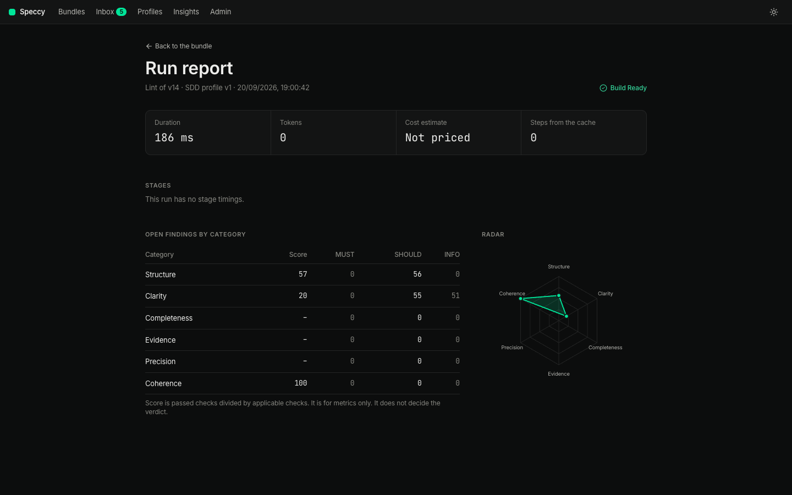
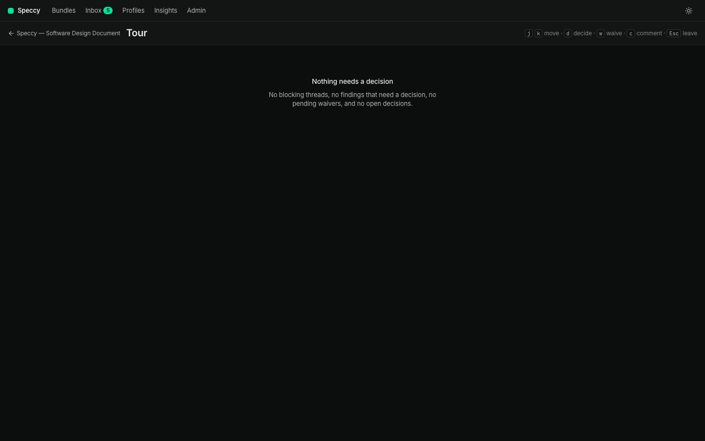
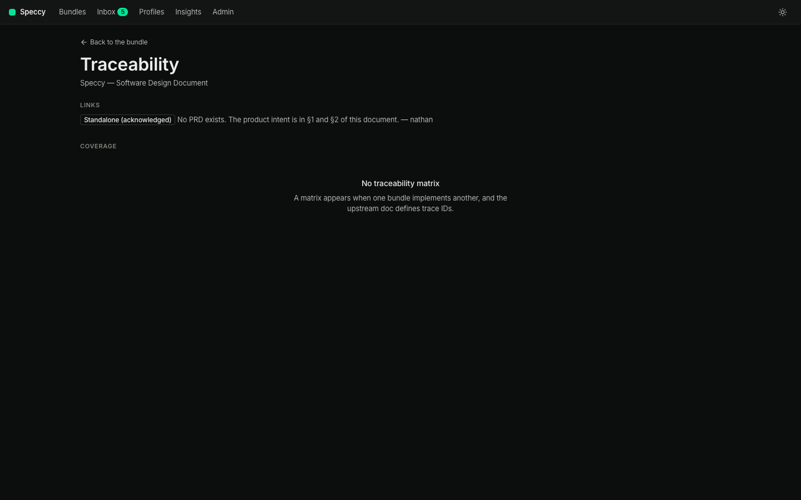

# Reviews, waivers, and approvals

A review run reads one version of one bundle and returns one verdict: Build Ready, or Not Build Ready.

## The stages

| Stage | What it asks | Needs a model |
|---|---|---|
| Lint | Is the writing clear, and are the headings, links, and trace IDs in order? | No |
| Rubric | Does the doc answer what its profile requires? | Yes |
| Grounding | Does each factual claim hold, and what says so? | Yes |
| Divergence | Do independent readers get the same meaning from each build question? | Yes |
| Coherence | Does the doc agree with the docs it links to, and cover their IDs? | Yes |

Lint runs on every save. The other stages run when you press **Run review**, or when `speccy review` runs with a model assigned.

## The verdict

Build Ready means: no open MUST finding, every required link or acknowledgement is there, no blocking thread is open, and the run is on the current version. The score beside the verdict is passed checks divided by applicable checks. It is for metrics; it never decides the verdict.

An older version's verdict is stale. Speccy says so and asks for a new run.

## Findings and the overlay

Each finding anchors to the text that failed the check. The overlay marks that text in the preview, with one layer per kind. Risk and Ambiguous are on by default; the rest are one click away.

A finding carries a fix when the fix is certain, such as a missing trace ID or a broken link to a file that exists under another name.

## The tour

**Tour** lists the points that need a person, in order: a divergence, a gap, a contradiction, a missing decision. `j` and `k` move, `d` records a decision, `w` asks for a waiver, `c` opens a comment.

## Waivers

A waiver is an approved exception for one check in one section, with a reason of at least 20 characters.

1. Anyone who can edit asks for one from the finding: **Ask for a waiver**.
2. The request appears on that finding at the top of the findings rail, in the verdict bar as a count, and in the inbox of everyone whose policy lets them approve it.
3. The approver reads the reason beside the text it excuses, then presses **Approve** or **Reject**.

The profile's waiver policy says who may approve: any member, a non-author, N distinct non-authors, a profile maintainer, or nobody. An approved waiver is written into the main doc's frontmatter, so it travels with the doc in git. Any edit of the section ends the waiver, and the check runs again.

An acknowledgement uses the same mechanism for a link or a trace item that is intentionally absent.

## Traceability

**Traceability** shows every upstream ID and whether this doc references it, covers it elsewhere, or leaves a gap.

## Approval

A bundle reaches `approved` when it has a current Build Ready verdict and the approvals its profile requires. An author cannot approve their own bundle. Any change to the main doc or its assets revokes the approvals and moves the bundle back to `in_review`.
