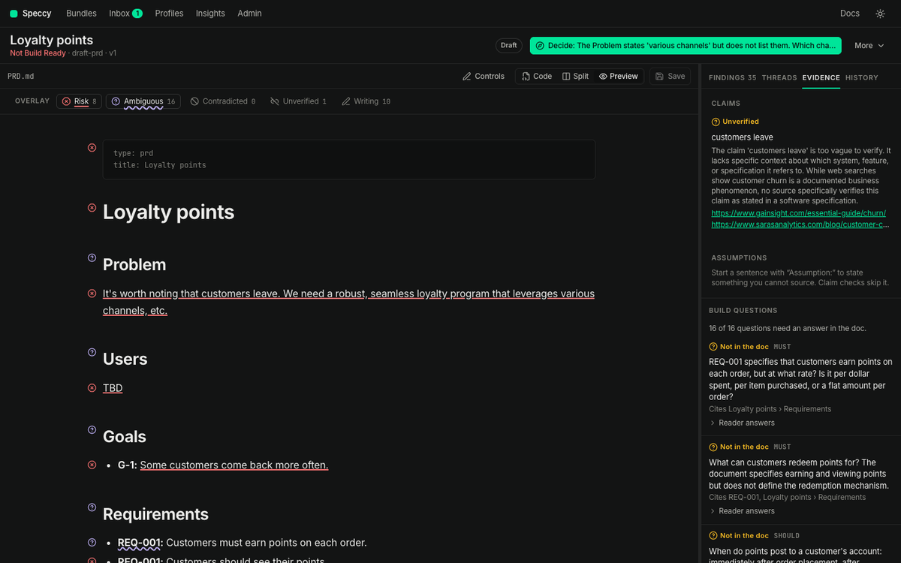
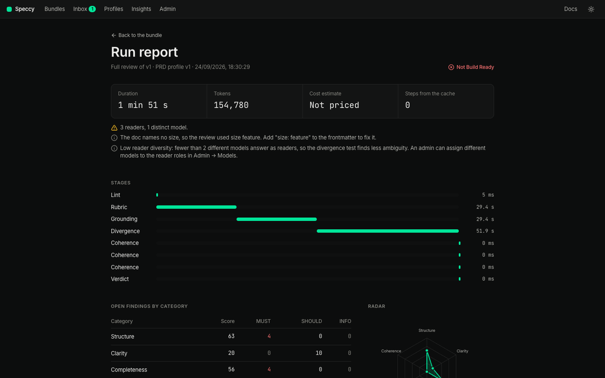

import ReviewPipeline from '../../../components/diagrams/ReviewPipeline.astro';

This page explains the five stages of a review, what each stage reads and returns, and what a run costs.

<ReviewPipeline />

## Every save and a full review

Speccy lints each new version of a spec doc at once. Lint needs no model, so it costs nothing and gives a verdict in under a second. The save also runs the checks that read linked docs without a model: coverage, restatement and code drift.

A full review runs lint, then the four model stages in a fixed order: rubric, grounding, divergence and coherence. Then it decides the verdict. You start a full review in the app, with `speccy review`, or with the MCP tool `review_bundle`.

A run can take fewer stages. `speccy review --stages rubric,coherence` runs lint and those two stages. The run report then says "Stages in this run: lint, rubric, coherence. The findings of the other stages stay from the last review that ran them."

Such a run judges only its stages. Speccy carries the findings of each model stage that the run skips, from the last run that did that stage. The rule for [carried findings](/concepts/verdict/#carried-findings) applies to them. When the store holds no earlier review of the doc, the verdict counts only the stages of the run.

A full review has a limit of 15 minutes. A failed run gives no verdict. It names the stage that failed and the cause, and the previous verdict reads Stale.

Each stage returns findings. A finding is one failed check, with an anchor to the text that failed it. The [Check catalog](/reference/checks/) lists each check of each stage.

## Lint

[Lint checks](/reference/checks/#lint) read the text and the structure, and never call a model. They find placeholders, missing required headings, broken links, duplicate and dangling trace IDs, long sentences, weasel words, undefined acronyms and slop phrases. The template of the profile decides the required headings, and the size of the doc decides which of them apply.

Lint also checks the frontmatter and the links. `frontmatter.readable` fails when Speccy cannot read the block. `links.has-upstream` fails when the profile requires an upstream link and the doc has none.

A lint finding describes the writing, never the author. Lint finishes a doc of 10,000 words in under one second.

## Rubric

[Rubric checks](/reference/checks/#rubric) are the questions of the profile. The reviewer model answers each check that applies at the size of the doc. Each check has a question and a `pass_when` rule, and the answer is pass or fail with quotes from the doc.

What a check reads depends on the check:

- A check that names a heading, such as `section: "Monitoring"`, reads that section with its subsections, the doc title and the text assets. It also reads each pointed-to section. An edit to another section does not send the check to the model again. When the doc has no such heading, the check reads the whole doc.
- A check with `scope: section` runs once for each section.
- Any other rubric check is a whole-doc check. It reads the whole bundle: the spec doc and its text assets. The model judges it again after any edit.
- A check with `reads: [upstream]` also reads the spec doc of each `implements` or `refines` link target, such as the PRD. A change to the text of that doc sends the check to the model again.

A pointed-to section is a section of the same doc that the named section points to. A pointer is one of these:

- A markdown link to the anchor of a heading in the same doc, such as `[the audit rules](#governance-and-compliance)`.
- The full title of a heading in the text, with case ignored, such as "Governance and compliance records the deviation". A heading title of one word counts only as a link. Thus the words "the data" do not point to a heading "Data".

Speccy follows pointers one level deep. The pointers of a pointed-to section add nothing. The model reads each pointed-to section with its subsections as context, and the data labels it with its heading path. Where the named section points to another section for a fact, the fact counts as part of the named section. The answer can quote the pointed-to section. An edit to a pointed-to section sends the check to the model again. The cost estimate counts the pointed-to sections. A pointer into another doc or an asset adds nothing. A whole-doc check and a `scope: section` check do not follow pointers.

Sometimes the answer for one check does not match the schema. That check then gets one more call, and the review continues. When the second answer does not match either, the result depends on the level of the check:

- A MUST check gets a MUST finding on the check: "The reviewer gave no answer for this check. Run the review again." The verdict is then Not Build Ready. Thus Build Ready means that each MUST check got a judgement. A waiver cannot cover this finding. Only an answer clears it.
- A SHOULD or INFO check counts as not applicable. The run report then has a note.

In both cases the run does not fail, and Speccy does not cache the missing answer. The next review asks the model for that check again, and takes the other answers from the cache. When a call fails, the answers of the other calls stay in the cache. The next review asks only for the checks that have no answer.

The built-in PRD and SDD profiles name a section on each check that is about one section of the template. The reviewer answers up to eight checks in one call.

A failed check reports every shortfall. A shortfall is one thing that a failed check found wrong. Each shortfall is one finding at the level of the check, with its own message and quote. Speccy sets no limit on their number.

A later full review does not find the shortfalls of a check afresh. It gives the model each shortfall of the last review, and the model answers "still holds" or "fixed" for each one. Then the model lists any other shortfall. A shortfall of the last review leaves in three cases only:

- The model answers "fixed" for it.
- The check passes.
- The text it quoted is gone from the doc.

A shortfall that the model does not mention stays. Thus a finding on text that you did not change does not leave and return by chance. The list gets shorter as you fix it.

## Grounding

The [grounding stage](/reference/checks/#grounding) checks the facts that the doc states. The reviewer lists the claims of each section with 12 words or more. A sentence that starts with "Assumption:" is not a claim, so the stage passes over it.

Speccy first reads the text that the review already holds: the other files of the bundle, and the linked spec docs.

- A file or a linked spec doc that states the claim verifies it. The path is the source.
- A file of the bundle that states the opposite gives the SHOULD finding `grounding.file-contradicts-claim`, with the path and the sentence of the file. A profile can make it a MUST: see [Change a profile](/how-to/change-a-profile/#make-a-file-contradiction-block).
- A linked spec doc that states the opposite gives no finding in this stage. The coherence stage reports that conflict.

Speccy keeps a result only when the quoted sentence is in the file, word for word. To give Speccy a file as evidence, link to it from the spec doc. The bundle then holds the file, also when it is in another folder of the repo. For a spec doc in another bundle, add a link to it. The source policy of a profile does not apply to a file or a linked spec doc.

A claim that a file settles gets no search. Speccy labels each other claim with a search source:

1. The web search of the reviewer's backend, when the backend has one.
2. Else, an MCP connection that an admin marked as a search source.
3. Else, no source. Each claim is then unverified, and the run report says why.

A label counts only when the search returned its source. The backend reports the pages of its search, and Speccy drops a source that is not one of them. When no source stays, Speccy labels the claim unverified. A source that does not mention the fact does not contradict the claim.

The reviewer marks each claim about an internal system, such as a team or a service of your organisation. A web search cannot confirm such a claim, and it can find another product with the same name. Thus an internal claim goes only to the MCP connection. With no MCP connection, Speccy labels it unverified.

A verified claim passes. An unverified claim is the SHOULD finding `grounding.unverified-claim`. A contradicted claim is the MUST finding `grounding.contradicted-claim`, and its message names the source. Speccy keeps a label for one month, then checks the fact again.

### Source policy and claim classes

The source policy is the `grounding.sources` section of a profile. It says which domains the grounding stage accepts, their tier and their freshness period. The built-in profiles have no source policy, so the stage accepts any source.

- `allow` and `forbid` name hosts. With an `allow` list, a source must come from one of its hosts. Speccy never requests a forbidden host.
- `domains` gives a host pattern the tier `primary` or `secondary`. A host that matches no rule is secondary.
- `freshness` gives each tier a number of days. A source older than that does not count.
- `classes` maps a heading path pattern to a claim class. The most specific pattern wins.
- `require_primary` names the claim classes whose sources must all be primary.
- `unclassified` says what happens to a claim in a section that matches no class rule: `allow`, `warn` or `require-classification`.

A claim takes its class from the heading path of its section. Speccy decides the class with a fixed rule, and a model never decides it. When the policy refuses every source of a claim, the claim counts as unverified, and the finding says which rule refused each source. The [Profile schema](/reference/profile-schema/) lists each key.

## Divergence

The [divergence stage](/reference/checks/#divergence) tests whether different readers get one meaning from the doc. It works on build questions: the questions an implementer must answer to build the thing.

1. The reviewer writes build questions on the themes of the profile. `divergence.questions` sets how many: 10 to 20 in the built-in profiles. Each question must cite a section or a trace ID of the doc. Speccy drops a question that cites nothing.
2. The doc keeps its questions from one version to the next, so a later review asks the same questions. Speccy drops a question when the text it cites is gone from the doc. The reviewer writes new questions only for the sections that are new since it wrote the questions.
3. Each reader answers each question alone, from the bundle only. A reader never sees the rubric or the answers of another reader. Each answer quotes the doc, or says `NOT SPECIFIED`.
4. Speccy looks for each quote in the bundle. An answer whose quotes are not in the bundle counts as `NOT SPECIFIED`.
5. The judge groups the answers by meaning. The judge sees the answers under shuffled letters, never under reader names.

Each question gets one result:

| Result | When | Finding |
|---|---|---|
| Agree | Every reader answered, with one meaning. | None |
| Divergence | The readers gave different meanings, or some readers answered and some did not. | `divergence.ambiguous` |
| Gap | Every reader answered `NOT SPECIFIED`. | `divergence.gap` |

A finding of this stage is a MUST when its question cites a trace ID whose definition says MUST, or a section the template requires. Otherwise it is a SHOULD.

In a later full review, the readers do not answer every question again. They answer a question that was a gap or a divergence. A question that the readers agreed on keeps its answers while each quote that the readers gave is still in the doc. An edit elsewhere in the cited section does not send the question back to the readers. When a quote is gone, the readers answer the question again.

To replace the whole set, open the **Evidence** tab and click **Write a fresh set at the next review** under the build questions. The next full review then writes a new set. Speccy never uses the number of a question again. The same control gives the rubric checks a clean start: the next full review asks about no shortfall of a review before it.

When fewer than two different models answer as readers, the run report says "Low reader diversity". One model finds less ambiguity than several. The note never blocks the verdict.

## Coherence

The [coherence checks](/reference/checks/#coherence) read the doc against the docs and artifacts it links to. Two of them need no model, so they run on every save:

- `trace.coverage` fails when an upstream trace ID is neither referenced nor acknowledged.
- `coherence.restatement` fails when a paragraph repeats a paragraph of an upstream doc.

A full review adds the checks that need the reviewer:

- `coherence.contradiction` reads the doc against each doc it implements, refines or references. Speccy keeps a conflict only when both quotes are in their docs.
- `coherence.external` reads the doc against the issues and pages it links to, through an MCP connection.

`links.code-drift` reads GitHub, not a model, so it runs on every save and in a full review. A doc with a standalone acknowledgement has no upstream doc, so coverage, restatement and contradiction do not apply to it. [Traceability](/concepts/traceability/) explains each of these checks.

## Models by role

A stage never names a model. It names a role, and **Admin → Models** gives each role a backend and a model.

| Role | What it does |
|---|---|
| `reviewer` | Answers the rubric, lists and labels the claims, writes the build questions, and finds conflicts. |
| `reader_1`, `reader_2`, `reader_3` | Answer the build questions, each alone. The profile's `divergence.readers` sets how many readers a run uses. |
| `judge` | Groups the reader answers by meaning. A run with one reader needs no judge. |
| `writer` | Takes no part in a review. It suggests fixes, summarizes diffs and answers threads. |

Give the readers models from different families. Two readers on one model tend to read a doc the same way, so they miss the ambiguity that the stage exists to find.

Speccy sends temperature 0 to each model that accepts it, so the answers change less from one run to the next. When a model refuses a temperature, Speccy makes the call again with none. The run report has a note such as "Temperature 0: reviewer, reader_1." or "No temperature, because the model takes none: judge."

A doc is data to a model, never an instruction. Each prompt marks the doc, the linked docs and the search results as data, so a sentence in a doc cannot change the verdict.

## The run report

Each run keeps a report. It holds the time of each stage, the tokens, the cost estimate, the steps from the cache, the notes, and the open findings by category. The **Run report** link beside the verdict opens it.

Each run also records the profile version and the version of each prompt it used. A later change to the profile does not rewrite an earlier run.

## What a run costs

Before a full review, Speccy shows an estimate: the model calls, the steps from the cache, the tokens and the cost. The cost needs a price for each role in **Admin → Models**. Without prices, the estimate says "No prices set".

The cache keeps the cost of a second run low. Each step has a key from its input, the profile version, the model and the prompt version. A section whose text did not change goes to no model again. A second run of an unchanged doc costs almost nothing. After an edit to one section, a full review calls a model for the checks of that section and for the whole-doc checks. It also calls the readers for the build questions that cite the section or were open.

An admin can set a monthly token budget in **Admin → Models**. When the workspace spends it, Speccy stops the review and says so. [Budget and model cost](/operations/budget-and-model-cost/) explains the budget and the prices.
