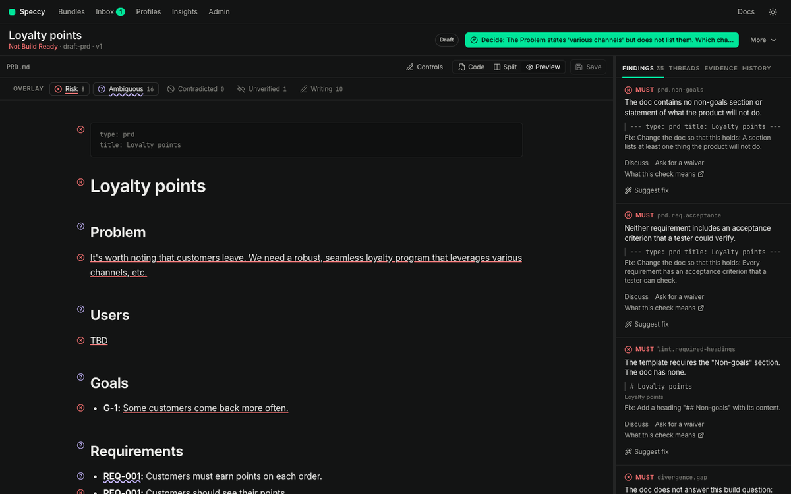

import VerdictInputs from '../../../components/diagrams/VerdictInputs.astro';

This page explains the one answer Speccy gives about a spec doc, and the rules behind it.

A verdict is Build Ready or Not Build Ready. Build Ready means that an implementer can build the thing without asking the author what they meant. Speccy computes the verdict from the findings and the decisions. No person and no model sets it.

<VerdictInputs />

## One verdict for each spec doc

Each spec doc has its own profile, its own review runs and its own verdict. A bundle with a PRD and an SDD has two verdicts. The file tree marks each spec doc with its verdict.

The bundles screen shows one state for each bundle: the worst state of its spec docs. One Not Build Ready spec doc makes the bundle row Not Build Ready. The row says Build Ready only when every spec doc is Build Ready.

## What decides it

Speccy computes the verdict with one pure function. It reads no clock, no file and no model, so the same input always gives the same verdict. The verdict is Build Ready only when all of these hold:

- No MUST finding is open.
- No blocking thread is open on the spec doc.
- The spec doc has the upstream link that its profile requires, or a standalone acknowledgement in its sidecar.

SHOULD findings and INFO findings never change the verdict. A SHOULD finding lowers the score. An INFO finding is a hint.

A thread can become blocking after the run. Speccy applies the thread rule each time it shows the verdict, so the verdict turns Not Build Ready at once. When a person resolves the thread, the result of the run comes back.

The profile sets the level of each check. The [Check catalog](/reference/checks/) lists the level of each built-in check, and [Profiles and size](/concepts/profiles-and-size/) says how a profile changes one.

## What acts on a finding first

Three things act on the findings before the rules run:

- **A waiver** excuses one check in one section. A valid waiver takes its finding out of the verdict. The verdict counts the waivers it used, such as "Build Ready (1 waiver)".
- **An acknowledgement** says that a link or a trace item is absent on purpose. A standalone acknowledgement meets the upstream link rule. A trace acknowledgement closes a coverage gap.
- **A relaxed check** reports at INFO, so it never blocks. A repo in adoption mode lists relaxed checks under `adoption.relaxed` in `.speccy.yaml`. The control row then says how many checks the repo relaxes, such as "Adoption mode: 3 checks relaxed".

Take a slug out of `adoption.relaxed`, and the check reports at its own level again. [Waivers and the sidecar](/concepts/waivers-and-the-sidecar/) explains waivers and acknowledgements. [Adopt a repo](/how-to/adopt-a-repo/) explains adoption mode.

## Lint verdicts and full verdicts

Speccy lints each new version of a spec doc at once. Lint needs no model, so each version gets a verdict. The control row says "Lint checks only" beside a lint verdict.

A full review adds the model stages: rubric, grounding, divergence and coherence. Its verdict counts their findings too. [The review pipeline](/concepts/review-pipeline/) explains each stage.

Speccy also lints the current version again in two cases. A change to the sidecar is the first case, because an approved waiver changes the verdict. A new version of the profile is the second case.

## Carried findings

An edit does not throw away the last full review. When you save a new version, Speccy lints it, and it carries the AI findings of the last full review into the new verdict. A carried finding counts in the verdict of the current version, and the rail lists it.

Speccy carries a finding only while its section has the same text. A finding in a section you changed drops out, because no model read the new text. A finding about the whole doc carries only while the whole doc body stays the same.

The control row names the review the carried findings come from, such as "AI review from v2 · 1 section changed". Run the review again to cover the changed sections. The unchanged sections come from the cache, so they cost nothing.

## A stale verdict

A verdict belongs to one version of one spec doc, read against the versions of its linked docs. When one of those moves on, the verdict reads Stale:

- **The spec doc has a newer version.** The control row says, for example, "This verdict is for version 3. The current version is 4."
- **A linked doc has a newer version than the run read.** Speccy lints the spec doc again at once, so a lint verdict never stays stale for this reason. A full verdict stays stale, so its model results stay on the screen. The control row names the linked doc that changed, such as "Stale · Refunds PRD changed after this review". The name links to that spec doc.
- **The last full review of the current version failed.** The control row says "The last review failed, so this verdict is stale." and gives the cause.

A stale verdict is not a finding. Only a new run replaces it. A builder cannot take the build packet of a stale verdict without the `acknowledged` flag, and nobody can approve a spec doc with a stale verdict.

## The score

The score is the number of passed checks divided by the number of applicable checks, as a whole number from 0 to 100. The score counts a waived check as passed. It leaves out INFO checks, and checks that do not apply, such as a check for a larger size. With no applicable check, the score is 100.

The run report splits the score into six categories: Structure, Clarity, Completeness, Evidence, Precision and Coherence.

The score is for metrics. It never decides the verdict. A spec doc with a score of 95 and one open MUST finding is Not Build Ready.

## Approvals come after the verdict

Approvals change the status of a spec doc, never its verdict. The status is Draft, In review, Approved or Superseded.

- An approval needs a current Build Ready verdict.
- An author cannot approve their own bundle.
- The status becomes Approved when the approvals of the current version reach `approvals.required` in the profile.
- A new version revokes the approvals, and an approved spec doc goes back to In review.
- A `supersedes` link from another bundle makes the status Superseded.

## The verdict outside the app

`speccy review` gives the same verdict in a terminal, and the GitHub Action gives it on a pull request. In advisory mode, a Not Build Ready verdict never fails the job. In blocking mode, `speccy review` exits with code 1. [Keep the verdict in CI](/how-to/keep-the-verdict-in-ci/) shows both.
