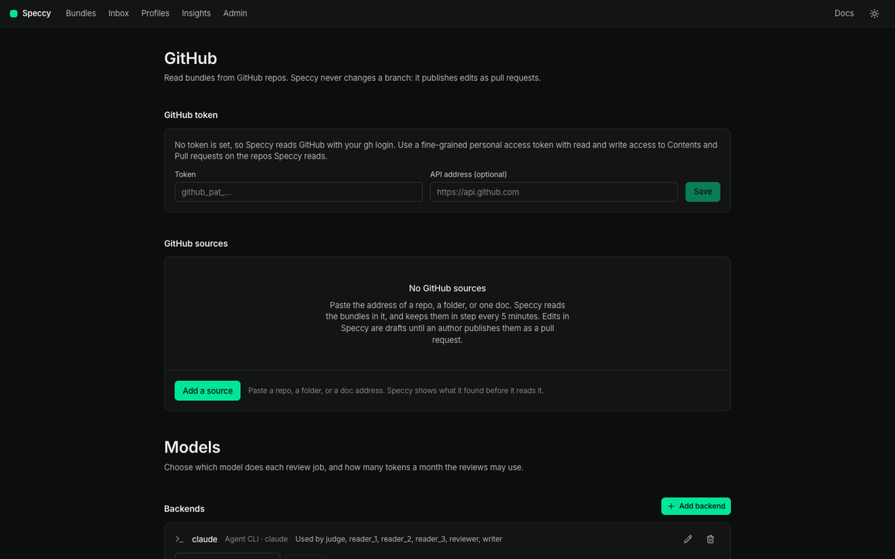

import { Steps, Aside } from '@astrojs/starlight/components';

This guide connects a model to Speccy and assigns it to the review roles. Lint needs no model. The rubric, grounding, divergence and coherence stages each need one.

In local mode, **Admin** is open to you. In hosted mode, only an admin sees it.



## Choose a backend kind

A backend is one model service. Speccy has five kinds.

| Kind | Needs | Notes |
|---|---|---|
| Anthropic | An API key | Claude models. The grounding stage can use its web search. |
| OpenAI | An API key | OpenAI models. The **Base URL** field points it at another server with the same chat completions API. |
| OpenRouter | An API key | Many providers through one key. The grounding stage can use its web plugin. |
| DeepSeek | An API key | DeepSeek models. Speccy asks for the JSON shape in the prompt, because DeepSeek has no schema mode. |
| Agent CLI | A CLI on the machine that runs Speccy | `claude`, `cursor-agent`, `opencode`, `pi`, or your own command. It uses the plan you already pay for. |

Speccy picks no default model. You type the model ID of your provider in each role.

## Add an API backend

<Steps>

1. Open **Admin**. The **Models** part has **Backends**, **Roles**, **MCP connections** and **Monthly token budget**.

2. Under **Backends**, select **Add backend**.

3. Under **Kind**, choose **Anthropic**, **OpenAI**, **OpenRouter** or **DeepSeek**.

4. Type a **Name**, such as `anthropic-main`. With no name, Speccy uses the kind.

5. Paste the **API key**. Speccy encrypts it with the master key and never shows it again. The list shows the last 4 characters.

6. Leave **Base URL (optional)** empty to use the provider's address. Fill it in for a proxy or a compatible server. It must start with `https://` or `http://`.

7. Select **Add**.

</Steps>

To change a key, select the pencil of the backend, paste the new key, and select **Save**. An empty **API key** field keeps the stored key. The kind of a backend cannot change. Add a new backend instead.

## Add an agent CLI backend

An agent CLI runs on the machine that runs Speccy. In local mode, that is your machine, so a CLI that you signed in to works as it is.

<Steps>

1. Under **Backends**, select **Add backend**.

2. Under **Kind**, choose **Agent CLI**.

3. Under **CLI**, choose a preset. Each preset says `installed`, or `not found on PATH`. The line under it shows the command that Speccy runs.

4. Select **Add**.

</Steps>

For each call, Speccy makes a new temporary folder. The folder holds only the bundle files and `prompt.md`. Speccy runs the CLI in that folder, and deletes the folder after the call. Each preset turns off the tools of its CLI, or runs the CLI in a mode that changes no file. Only the `claude` preset gets web tools: `WebSearch` and `WebFetch`, in the grounding stage and in a thread answer.

| Preset | Command | Prompt |
|---|---|---|
| `claude` | `claude -p --output-format json --json-schema {schema} --tools "" --no-session-persistence --strict-mcp-config --model {model}` | stdin |
| `cursor-agent` | `cursor-agent -p --output-format json --mode ask --trust --model {model} <instruction>` | `prompt.md` |
| `opencode` | `opencode run --format json --pure --agent plan -m {model} -f prompt.md -- <instruction>` | `prompt.md` |
| `pi` | `pi -p --mode json --no-tools --no-session --no-context-files --no-extensions --no-skills --model {model}` | stdin |

`<instruction>` is one sentence that tells the CLI to follow `prompt.md` and reply with JSON only.

A CLI that reports no token counts gets an estimate from the length of the text. The test result then says `(estimated)`.

### Your own command

Choose **custom** under **CLI**.

- In **Command, one argument per line**, write the command. Speccy replaces `{model}` with the model of the role, `{schema}` with the JSON schema of the answer, and `{prompt_file}` with `prompt.md`.
- Choose **Prompt on stdin** or **Prompt in prompt.md**.
- The command must print the JSON answer to standard output.

Speccy runs the command from the admin configuration only. A doc cannot change the command.

### Hosted mode and agent CLIs

The hosted image holds only the `speccy` binary. An agent CLI preset there says `not found on PATH`. Use an API backend in hosted mode, or build your own image that adds the CLI and its sign-in.

## Test a backend

Each backend in the list has a **Model to test** field.

<Steps>

1. Type a model ID in **Model to test**.

2. Select **Test**. Speccy sends one short call and checks that the answer is valid JSON.

3. Read the result. `Works: 1.4 s, 212 tokens` means the key and the model work. Otherwise, Speccy shows the error of the provider or the CLI.

</Steps>

The test call counts against the monthly budget. [Budget and model cost](/operations/budget-and-model-cost/) explains the budget.

## Assign the roles

Each role does one kind of work. Under **Roles**, give each role a backend and a model.

| Role | Work |
|---|---|
| `reviewer` | Checks the rubric, finds and labels the claims of the grounding stage, writes the build questions, and reads linked docs for contradictions. Maps trace IDs to the code in a verification run. |
| `reader_1` | Answers the build questions from the doc only. |
| `reader_2` | A second, independent reader. |
| `reader_3` | A third reader. |
| `judge` | Groups the reader answers by meaning. Judges the cited code in a verification run. |
| `writer` | Suggests fixes, summarises the changes between versions, and answers in threads. |

<Steps>

1. In the row of a role, choose the backend.

2. Type the model ID in **Model**.

3. Optional: type the prices in `$ in / M` and `$ out / M`, per million input and output tokens. Speccy uses them only for cost estimates.

4. Select **Save**.

</Steps>

**Clear** removes the assignment of a role. Speccy refuses to delete a backend that a role uses. Assign the role to another backend first.

### Which roles a review needs

- Every model stage needs `reviewer`.
- The divergence stage needs as many readers as the profile asks for in `divergence.readers`. The built-in profiles ask for 3.
- With 2 or more readers, the divergence stage also needs `judge`.
- A suggested fix, a thread answer and a diff summary need `writer`.
- A verification run needs `reviewer` and `judge`.

A review with a missing role does not start. The message names the role:

```text
No model is assigned to the reviewer role. An admin assigns one in Admin → Models.
```

### Reader diversity

The divergence test finds ambiguity where readers read one sentence in different ways. Two calls to one model tend to agree with each other. Give the readers models from different families, such as a Claude model, an OpenAI model and a DeepSeek model.

Speccy compares the backend kind and the model of each reader. When fewer than 2 different models answer, the run report shows `Low reader diversity`. The note never changes the verdict.

A verification run uses the same idea. When the judge finds a contradiction, a second role with a different model confirms it. Speccy tries `reader_1`, `reader_2`, `reader_3` and `reviewer`, in that order.

## Give the grounding stage a search source

The grounding stage checks each factual claim against a source. It uses the first search source it finds:

1. The web search of the backend on the `reviewer` role. Anthropic and OpenRouter backends have one, and so does the `claude` agent CLI preset. OpenAI, DeepSeek and the other presets have none that Speccy can turn on.
2. An MCP connection marked as search.
3. None. Every claim is then unverified, and the run report says so:

```text
No search source is configured, so every claim is unverified. Use a backend with web search, or add an MCP connection marked search.
```

A profile's source policy then decides which of the returned sources count. [Change a profile](/how-to/change-a-profile/) covers the policy.

## Add an MCP connection

An MCP connection gives the review a search tool, or a tool that reads pages on your own hosts, such as an issue tracker.

<Steps>

1. Under **MCP connections**, select **Add connection**.

2. Type a **Name**, such as `Web search`.

3. Choose **HTTP URL** and type the **URL**, or choose **Local command (stdio)** and write the **Command, one argument per line**.

4. Optional: paste a **Secret**. An HTTP connection sends it as a bearer token. A stdio connection gets it in the environment variable you name in **Pass the secret as the environment variable**. Speccy encrypts the secret.

5. Select **Add**.

6. Select **Tools (0 allowed)** in the row of the connection. Speccy connects to the server and lists its tools.

7. Tick each tool that the review may use. Speccy refuses a tool that the server marks as one that changes data.

8. Mark one allowed tool **search** to make the connection a search source.

9. Optional: to read links on your own hosts, type the hosts, such as `company.atlassian.net, linear.app`. Mark one allowed tool **reads a page**.

10. Select **Save tools**.

</Steps>

Speccy puts every tool result in a data block of the prompt. A result is data, and it cannot change the instructions of a step. [Link to an issue, a page or the code](/how-to/link-to-an-issue-a-page-or-the-code/) shows how external links use the hosts.

## Set the models in CLI runs and CI

`speccy review` and `speccy action` use the models of the store they open. With no store, or in CI, set the models in the environment:

```sh
export SPECCY_MODELS="all=anthropic:<model>; reader_2=openai:<model>; reader_3=deepseek:<model>"
export SPECCY_ANTHROPIC_API_KEY=...
export SPECCY_OPENAI_API_KEY=...
export SPECCY_DEEPSEEK_API_KEY=...
speccy review docs/specs
```

`SPECCY_MODELS` takes the API backends only, not an agent CLI. [Configuration](/reference/configuration/) has the format. [Keep the verdict in CI](/how-to/keep-the-verdict-in-ci/) sets the same models through the inputs of the GitHub Action.

<Aside type="caution">
With no model on the `reviewer` role, `speccy review` runs lint only, and it says so. Pass `--stages lint` to ask for lint only on purpose.
</Aside>
