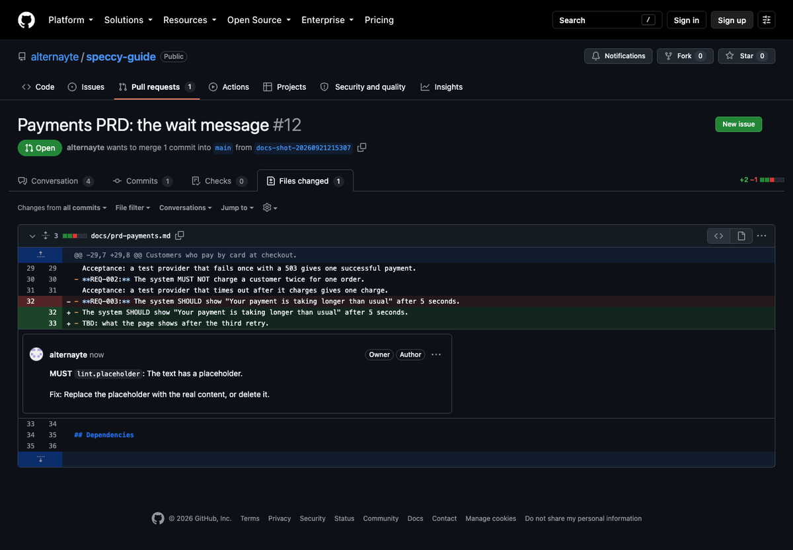
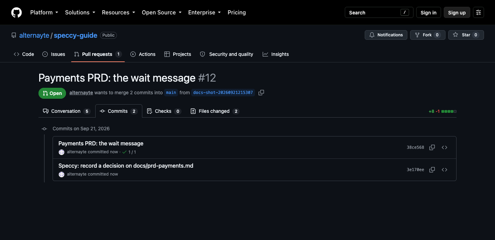

import { Steps, Aside } from '@astrojs/starlight/components';

This guide puts a repo of specs that Speccy did not write under review, in one pull request. Each later pull request then gets a verdict, and your team decides on findings with replies in the pull request.

You need a clone of the repo and the `speccy` binary. The repo needs no Speccy frontmatter.

## Adopt the repo

<Steps>

1. In the root of the clone, run:

   ```sh
   speccy init --github
   ```

2. Read the output. It names what Speccy wrote:

   ```text
   Wrote .speccy.yaml: 2 mappings for 7 docs.
   Adoption mode: 4 checks fail today, so they report as INFO: links.has-upstream, lint.placeholder, …
   A reply of /speccy enforce <slug> in a pull request turns one back on.
   Wrote .github/workflows/speccy.yml. It needs no secret and fails no job. The comment says what the model stages add.
   Added .speccy/state/ to .gitignore. It holds the local database and key.
   Open a pull request with these files. Speccy reviews the specs it changes.
   ```

3. Commit the files on a branch, and open a pull request.
4. Merge the pull request. The repo is now an adopted repo.

</Steps>

`speccy init --github` changes no doc. It writes these files:

- **`.speccy.yaml`**, with the mappings. Speccy guesses a profile for each markdown file from its headings. A folder whose markdown files all guess the same profile gets one glob, such as `docs/*.md`. Any other file gets one mapping of its own. A file that names a type in its frontmatter needs no mapping.
- **`adoption.relaxed`** in `.speccy.yaml`. Speccy runs the lint checks on every spec doc of the repo. Each check that reports a MUST or a SHOULD finding on at least one doc goes into this list.
- **`.github/workflows/speccy.yml`**, the workflow. If the file exists, Speccy leaves it as it is.
- **`.speccy/state/`** in `.gitignore`, when the line is not there yet.

The scan passes over hidden folders, `node_modules`, and files such as `README.md` and `CHANGELOG.md`. If no file without a type reads like a spec, the command says so and writes nothing.

<Aside type="caution">
`speccy init --github` writes a new `.speccy.yaml` over the old one. If your repo has a `.speccy.yaml`, commit it first, and merge your old keys back in after the run.
</Aside>

A `.speccy.yaml` after the run looks like this:

```yaml speccy-config
map:
  - glob: "docs/*.md"
    profile: prd
  - glob: "design/payments.md"
    profile: sdd

adoption:
  relaxed:
    - links.has-upstream
    - lint.placeholder
```

[`.speccy.yaml`](/reference/speccy-yaml/) lists every key.

## Adoption mode

A repo that nobody wrote for Speccy fails many checks on day one. Adoption mode makes the first verdict useful: each check in `adoption.relaxed` reports at INFO instead of its own level. An INFO finding never makes a doc Not Build Ready. So the first verdict names only the checks your team has opted into.

A profile setting of `off` for a check stays off. The summary comment on each pull request gives the count of relaxed checks, such as `Adoption mode: 4 checks relaxed.`

`speccy init --github` runs the lint checks only. So it relaxes lint checks only. You can add any check slug to the list by hand.

## The workflow

This is the file that `speccy init --github` writes:

```yaml workflow
# Speccy reviews the specs that a pull request changes (SDD §12.4).
name: Speccy
on:
  pull_request:
    paths: ["**/*.md", ".speccy.yaml"]
permissions:
  contents: write        # commit a decision that a reply asked for
  pull-requests: write   # the summary and inline comments
  checks: write          # one check per bundle
jobs:
  review:
    runs-on: ubuntu-latest
    steps:
      - uses: actions/checkout@v4
      - uses: alternayte/speccy@v0.1.0
        # Lint checks only. For the model stages, set a key and pass it here:
        # with:
        #   models: all=anthropic:<model>
        #   anthropic-api-key: ${{ secrets.ANTHROPIC_API_KEY }}
```

The file pins the Action at `v0.1.0`. Change the tag to the release you run, such as `alternayte/speccy@v0.18.0`.

With no model and no key, the Action runs the lint checks only. The check of each bundle then says `Lint checks only.` [Keep the verdict in CI](/how-to/keep-the-verdict-in-ci/) adds the models, blocking enforcement, and connected mode.

| Permission | Why the Action needs it |
|---|---|
| `contents: write` | It commits the sidecar entry that a reply asks for, and the `.speccy.yaml` change that `/speccy enforce` asks for. |
| `pull-requests: write` | It posts the summary comment and the inline comments, and it resolves them. |
| `checks: write` | It sets one check per bundle, named `speccy: <bundle slug>`. |

## What a pull request gets

The Action reviews each bundle that the pull request changes. It posts one summary comment, and it updates that same comment on each push.


The summary comment holds:

- A table with the verdict, the score, and the MUST and SHOULD counts of each bundle. The bundle name links to its full report, or to the run that holds the report.
- The adoption mode line, when `adoption.relaxed` holds a check of the profile.
- Each decision that a reply asked for, and the commit that recorded it.
- The relaxed checks that now pass everywhere, with the reply that turns each one back on.
- For each bundle, a collapsed list of the findings with no inline comment: MUST findings off the changed lines, and findings above the limit.
- `Advisory mode: the verdict does not fail the check.`, in advisory mode.

A push that changes no bundle posts no new comment. If a summary comment exists, it changes to `This pull request changes no bundle.`

### Inline comments

The Action comments inline on the lines that the pull request changed. It comments on each MUST finding there, and on each finding that has a certain fix. Each comment gives the level, the check, and the message, and the fix when the check has one.



A certain fix comes as a suggestion block that you commit with one click. Speccy suggests a fix in three cases only:

- `must`, `should` or `may` in lower case, where the check `lint.rfc2119-case` wants capitals.
- A broken relative link, when exactly one file in the bundle has the name that the link points at.
- A trace ID for an item that has none, when the profile's trace ID check failed.

No model writes a suggestion.

Each bundle gets at most 15 inline comments. Set `pr.inline_limit` in `.speccy.yaml` to change the limit. The findings above the limit go into the summary comment. A waived finding gets no inline comment.

On each push, the Action resolves its own comments whose findings are gone. It never posts a second copy of a comment that is still open.

### The check of each bundle

Each bundle gets one check, `speccy: <bundle slug>`. Its title is the verdict. In advisory mode, a Not Build Ready bundle gets a neutral check, and the job passes. In blocking mode, the check fails, and so does the job.

## Decide in the pull request

Reply to a Speccy inline comment to settle the finding it points at:

```text
/speccy waive The provider sets this limit, and the design cannot change it.
```

```text
/speccy ack REQ-003 The checkout page shows this message.
```

<Steps>

1. Reply to the Speccy comment with the command and a reason of 20 characters or more.
2. Push to the branch, or run the job again. The workflow runs on `pull_request` events, so a reply alone does not start it.
3. The Action writes the entry into the sidecar of the doc, `.speccy/decisions/<doc path>.yaml`. It commits the sidecar to the branch of the pull request, and resolves the comment.

</Steps>




The doc itself does not change. [Reply commands](/reference/reply-commands/) lists each command, where it goes, and why the Action refuses one.

While a waiver is in the branch and not in the base branch, the waiver counts in the verdict. The summary comment then gives both verdicts:

```text
`docs/prd-payments`: Build Ready. 1 waiver in this pull request is not merged yet. Without them: Not Build Ready.
```

The check title says the same: `Build Ready with 1 waiver that this pull request has not merged`.

### Who approves a decision

Speccy approves nothing on its own. It does not check who wrote a reply. Any person who can comment on the pull request can ask for a decision, and Speccy records their login in the sidecar.

The decision takes effect only when the pull request merges. So your branch protection and your CODEOWNERS file decide who may approve it. The sidecars sit under `.speccy/decisions/` at the root of the repo, next to `.speccy.yaml`. Name owners for both:

```text
# .github/CODEOWNERS
/.speccy/decisions/ @acme/spec-maintainers
/.speccy.yaml       @acme/spec-maintainers
```

A pull request from a fork gives the Action no write token. The Action then commits nothing. The summary comment prints the sidecar text for the author to put in their branch.

## Leave adoption mode

A relaxed check stays relaxed until a maintainer turns it back on. Nothing turns on by itself.

On each run, Speccy lints every spec doc of the repo, including the docs that the pull request did not change. The summary comment offers each relaxed check that now passes on every doc:

```text
These relaxed checks now pass on every mapped doc. Reply to turn one back on:

/speccy enforce links.has-upstream
```

<Steps>

1. Write `/speccy enforce <slug>` as a comment in the conversation of the pull request, on a line of its own.
2. Push, or run the job again.
3. The Action removes the slug from `adoption.relaxed` and commits `.speccy.yaml` to the branch, with the message `Speccy: enforce <slug>`.
4. The summary comment names the change, such as ``@kim turned `links.has-upstream` back on. It counts from the next review.``

</Steps>

You can turn back on any relaxed check this way, not only one that the comment offers. You can also delete the slug from `.speccy.yaml` yourself.

In connected mode, the summary comment offers no check, because the lint pass over the whole repo runs only in standalone mode. The `/speccy enforce` reply still works.

## Next steps

- [Reply commands](/reference/reply-commands/) lists each reply and each reason for a refusal.
- [Keep the verdict in CI](/how-to/keep-the-verdict-in-ci/) adds models, blocking enforcement, and connected mode.
- [Review docs you already have](/how-to/review-docs-you-already-have/) reads the repo from Speccy, with no commit to it.
- [Waivers and the sidecar](/concepts/waivers-and-the-sidecar/) explains what a waiver covers and when it ends.
