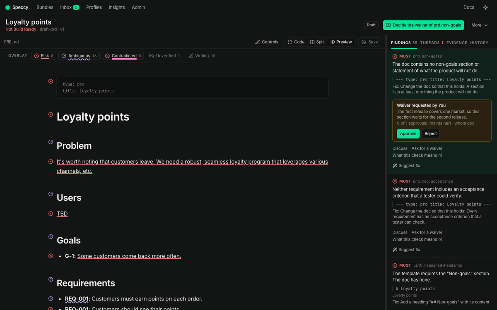

import { Steps, Aside } from '@astrojs/starlight/components';

This guide shows you how to ask for a waiver, how to approve or reject one, and what to do when a waiver ends.

A waiver is an approved exception for one check in one section, with a reason. An approved waiver stops the finding from counting in the verdict. Speccy writes it to the sidecar of the doc, and the doc text does not change.

## Before you start

- The finding is a MUST or a SHOULD. An INFO finding never changes the verdict, so it takes no waiver.
- The finding is not a coverage gap. A `trace.coverage` finding takes an answer instead. [Close a coverage gap](/how-to/close-a-coverage-gap/) shows the three answers.
- In hosted mode, you are a member of the workspace. A person in reviewer mode sees no findings and asks for no waiver.

## Ask for a waiver

<Steps>

1. Open the spec doc, and open the **Findings** tab of the rail.

2. Under the finding, click **Ask for a waiver**. The dialog names the check and the section.

3. Write the reason: why this check does not apply here. The reason needs at least 20 characters, so an approver can judge it.

4. Click **Ask**.

</Steps>

The tour offers the same request. On a finding point, click **Ask for a waiver**, or press `w`. Write the reason under **Reason for the waiver**, and click **Ask for the waiver**. The tour shows only the MUST findings that need a decision, such as a divergence or a contradiction.

A waiver covers the section of the finding. A check with `scope: doc` in the profile reads the whole doc, so its waiver covers the whole doc, and the card reads "whole doc".

## Who approves

The profile's waiver policy decides who approves. `waivers.should` names the policy for a SHOULD finding, and `waivers.must` for a MUST finding. A check can carry its own `waiver`, which wins.

| Policy | Who approves |
|---|---|
| `any_member` | Any member, the author too. |
| `non_author` | One member who is not an author of the bundle. |
| `n_approvals: N` | N different members who are not authors of the bundle. |
| `maintainer` | A maintainer of the profile, or an admin. |
| `forbidden` | Nobody. Speccy refuses the request, and you fix the doc. |

The built-in PRD and SDD profiles use `non_author` for a SHOULD and `maintainer` for a MUST. [Change a profile](/how-to/change-a-profile/#change-who-approves-a-waiver) shows how to change them.

In local mode, you are the only person, and you have every role. You approve your own request in the same way.

## Approve or reject a request

An approver meets a request in four places:

- The **Inbox** holds a **Waiver request** item, with the check and the reason. A click opens the bundle on the finding.
- The next action in the control row reads "Decide the waiver of" and the check.
- The tour holds a point: "Approve or reject the waiver of" the check, in its section.
- The findings rail puts the finding with the request at the top, with the request card under it.



<Steps>

1. Read the card. It shows the reason, the approvals so far against the policy, and the section. **Decided on this section** lists the waivers that people decided on the same section before.

2. Read the section in the preview. The reason alone does not support a decision.

3. Click **Approve**. Or click **Reject**, write a decision reason of at least 20 characters, and click **Reject** again. In the tour, the second control reads **Reject the waiver**.

4. When other requests wait for you on this bundle, click **Next waiver** under the card. The rail moves to the next request, and the control counts the requests that are left.

</Steps>

A decision reason tells the author what to change instead. An approval takes no reason: the request reason is the record.

When the policy cannot let you decide, the card says which role decides it. An author cannot approve a waiver of their own bundle under `non_author` or `n_approvals`.

## What happens

**On approval.** When the approvals reach the policy, Speccy writes the waiver to the sidecar, `.speccy/decisions/<doc path>.yaml`. The finding reads **Waived**, and it no longer counts in the verdict. The verdict counts the waivers it applied. With `n_approvals`, each approval before the last one only adds to the count.

```yaml sidecar
waivers:
  - check: lint.sentence-length
    section: [Payment retries, Limits]
    reason: The retry table quotes the card network rule word for word.
    section_hash: sha256:3f1c9a7e2b8d4f60a1e5c7b9d2f4a6c8e0b1d3f5a7c9e1b3d5f7a9c1e3b5d7f9
    requested_by: priya
```

For a folder that Speccy serves, the sidecar sits under the root of the folder, where git sees it. For a doc in a GitHub source, the approval writes the sidecar into a pull request.

**On rejection.** The request reads **Rejected**, with the decision reason. The person who asked gets a **Waiver rejected** item in their inbox, with the reason.

## When a waiver ends

A waiver holds only while its section stays the same. Speccy records a hash of the section's own text with the request. Any edit of that text ends the waiver, and the check counts again. A waiver of the whole doc ends on any edit of the doc body.

<Steps>

1. Look under **Waivers** at the end of the findings rail. The ended waiver carries the status **ended**. It names the section that someone edited after the approval, and it asks you to run the review again.

2. Run the review again, so the check reads the new text. Lint checks read it on the save already.

3. When the finding is still there, click **Ask for it again**. The dialog opens with the old reason in the field. Change it or keep it, and click **Ask**.

</Steps>

The authors of the bundle get a **Waiver ended** item in their inbox, because an edit often ends a waiver without the author seeing it. The old entry stays in the sidecar until a later approval replaces it. Speccy ignores it, because its hash no longer matches the section.

<Aside type="caution">
A section that changes between the request and the approval makes the approval fail. Speccy says the waiver no longer fits the section. Ask for a new waiver on the new text.
</Aside>

## Related

- [Waivers and the sidecar](/concepts/waivers-and-the-sidecar/): why a waiver lives beside the doc and not in it.
- [Sidecar format](/reference/sidecar/): every key of the sidecar.
- [Reply commands](/reference/reply-commands/): `/speccy waive` asks for a waiver in a pull request.
- [Close a coverage gap](/how-to/close-a-coverage-gap/): the acknowledgement, which uses the same approval.
