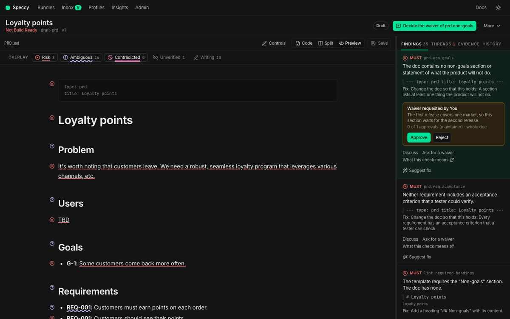

import { Steps, Aside } from '@astrojs/starlight/components';

This guide shows you how to ask for a waiver, how to approve or reject one, and what to do when a waiver ends.

A waiver is an approved exception for one check in one section, with a reason. An approved waiver stops the finding from counting in the verdict. Speccy writes it to the sidecar of the doc, and the doc text does not change.

## Before you start

- The finding is a MUST or a SHOULD. An INFO finding never changes the verdict, so it takes no waiver.
- The finding is not a coverage gap. A `trace.coverage` finding takes an answer instead. [Close a coverage gap](/how-to/close-a-coverage-gap/) shows the three answers.
- In hosted mode, you are a member of the workspace. A person in reviewer mode sees no findings and asks for no waiver.

## Ask for a waiver

<Steps>

1. Open the spec doc, and open the **Findings** tab of the rail.

2. Under the finding, click **Ask for a waiver**. The dialog names the check and the section.

3. Write the reason: why this check does not apply here. The reason needs at least 20 characters, so an approver can judge it.

4. Click **Ask**.

</Steps>

The tour offers the same request. On a finding point, click **Ask for a waiver**, or press `w`. Write the reason under **Reason for the waiver**, and click **Ask for the waiver**. The tour shows only the MUST findings that need a decision, such as a divergence or a contradiction.

A waiver is for one check in one section. A failed rubric check can give several findings, one for each shortfall, and one waiver covers all of them there. What the waiver binds to depends on the check:

- A rubric check that names a section in the profile: that section with its subsections.
- A lint rule, or a check with `scope: section`: the section of the finding.
- A whole-doc check, which is a rubric check with no section: the check itself. The card reads "whole doc".
- A check of another stage that reads the whole doc, such as `links.has-upstream`: the whole doc text. The card reads "whole doc".
- `coherence.contradiction`: the section of the finding and the one conflict it names. A new conflict in the same section needs its own waiver. A later review that finds the same conflict keeps its quotes, so the waiver still covers it.

### Ask from the terminal

`speccy waive` asks for a waiver without the app. It uses the state of the folder, as the app does. When the app runs, the command sends its calls to the app.

<Steps>

1. Review the doc, and find the `id` of the finding in the JSON output:

   ```sh
   speccy review docs/sdd-payments.md --format json
   ```

   Each bundle in the output also has its `doc_id` and its `bundle_id`.

2. Ask for the waiver, with the reason:

   ```sh
   speccy waive docs/sdd-payments.md 01a110a2-3aeb-719a-b706-5d03631f85a4 --reason "The card network sets this limit, and we cannot change it."
   ```

3. To approve it in the same step, add `--approve`. The profile's waiver policy applies, as in the app.

4. List the waivers of the doc and their status:

   ```sh
   speccy waivers list docs/sdd-payments.md
   ```

</Steps>

A coding agent uses the MCP tools `request_waiver`, `approve_waiver` and `list_waivers`. The reason comes from you. The agent asks you for it, and it approves only when you tell it to.

## Answer a conflict that only the linked doc can fix

A `coherence.contradiction` finding is a conflict with a doc that this doc links to. When this doc is right, a waiver is the wrong answer: the conflict is not acceptable. Answer that the linked doc must change.

<Steps>

1. Under the conflict, click **The linked doc must change**.

2. Write the reason: why the linked doc is wrong. The author of the linked doc reads it. The reason needs at least 20 characters.

3. Click **Ask**. The request waits for approval under the waiver policy of `coherence.contradiction`, as a waiver does.

</Steps>

After the approval, the finding reads **Waiting on** and the name of the linked doc. It does not block the verdict. The sidecar holds the request under `upstream_changes`. The linked doc gets the MUST finding `coherence.downstream-request`, which quotes both docs and gives your reason.

The author of the linked doc answers in one of three ways:

- An edit of the linked doc that removes its quote. The next reviews close the conflict on both docs.
- **Ask for a waiver** on the `coherence.downstream-request` finding. The waiver says the conflict is acceptable, and it closes the conflict on both docs.
- **The downstream doc must change** on the `coherence.downstream-request` finding, with a reason. After approval, the conflict blocks your doc again, and your finding shows that reason. Then edit your doc, or ask for a waiver. A second upstream request of the same conflict is not possible.

From the terminal, add `--upstream-change` or `--send-back` to `speccy waive`:

```sh
speccy waive docs/sdd-payments.md 01a110a2-3aeb-719a-b706-5d03631f85a4 --upstream-change --reason "The shipped worker pays within 10 days, and support agreed."
```

The MCP tool `request_waiver` takes `upstream_change` or `send_back` in the same way.

To keep a conflict blocking until the linked doc changes, set `coherence.upstream_pending: block` in the profile. [Upstream requests and send-backs](/concepts/waivers-and-the-sidecar/#upstream-requests-and-send-backs) explains the flow.

## Who approves

The profile's waiver policy decides who approves. `waivers.should` names the policy for a SHOULD finding, and `waivers.must` for a MUST finding. A check can carry its own `waiver`, which wins.

| Policy | Who approves |
|---|---|
| `any_member` | Any member, the author too. |
| `non_author` | One member who is not an author of the bundle. |
| `n_approvals: N` | N different members who are not authors of the bundle. |
| `maintainer` | A maintainer of the profile, or an admin. |
| `forbidden` | Nobody. Speccy refuses the request, and you fix the doc. |

The built-in PRD and SDD profiles use `non_author` for a SHOULD and `maintainer` for a MUST. [Change a profile](/how-to/change-a-profile/#change-who-approves-a-waiver) shows how to change them.

In local mode, you are the only person, and you have every role. You approve your own request in the same way.

## Approve or reject a request

An approver meets a request in four places:

- The **Inbox** holds a **Waiver request** item, with the check and the reason. A click opens the bundle on the finding.
- The next action in the control row reads "Decide the waiver of" and the check. For an acknowledgement it reads "Decide the acknowledgement of" and the trace ID, or "Decide the standalone acknowledgement".
- The tour holds a point: "Approve or reject the waiver of" the check, in its section.
- The findings rail puts the finding with the request at the top, with the request card under it.



<Steps>

1. Read the card. It shows the reason, the approvals so far against the policy, and the section. **Decided on this section** lists the waivers that people decided on the same section before.

2. Read the section in the preview. The reason alone does not support a decision.

3. Click **Approve**. Or click **Reject**, write a decision reason of at least 20 characters, and click **Reject** again. In the tour, the second control reads **Reject the waiver**.

4. When other requests wait for you on this bundle, click **Next waiver** under the card. The rail moves to the next request, and the control counts the requests that are left.

</Steps>

A decision reason tells the author what to change instead. An approval takes no reason: the request reason is the record.

When the policy cannot let you decide, the card says which role decides it. An author cannot approve a waiver of their own bundle under `non_author` or `n_approvals`.

## What happens

**On approval.** When the approvals reach the policy, Speccy writes the waiver to the sidecar, `.speccy/decisions/<doc path>.yaml`. The finding reads **Waived**, and it no longer counts in the verdict. The verdict counts the waivers it applied. With `n_approvals`, each approval before the last one only adds to the count.

```yaml sidecar
waivers:
  - check: lint.sentence-length
    section: [Payment retries, Limits]
    reason: The retry table quotes the card network rule word for word.
    section_hash: sha256:3f1c9a7e2b8d4f60a1e5c7b9d2f4a6c8e0b1d3f5a7c9e1b3d5f7a9c1e3b5d7f9
    requested_by: priya
```

For a folder that Speccy serves, the sidecar sits under the root of the folder, where git sees it. For a doc in a GitHub source, the approval writes the sidecar into a pull request.

**When an approver rejects it.** The request reads **Rejected**, with the decision reason. The person who asked gets a **Waiver rejected** item in their inbox, with the reason.

## When a waiver ends

A waiver of a section holds only while that section stays the same. Speccy records a hash of the section's text with the request. Any edit of that text ends the waiver, and the check counts again. For a check that names a section, the text includes the subsections.

A waiver of a whole-doc check does not end on an edit. It ends in two cases:

- A full review passes the check, so nothing is left to excuse. When a later review fails the check again, the waiver becomes approved again. You do not ask again.
- The profile changes the `question` or the `pass_when` of the check.

A waiver of `links.has-upstream`, or of another check that reads the whole doc outside the rubric stage, ends on any edit of the doc body.

<Steps>

1. Look under **Waivers** at the end of the findings rail. The ended waiver carries the status **ended**, and it says why it ended. For a changed section, it names the section that someone edited after the approval, and it asks you to run the review again.

2. Run the review again, so the check reads the new text. Lint checks read it on the save already.

3. When the finding is still there, click **Ask for it again**. The dialog opens with the old reason in the field. Change it or keep it, and click **Ask**.

</Steps>

The authors of the bundle get a **Waiver ended** item in their inbox, because an edit often ends a waiver without the author seeing it. The old entry stays in the sidecar until a later approval replaces it. Speccy ignores it while its hash does not match the section or the check.

<Aside type="caution">
A section that changes between the request and the approval makes the approval fail. Speccy says the waiver no longer fits the section. Ask for a new waiver on the new text. For a whole-doc check, the approval fails when the profile changed the check after the request.
</Aside>

## Related

- [Waivers and the sidecar](/concepts/waivers-and-the-sidecar/): why a waiver lives beside the doc and not in it.
- [Sidecar format](/reference/sidecar/): every key of the sidecar.
- [Reply commands](/reference/reply-commands/): `/speccy waive` asks for a waiver in a pull request.
- [Close a coverage gap](/how-to/close-a-coverage-gap/): the acknowledgement, which uses the same approval.
