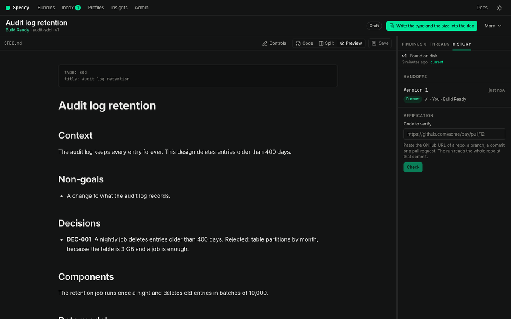

import { Steps, Aside, Tabs, TabItem, FileTree } from '@astrojs/starlight/components';

This guide shows you how to give a coding agent the build packet of a spec doc, and how to read its build reports.

A handoff is one record that a builder took the build packet of one version of a bundle. Speccy records the version and the verdict at that moment. Speccy never runs the build. The agent builds, and Speccy keeps the record.

## What the build packet holds

- The spec doc and every asset of the bundle, at the current version.
- The spec doc of each bundle that this one links to, such as the PRD that an SDD implements.
- Each external link, with its kind and its URL. A code target also carries the commit that the last run read.
- The trace IDs that the doc defines, in document order.
- The build questions of the newest full review, with the answer that the readers agreed on. A question that the readers read differently, or that the doc does not answer, carries no answer.
- `HANDOFF.md`, the re-entry prompt.

The packet holds no findings and no review report. They describe the quality of the doc, and a builder builds from the doc itself.

## Take the build packet

The verdict must be Build Ready, and it must belong to the current version. Otherwise Speccy refuses the packet and says why: no review, a stale verdict, or the count of MUST findings to fix.

<Tabs>
<TabItem label="MCP">

Ask the agent to call `handoff_bundle` with the bundle's slug or ID. The tool returns the packet inline, with `HANDOFF.md` as text.

`label` names the work, such as a repo, a branch or a ticket. `acknowledged: true` takes the packet from a bundle that is not Build Ready.

</TabItem>
<TabItem label="CLI">

Run the command in the folder that Speccy serves:

```sh
speccy handoff docs/specs/refunds --out ./packet --label acme/payments
```

Speccy writes the packet as a folder, and it prints the path of `HANDOFF.md`. With no `--out`, the folder is `handoff`. `--acknowledged` takes the packet from a bundle that is not Build Ready.

<FileTree>

- packet/
  - SDD.md the spec doc
  - assets/
    - refund-states.svg
  - links/
    - PRD.md the spec doc of a linked bundle
  - HANDOFF.md the re-entry prompt

</FileTree>

The command uses `.speccy/state/`, the store that the app keeps beside your docs, and it records the handoff there. In a folder with no `.speccy/state/`, the command uses a temporary store, and the record does not stay.

</TabItem>
</Tabs>

The web app has no control that takes a packet. On a Build Ready doc with no handoff, the next action reads **Hand it to a builder**. It opens the **History** tab of the rail, which lists the handoffs.

<Aside type="caution">
A handoff with `acknowledged` records the verdict at that moment, and **History** marks it "(override)". Use it for a deliberate spike, not to skip the review.
</Aside>

## Set up the MCP server

<Tabs>
<TabItem label="Local mode">

Add Speccy as an MCP server that runs `speccy mcp` in the folder with your docs. In Claude Code:

```sh
claude mcp add speccy -- speccy mcp
```

`speccy mcp` serves the tools over stdio, as the local user. It uses `.speccy/state/`, so the app, the CLI and the agent share the same reviews, threads and handoffs.

</TabItem>
<TabItem label="Hosted mode">

The same tools are at `/mcp` on the server, over streamable HTTP.

<Steps>

1. Open **Account**. Under **API tokens**, name a token and click **Make a token**.

2. Copy the token. Speccy shows it one time.

3. Add the server to the agent, with the token as a bearer token. In Claude Code:

   ```sh
   claude mcp add --transport http speccy https://speccy.example.com/mcp --header "Authorization: Bearer <token>"
   ```

</Steps>

A tool can do what the owner of the token can do in the app, and nothing more.

</TabItem>
</Tabs>

[MCP tools](/reference/mcp-tools/) lists each tool and its input.

## What the re-entry prompt says

`HANDOFF.md` is the file an agent reads first, and again after it loses its context. It has five parts:

- **Read**: the spec doc, its assets, the linked docs and the external links.
- **Answers**: each build question with its agreed answer. A question with no agreed answer says to ask the author first.
- **Work**: one unchecked line for each trace ID of the doc. A doc with no trace IDs asks the agent to write the list itself.
- **If you get stuck**: the handoff ID, and how to send a build report.
- **Done when**: every line ticked, and the project's own checks pass.

The agent owns the file after the handoff, and it ticks the lines as it works. Speccy never reads it back.

## Read the build reports

A build report is what the agent tells Speccy about the doc. It names the handoff ID from the packet. It also names a section heading path or a trace ID, so the question lands on that text.

- **Blocked report**: the agent cannot build a section without an answer. Speccy opens a blocking thread, and the bundle is Not Build Ready until a person resolves it.
- **Note**: the agent built something, but the doc was unclear. Speccy opens an ordinary thread. A note changes no verdict.

The agent sends a report with the MCP tool `report_build`. A builder with no MCP connection uses the CLI:

```sh
speccy report docs/specs/refunds --handoff 3f0c2a8e-5b1d-4c7a-9e2f-6a4b8d1c0e97 --blocked --section "Refunds › Data model" --text "Which currency does a partial refund use?"
```

`--section` takes the heading path, with `›` between the headings. `--trace-id REQ-012` names a trace ID instead. With neither, the thread anchors to the doc. Without `--blocked`, the report is a note.

<Steps>

1. Open the **Threads** tab of the rail. The thread title names the kind of report, and the section or the trace ID it is about. A chip shows the version that the builder took.

2. Answer in the thread. Change the doc when the answer belongs in it.

3. Click **Resolve**. A resolved blocking thread no longer blocks, and the verdict returns to what the review found.

</Steps>

A report against a stale handoff never blocks. The doc changed after the builder took the packet, so the answer can be in the doc already. Speccy opens the report as a note, and the thread says so.

## What happens

**History** lists each handoff, newest first: the label or the version, who took it, and the verdict at that moment. A handoff reads **Current** until the bundle gets a new version. It then reads **Stale**, and it names the version the bundle is at now. That tells an author that an edit landed after someone started to build.



**Insights** shows the false-ready rate of each profile under **False ready**. It is the share of the handoffs taken at Build Ready that came back with a blocked report. A handoff taken with `acknowledged` does not count. **Sections that blocked a builder** lists the sections that the blocked reports name, most frequent first. A high rate means the profile passes docs that a builder cannot build from.

## Related

- [Verify a build](/how-to/verify-a-build/): check the code that the agent wrote against the doc.
- [Handoffs and build reports](/concepts/handoffs-and-build-reports/).
- [MCP tools](/reference/mcp-tools/) and [CLI](/reference/cli/).
