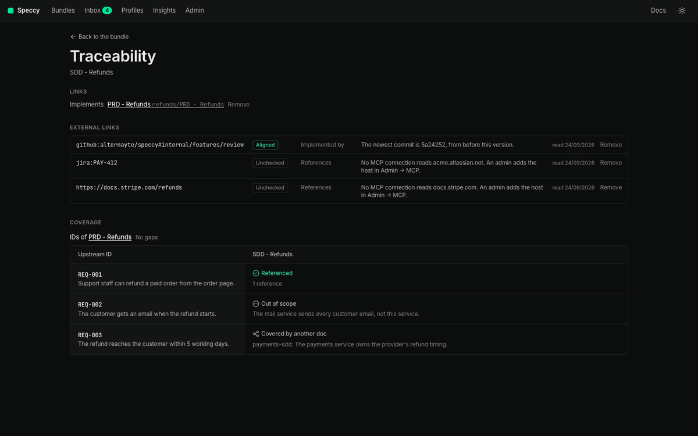

import { Steps, Aside } from '@astrojs/starlight/components';

This guide shows you how to link a spec doc to an issue, a page or the code, and how to read the result.

An external link names an artifact outside Speccy: an issue, a page, a repo path or a commit. It sits in the same `links:` list of the frontmatter as a link to another bundle. The target carries a scheme that says which system holds it.

## Write the target

| Target | Example | What it names |
|---|---|---|
| `github:owner/repo` | `github:acme/payments` | A whole repo. |
| `github:owner/repo#path` | `github:acme/payments#internal/pay` | A folder or a file in a repo. |
| `github:owner/repo@commit#path` | `github:acme/payments@4f2a9c1#internal/pay` | A path at one commit. |
| `github:owner/repo@commit` | `github:acme/payments@4f2a9c1` | One commit. |
| `<scheme>:<key>` | `jira:PAY-412` | A key that a pattern in `.speccy.yaml` turns into a URL. |
| A full URL | `https://company.atlassian.net/wiki/spaces/ENG/pages/4210` | Any `http` or `https` page. |

A commit is 7 to 40 hexadecimal characters. The `github` scheme and a full URL need no pattern.

The link kind says how the doc relates to the target. `implemented-by` names the code that builds this doc. `implements`, `refines`, `references` and `supersedes` also take an external target.

## Add the link

<Steps>

1. Add the link to the `links:` list in the frontmatter of the spec doc:

   ```yaml frontmatter
   type: sdd
   title: Refunds
   links:
     - kind: implemented-by
       target: github:acme/payments#internal/pay
     - kind: references
       target: jira:PAY-412
     - kind: references
       target: https://company.atlassian.net/wiki/spaces/ENG/pages/4210
   ```

2. For a short key, such as `jira:PAY-412`, add a pattern for the scheme to `.speccy.yaml` at the root of the folder. `{key}` stands for the part after the colon:

   ```yaml speccy-config
   link_patterns:
     jira: https://company.atlassian.net/browse/{key}
   ```

   A pattern is an `http` or `https` URL that holds `{key}`. It cannot replace the `github` scheme.

3. Save the doc. Lint runs on the new version. A target that does not parse fails [`links.external-target`](/reference/checks/#links.external-target), a MUST check. The finding says what to write instead.

4. Choose **More → Traceability**. The **External links** table lists each link with its state, its kind and the reason for the state.

</Steps>

Speccy reads `link_patterns` from the `.speccy.yaml` of the folder it serves. A server in hosted mode serves no folder, so there you write the full URL.

## Read the state

Each row of **External links** has one of four states.

| State | What it means | What you do |
|---|---|---|
| **Aligned** | Speccy read the target, and it agrees with the doc. | Nothing. |
| **Drifted** | The code at the target changed after this version of the doc. | Read the commit. Verify the build at it, then change the doc, or waive the drift with a reason. |
| **Conflicting** | The issue or the page states something that the doc contradicts. | Decide which of the two is right, and change that one. |
| **Unchecked** | No credential and no MCP connection reads the target. | Add a connection for the host, or leave it. An unchecked link fails no check. |

Speccy reads the targets in two ways.

**Code.** Speccy reads an `implemented-by` link with a `github:` target. It asks GitHub for the newest commit that touched the path. Local mode uses your `gh` login, or the token in **Admin**, under **GitHub**. Hosted mode uses the token of the source. A repo that the credential cannot read stays unchecked. A target that names one commit never moves, so it reads aligned.

**An issue or a page.** Speccy reads any other target through an MCP connection whose hosts include the host of the URL. A full review reads it, and the model compares it with the doc. A `github:` link of another kind stays unchecked.

Drift and conflict are SHOULD checks: [`links.code-drift`](/reference/checks/#links.code-drift) and [`coherence.external`](/reference/checks/#coherence.external). Neither one blocks Build Ready. Speccy checks drift on every save, because drift needs no model. It checks a conflict only in a full review.



### Clear a drift

<Steps>

1. Open the `links.code-drift` finding in the findings rail. It names the newest commit and its date.

2. Click **Verify at** and the short commit. The **Verification** panel on the **History** tab opens with that commit. [Verify a build](/how-to/verify-a-build/) goes on from there.

3. Change the doc where the code shows it is wrong, and save. Drift compares the code with the date of the doc version, so a new version clears the drift. To keep the doc as it is, ask for a waiver of the finding with a reason.

</Steps>

A new review run on the same version does not clear a drift. A version is the record of a person who read the doc.

## Connect another host through MCP

Speccy stores no tracker password, and it calls no tracker API of its own. It reads an issue or a page through an MCP connection that an admin adds.

<Steps>

1. Open **Admin**. Under **MCP connections**, click **Add connection**.

2. Enter a **Name**. Pick **HTTP URL** and enter the **URL**, or pick **Local command (stdio)** and enter the command, one argument per line. Enter a **Secret (optional)** when the server needs one. Click **Add**.

3. On the new row, click **Tools (0 allowed)**. Speccy connects to the server and lists its tools.

4. Tick the read-only tools that the review may use. Speccy refuses a tool that the server marks as one that changes data.

5. Mark one allowed tool **reads a page**.

6. In the hosts field, enter the hosts that this connection reads, separated by commas, such as `company.atlassian.net, linear.app`.

7. Click **Save tools**.

</Steps>

Speccy picks the connection by the host of the URL, and it calls the tool marked **reads a page**. No model picks the connection or the tool, so a doc cannot steer Speccy into another system. The next full review reads the link. An unchanged issue costs no model call on the next run, because Speccy keeps the result for the same content.

## Remove a link

Speccy v0.18.0 and later remove a link from the **Traceability** page.

<Steps>

1. Choose **More → Traceability**.

2. Find the link under **Links** or **External links**, and click **Remove**.

3. Read what Speccy does, and click **Remove the link**.

</Steps>

What Speccy does depends on where the link lives:

- **A frontmatter link of a doc that Speccy writes**, in a folder it serves or in its own store. Speccy takes the link out of the frontmatter, as a new version.
- **An adopted link.** Speccy forgets the link. The repo takes no commit.
- **A link in the frontmatter of a repo doc.** The row reads "(in the repo)", and it has no **Remove**. Change the frontmatter in the repo.
- **A link that a link rule makes.** The row reads "(link rule)". Change the rule in `.speccy.yaml`.

An adopted link always names another bundle, so only the **Links** list shows one.

<Aside type="caution">
An `implements` link can be the link that passes `links.has-upstream`, and the link that draws the coverage matrix. Before it removes an `implements` link, Speccy warns that the doc can fail `links.has-upstream`.
</Aside>

## What happens in the build packet

The build packet lists each external link with its kind and its URL. For a code target, it also gives the commit that the last run read. The re-entry prompt, `HANDOFF.md`, carries the same lines, so a coding agent knows which path to change and which issue to read. Speccy fetches no issue or page content into the packet.

## Related

- [Verify a build](/how-to/verify-a-build/): check the code that an `implemented-by` link names.
- [Link an SDD to a PRD](/tutorials/link-an-sdd-to-a-prd/): links between two spec docs.
- [Frontmatter](/reference/frontmatter/) and [`.speccy.yaml`](/reference/speccy-yaml/): every key.
- [Traceability](/concepts/traceability/): links, trace IDs and the matrix.
