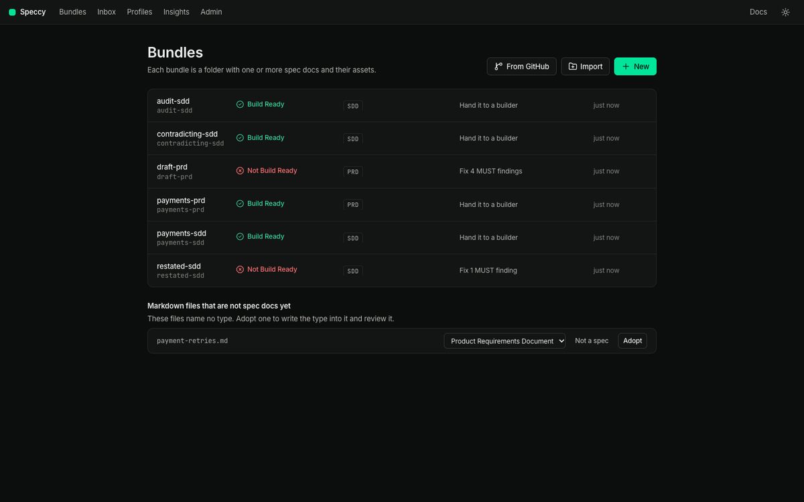
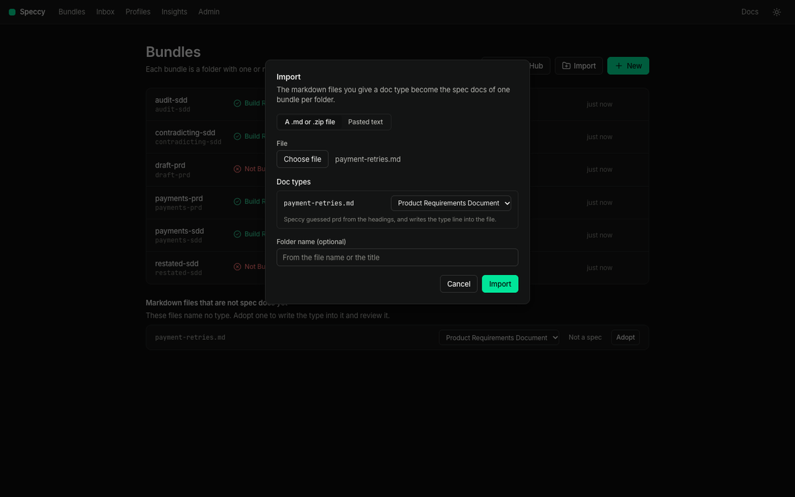
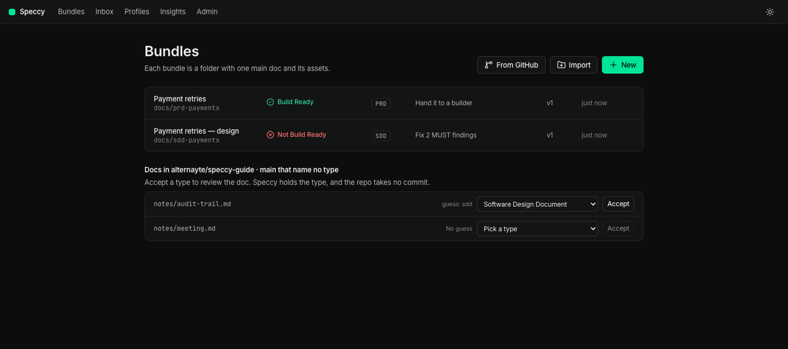
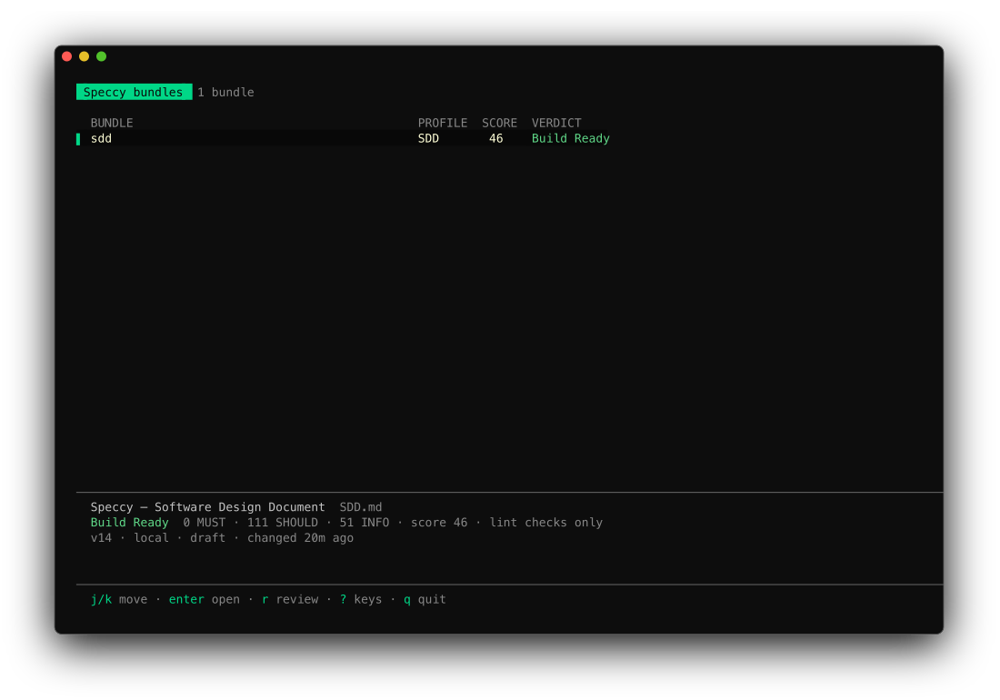

import { Steps, Aside } from '@astrojs/starlight/components';

This guide shows each way to review a doc that Speccy did not write. You do not rewrite the doc, and you do not change your repo before you see a verdict.

| Where your doc is | The way in | What changes in your files |
|---|---|---|
| A folder on your disk | **Adopt**, **Import**, a drag onto the bundles screen, or `speccy init` | One line, `type: <key>`, at the top of the file |
| One doc in GitHub | Paste its source URL | Nothing. Speccy holds the type |
| A folder or a repo in GitHub | Paste its source URL, then accept a type for each doc | Nothing. Speccy holds the types |
| A repo your team reviews in | `speccy init --github` in a clone | One pull request with `.speccy.yaml` and the workflow |

Speccy never writes to your repo on its own. It opens a pull request, and you merge it. [Adopt a repo and decide in a pull request](/how-to/adopt-a-repo/) covers the last row.

## Review a doc on your disk

To see a verdict before you change the file, review it from a terminal:

```sh
speccy review docs/payments.md
```

The file needs no `type` field. Speccy picks the profile whose headings the doc fits, and the output names the profile it used. Add `--adopt` to write that type and the doc size into the frontmatter, so the next review needs no guess.

### Adopt a file in the app

The bundles screen lists the markdown files in the served folder that name no type, under **Markdown files that are not spec docs yet**.



<Steps>

1. Start Speccy in the folder:

   ```sh
   speccy
   ```

2. On the bundles screen, find the file under **Markdown files that are not spec docs yet**.
3. Check the doc type in the picker. Speccy fills in the profile that the headings fit. Pick another type if the guess is wrong.
4. Select **Adopt**. Speccy writes `type: <key>` into the file, and opens the new spec doc with its review.

</Steps>

With more than one file in the list, **Adopt all picked types** adopts every file that has a type in one step.

When you adopt a doc whose profile names an upstream type, Speccy looks in the same folder. If exactly one doc there has that type, the row offers the link, such as `Link: implements prd.md`. Keep the box checked, and Speccy writes the link into the frontmatter of the doc you adopt. Clear it, and Speccy writes no link.

`speccy init` does the same in a terminal. It writes `.speccy.yaml`, adds `.speccy/state/` to `.gitignore`, and asks about each file that names no type. Press Enter to take the guessed profile, type another profile key, or type `-` to skip the file.

### Import a file or a folder from anywhere

**Import** takes a `.md` file, a `.zip` file, or pasted markdown. You can also drag a folder or a file onto the bundles screen.



The dialog lists each markdown file with a doc type picker. The picker shows the type that the file names, or else the profile that its headings fit. Pick **Not a spec** for a file that is not a spec. Each file you give a type becomes a spec doc. The spec docs of one folder make one bundle. Speccy writes `type: <key>` into a file that names no type, and it changes nothing else.

When a PRD and an SDD sit side by side, the dialog offers the link between them under **Links**, checked. Speccy writes that link into the frontmatter of the SDD.

A drop of a folder with one markdown file imports it at once. A drop of a folder with several markdown files opens the dialog. So does a file whose type Speccy cannot guess. In local mode, Speccy writes the imported files to a new folder under the served folder.

### Mark a file that is not a spec

Most folders hold markdown that is not a spec: a readme, a changelog, meeting notes. **Not a spec** takes a file out of the list. The section then shows one line with the count of files you marked, and **show** lists them. **Undo** puts a file back in the list.

The mark lives in Speccy, for your workspace. The file does not change, and neither does the repo. The mark does not reach another workspace or the Action. When you accept a type for the file later, Speccy removes the mark.

Speccy never offers `README.md`, `CHANGELOG.md`, `LICENSE.md`, `CONTRIBUTING.md`, `CODE_OF_CONDUCT.md`, `SECURITY.md`, `AGENTS.md` or `CLAUDE.md` in these lists.

## Review one doc in GitHub

Paste the source URL of the doc. A URL on any branch works, so a spec that is still in a pull request gets a review too.

<Steps>

1. On the bundles screen, select **From GitHub**.
2. Paste the URL in **Address**, and select **Look**. Speccy shows the repo, the branch, the folder, and the doc it opens.
3. Check the **Doc type**. Speccy fills in the type that the doc names, or the type that the repo's `.speccy.yaml` maps it to. Else it fills in a guess from the headings.
4. Select **Add**. Speccy reads the folder and opens the doc with its review.

</Steps>

The same step in a terminal:

```sh
speccy add https://github.com/acme/payments/blob/main/docs/sdd-retries.md --profile sdd
```

`--profile` gives the type of a doc that names none. Without it, Speccy uses its guess. If no profile fits the headings, `speccy add` stops and lists the profile keys.

Speccy holds the type you confirm. This is an adopted type: the repo takes no commit, and the branch you read from does not move.

<Aside type="caution">
Speccy reads the branch from one path segment of the URL. A branch with a slash in its name, such as `feature/retries`, does not work in a source URL.
</Aside>

The URL of one doc makes a source for the folder of that doc. The other spec docs in that folder appear too. The other markdown files there appear as skipped docs, as the next section shows.

## Review a folder or a repo in GitHub

A source URL can name a whole repo, a folder, or one doc. Speccy takes these forms:

- `acme/payments`
- `https://github.com/acme/payments`
- `https://github.com/acme/payments/tree/main/docs`
- `https://github.com/acme/payments/blob/main/docs/prd-payments.md`

A URL with no branch reads the default branch of the repo. A `.git` suffix and a GitHub Enterprise Server host both work.

Paste the URL under **From GitHub**, or run `speccy add` with it. Speccy reads the tree. Each markdown file that names a type, or that a mapping in the repo's `.speccy.yaml` covers, becomes a spec doc at once. The scan passes over the other markdown files. Speccy calls them skipped docs.



The bundles screen lists the skipped docs of each source under **Docs in `<repo> · <branch>` that name no type**. Each row shows the guess, a doc type picker, **Not a spec**, and **Accept**.

<Steps>

1. Check the type of each doc you want reviewed.
2. Select **Accept** on a row, or **Accept all picked types** to accept every row that has a type.
3. Speccy makes the spec docs and reviews them. The repo takes no commit.

</Steps>

**Not a spec** works as it does on disk: the row leaves the list, and **show** and **Undo** bring it back. The list holds 200 files at most. Above that, it says how many files name no type, and you narrow the source to a folder.

When you accept a type for an SDD, Speccy offers the link to its PRD, as it does on disk. It offers the link only when exactly one doc in the same folder has the upstream type. Speccy stores the link you confirm as an adopted link. It writes nothing into the repo.

### The repo always wins

An adopted type and an adopted link last only until the repo gives its own answer:

- When the doc gains `type:` in its frontmatter, or `.speccy.yaml` gains a mapping that covers it, Speccy drops the adopted type on the next read.
- When the doc names a link of the same kind in its frontmatter, that link replaces the adopted link.

The spec doc stays the same doc, with its threads and its waivers.

### Write the types to the repo

Your team's Action does not read the types you accepted in Speccy. **Write the mapping to the repo** opens one pull request that adds the same answers to `.speccy.yaml`:

```yaml speccy-config
map:
  - glob: docs/*.md
    profile: sdd
```

Speccy writes one glob for a folder only when you accepted every skipped doc in it with the same type. For a folder you accepted in part, it writes one mapping per doc, so a glob never takes in a doc you left alone. The pull request changes no doc, and it adds no workflow. To add the workflow too, run `speccy init --github` in a clone. [Adopt a repo](/how-to/adopt-a-repo/) shows how.

### How Speccy reads GitHub

Speccy reads through the GitHub API. It writes no file into your folder and runs no `git` command.

- In local mode, Speccy takes the token of your `gh` login. Run `gh auth login` first. With no `gh`, paste a fine-grained token under **Admin → GitHub**.
- In hosted mode, Speccy uses the workspace token that an admin sets under **Admin → GitHub**. Only an admin can add a source or accept a type. Any member can mark a doc as not a spec.

Speccy reads each source when it starts and every 5 minutes after that. **Sync** under **Admin → GitHub** reads a source at once.

An edit you make in Speccy to a doc from GitHub is a draft. The GitHub control on the doc shows **Unpublished**. **Open a pull request** puts the changed files on a new branch, `speccy/<bundle>-v<version>-<time>`, and opens a pull request into the source branch. **Discard the changes** takes the text from GitHub again.

## What each surface does

| Surface | What it does for docs you already have |
|---|---|
| The web app | Every way in: **Adopt**, **Import**, **From GitHub**, **Accept**, **Not a spec**, and **Write the mapping to the repo** |
| The CLI | `speccy review <file>`, `speccy init`, `speccy add <url>` and `speccy init --github` |
| The TUI | Reviews only: the list, the verdict, the findings and the tour. It adds no source |



## Next steps

- [From a blank page to a build packet](/tutorials/blank-page-to-build-packet/) follows one doc through the daily loop.
- [Adopt a repo and decide in a pull request](/how-to/adopt-a-repo/) brings the same checks to your pull requests.
- [Link an SDD to a PRD](/tutorials/link-an-sdd-to-a-prd/) covers two docs that must agree.
