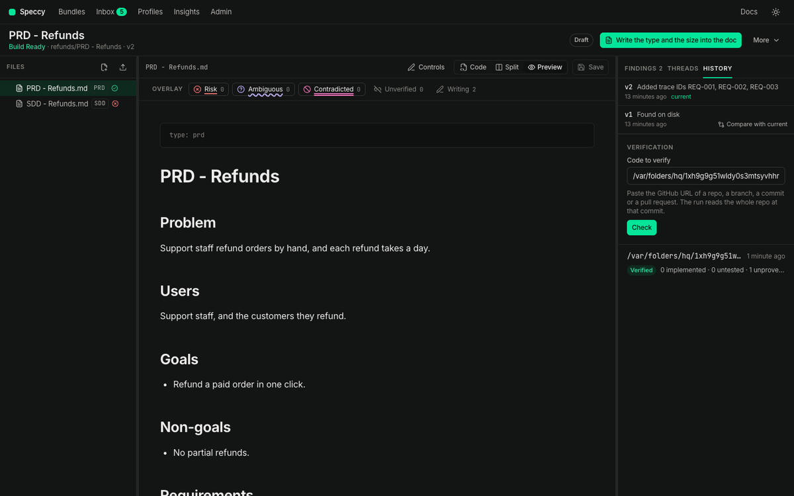

import { Steps, Aside, Tabs, TabItem } from '@astrojs/starlight/components';

This guide shows you how to check the code that a builder wrote against the spec doc it built from.

A verification run reads one code repo at one commit, or one folder. It finds the code and the tests that meet each trace ID of the doc, and it gives each trace ID one outcome. **Speccy reads the code. It runs no code and no tests.** A cited test is a citation, never a pass.

## Before you start

- The spec doc defines trace IDs whose prefix is in the profile's `verify.prefixes`. The default is `REQ` and `NFR`. A decision ID names no code, so the run skips it and counts it. A doc with no such ID cannot start a run. Add IDs from **More → Traceability** first.
- **Admin** names a model for the reviewer role and for the judge role. [Add a model backend](/how-to/add-a-model-backend/) shows how.
- For a GitHub repo, Speccy has a credential that reads it. Local mode uses your `gh` login, or the token in **Admin**, under **GitHub**.

A trace ID is a MUST when its definition holds the word `MUST`. Every other trace ID is a SHOULD. Only a MUST can block.

## Name the code in the doc

An `implemented-by` link names the repo that builds the doc. The run then needs no URL:

```yaml frontmatter
type: sdd
title: Payment retries
links:
  - kind: implemented-by
    target: github:acme/payments#internal/pay
```

The path in the link does not narrow the run. The run reads the whole repo, because code often meets a requirement outside the linked folder. [Link to an issue, a page or the code](/how-to/link-to-an-issue-a-page-or-the-code/) covers the target forms.

## Start a run

<Tabs>
<TabItem label="App">

<Steps>

1. Open the spec doc, and open the **History** tab of the rail. The **Verification** panel sits at the end.

2. Check the **Code to verify** field. It holds the repo of the `implemented-by` link, or else the repo of the last run. With two or more linked repos, click one of them under the field.

3. To verify another build, paste its GitHub URL: a repo, a branch, a file or folder in a branch, a commit or a pull request. In local mode, an absolute folder path also works.

4. Click **Check**. Speccy shows the repo, the branch or the pull request, and the short commit that it reads.

5. Click **Verify**, or click **Change** to name other code.

</Steps>

The panel follows the run. It shows the repo it reads, then "Finding where each requirement lives", then each trace ID that the judge reads.

</TabItem>
<TabItem label="CLI">

Name the bundle, and the code as a GitHub URL or a folder:

```sh
speccy verify docs/specs/pay https://github.com/acme/payments/pull/12
```

With no URL, Speccy reads the repo of the `implemented-by` link, at the head of its default branch:

```sh
speccy verify docs/specs/pay
```

These forms also work:

```sh
speccy verify docs/specs/pay --repo acme/payments --sha 4f2a9c1e
speccy verify docs/specs/pay --path ../payments --summary
```

The command waits for the run. It prints one row for each trace ID, with the file and line of the target that holds, then the run verdict. `--summary` prints the verdict only. `--handoff <id>` ties the run to a handoff. The command exits with code 1 when the run is Not Verified.

</TabItem>
<TabItem label="MCP">

The agent that took the build packet calls `verify_build` with the bundle and one of these:

- `target`: a GitHub URL, or an absolute folder in local mode.
- `repo` and `sha`.
- `path`: a folder.
- Nothing: the repo of the `implemented-by` link.

`handoff` ties the run to the handoff from the packet. `claims` gives builder claims. [MCP tools](/reference/mcp-tools/#verify_build) lists every input.

</TabItem>
</Tabs>

A repo URL reads the head of the default branch. A branch, file or folder URL reads the head of its branch. A commit URL reads that commit, and a pull request URL reads its head commit. The run records the commit it read. A pasted URL writes nothing into the doc.

In a pull request, `speccy action --verify` runs the same check. [Keep the verdict in CI](/how-to/keep-the-verdict-in-ci/) covers the Action.



## How Speccy finds the code

A code target is a repo path and an anchor quote: a verbatim string that must appear in that file exactly once. A test target has the same form, anchored on the test declaration line. Speccy finds the targets of each trace ID in one of three ways, in this order:

1. **A builder claim.** A builder who knows where a requirement lives says so, through `verify_build`. The claim replaces what Speccy finds for that trace ID. Every target in the claim must hold, or none of them counts.
2. **The trace ID in the code.** Speccy searches every file it reads for the literal trace ID, such as `REQ-012` in a comment or a test name. The whole line is the anchor quote. A file in a test folder, or with a test name such as `_test.go` or `.spec.ts`, gives a test target.
3. **A model.** For a trace ID that appears nowhere, a model picks files and quotes a line from each. Speccy keeps a quote only when it finds it in the file. A model can add a candidate, never a fact.

A quote that appears zero times, or more than once, does not hold. The row then says why. Mention the trace ID in the code, next to the code that meets it, and the run finds it with no model.

The scan skips binary files, files over `verify.max_file_kb`, and the paths in `verify.exclude`. The model sees at most `verify.max_mapper_files` files. The run report names each limit that the scan hit.

## Read the outcomes

A judge reads the requirement and the cited code. It must quote both. The absence of a conflict is not evidence.

| Outcome | What it means |
|---|---|
| implemented | A code target holds, a test target holds, and the judge found the requirement in the code. |
| untested | The judge found the requirement in the code, and no test target holds. |
| unproven | A code target holds, and the judge neither found the requirement nor found a contradiction. |
| missing | No target holds. |
| breached | Two judges agreed that the cited code contradicts the requirement. |

A breached outcome needs a second, independent judge. When the second judge does not agree, the outcome is unproven, with the note "possible breach", and it does not block. When the definition does not parse in the shapes of the [requirement grammar](/reference/checks/#lint.requirement-grammar), a breach reports at SHOULD.

Unproven is always a SHOULD. A judge's silence does not stop a build.

The run has its own verdict: **Verified** or **Not Verified**. A run is Not Verified when a MUST trace ID is missing or breached, and no waiver covers it. The run computes no Build Ready verdict.

## What happens

For each MUST trace ID that is missing or breached, Speccy opens a blocking thread on the requirement. The title names the trace ID, the outcome and the repo. A blocking thread makes the bundle Not Build Ready until a person resolves it. Answer the thread: say where the code is, change the code, or change the requirement. Then click **Resolve**.

The **History** tab lists the runs, newest first, with **Verified**, **Not Verified** or **Stale**, and the count of each outcome. **More → Traceability** shows the newest run under **Code and tests**: each trace ID, its outcome, the code target and the test cited.

A run is a statement about one commit. A new commit in the code repo makes no run stale. A new version of the spec doc makes every earlier run stale, because the requirements moved. Run the check again on the new version.

## Excuse one trace ID

A verification waiver excuses one trace ID in one code repo. It keeps the rest of the waiver mechanism. It needs a reason of at least 20 characters, and it follows the profile's policy for a MUST. It ends when the section of the requirement changes. It never goes in the sidecar. The sidecar travels with the doc into every build, and this exception belongs to one repo.

The app, the CLI and the MCP server have no control that asks for a verification waiver. Ask through the HTTP API. The doc ID is the last part of the bundle page URL, `/bundles/<bundle id>/docs/<doc id>`:

```sh
curl -X POST http://127.0.0.1:7878/api/v1/docs/<doc id>/verification-waivers \
  -H "Content-Type: application/json" \
  -d '{"trace_id": "REQ-012", "repo": "acme/payments", "reason": "The retry limit lives in the gateway config, not in this repo."}'
```

`repo` is the repo as the run names it, such as `acme/payments`. In hosted mode, send a personal API token as `Authorization: Bearer <token>`.

The request waits in the approver's **Inbox** and in the tour, as any waiver does. [Ask for and approve a waiver](/how-to/ask-for-and-approve-a-waiver/) shows the approval. The next run counts the trace ID as waived, and the run verdict counts the waivers.

## Related

- [Hand a spec to a coding agent](/how-to/hand-a-spec-to-a-coding-agent/): the handoff that comes before the run.
- [Traceability](/concepts/traceability/): trace IDs from the requirement to the code.
- [Profile schema](/reference/profile-schema/#verify): the `verify` keys.
- [CLI](/reference/cli/) and [MCP tools](/reference/mcp-tools/).
