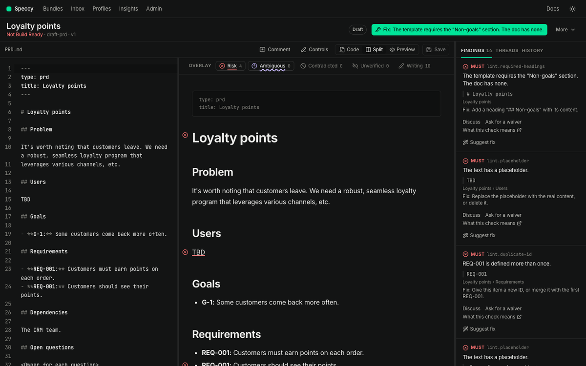

import { Card, CardGrid, LinkCard } from '@astrojs/starlight/components';

Speccy is one binary: the app, the CLI, the terminal UI and an MCP server. Models find the problems, and a pure function decides the verdict. A doc is Build Ready only when no MUST finding is open.

```sh
curl -fsSL https://raw.githubusercontent.com/alternayte/speccy/main/install.sh | sh
cd <the folder with your specs>
speccy
```

The install script checks the release against its published checksum. `speccy` opens the app on 127.0.0.1, with no account and no server.



<CardGrid>
  <Card title="Finds ambiguity, not only gaps" icon="magnifier">
    Three independent readers answer the same build questions from your doc. Where they disagree, the doc is ambiguous. Where none of them finds an answer, the doc has a gap.
  </Card>
  <Card title="Checks the writing in under a second" icon="pencil">
    Fixed rules find placeholders, missing sections, broken links, duplicate trace IDs, filler phrases and long sentences, on every save.
  </Card>
  <Card title="Keeps linked docs honest" icon="random">
    An SDD must cover the requirements of the PRD it implements. It must not contradict the PRD, and it must not repeat it.
  </Card>
  <Card title="Verifies the build" icon="approve-check">
    After a builder takes the build packet, `speccy verify` reads the code. It says where each requirement lives and where the code contradicts it.
  </Card>
</CardGrid>

## Where to go next

<CardGrid>
  <LinkCard title="Tutorials" href="/tutorials/blank-page-to-build-packet/" description="One doc from a blank page to Build Ready and a build packet, and a PRD with the SDD that implements it." />
  <LinkCard title="How-to guides" href="/how-to/review-docs-you-already-have/" description="Tasks: adopt a repo, close a coverage gap, ask for a waiver, hand a spec to a coding agent, keep the verdict in CI." />
  <LinkCard title="Concepts" href="/concepts/verdict/" description="How the verdict, the review pipeline, profiles, waivers and traceability work, and why." />
  <LinkCard title="Reference" href="/reference/checks/" description="Every check, command, key, input, tool and API operation." />
</CardGrid>
