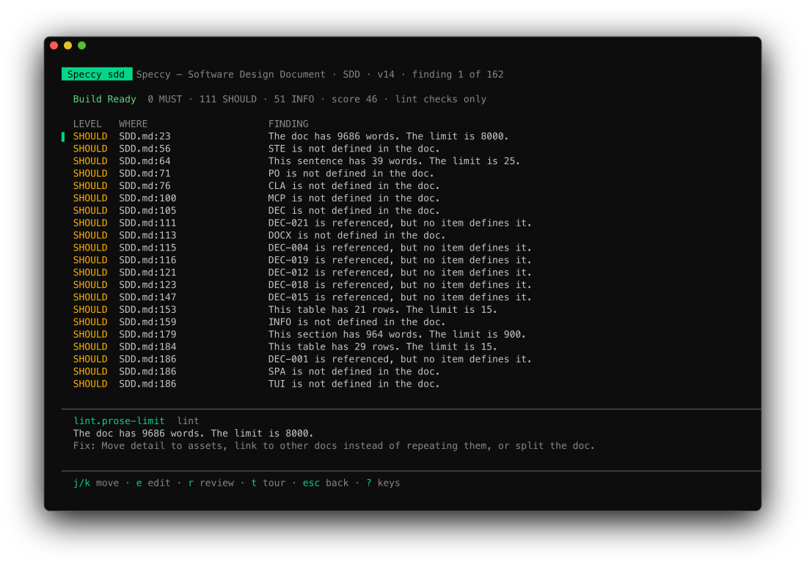

This page lists what `speccy tui` shows, every key it reads, and how it fits a small terminal.

```sh
speccy tui
```

The TUI lists the bundles and runs a review. It shows the verdict, the findings and the tour, and it opens a file in your editor at a finding.

## Where it runs

| Item | Value |
|---|---|
| Folder | The folder with `.speccy.yaml`, from the current folder up. With no `.speccy.yaml`, the current folder. |
| State | `.speccy/state/` in that folder. The TUI makes the folder when it is missing, and it shares the store with local mode. |
| Log | `.speccy/state/tui.log`. The TUI writes warnings and errors there, not to the screen. |
| Arguments | None. `speccy tui` with an argument prints the usage and exits with code 2. |
| Server | None. The TUI runs local mode in its own process, over the files on disk. |
| Updates | The TUI reads the list or the open bundle again every 2 seconds. A change on disk syncs the bundles and reloads the profiles. |

The TUI has no connected mode. It takes no `--server` flag, and it does not read `mode` or `server` in [`.speccy.yaml`](/reference/speccy-yaml/).

## The frame

Every screen has the same five parts, from top to bottom.

| Part | What it holds |
|---|---|
| Title bar | `Speccy` and the screen name, then the meta text: the bundle count, or the title, profile and version. |
| Body | The list, the findings or the tour point. |
| Status line | One line of progress, feedback, an error, or the next action. |
| Rule | A thin line. |
| Key bar | The keys of this screen. |

The status line shows the first of these that applies:

| Shows | When |
|---|---|
| `Error:` and the message | A call to the API failed. |
| `Reviewing:` and the stage | A review runs. |
| A message | The TUI has feedback, such as `The review finished.` or the error of a failed run. |
| `n` and the sentence | The bundle in hand has a next action. |

## The bundle list


The list has one row for each spec doc.

| Column | What it shows |
|---|---|
| `BUNDLE` | The slug. |
| `PROFILE` | The profile key, in capitals. |
| `SCORE` | The score of the verdict, or `–` with no verdict. |
| `VERDICT` | `Build Ready`, `Not Build Ready`, `Stale` or `Not reviewed`, with the waiver count. A red `N MUST` follows when the verdict has MUST findings. |

The preview under the list describes the row under the cursor:

- The title and the path of the spec doc.
- The verdict, the MUST, SHOULD and INFO counts, and the score. `lint checks only` marks a verdict from lint alone.
- The version, the source, the status and the age of the last change.
- The error of the last review, or else the next action.

## The bundle screen



The bundle screen lists the open findings of the verdict: MUST first, then SHOULD, then INFO. A waived finding is not on the list.

| Column | What it shows |
|---|---|
| `LEVEL` | `MUST`, `SHOULD` or `INFO`. |
| `WHERE` | The file and the line of the anchor. |
| `FINDING` | The message. |

The block under the list shows the selected finding: the check slug, the stage, the message, and the fix. A finding with no fix shows its quote instead.

## The tour screen

The tour screen shows one point at a time: a progress bar, the kind of point, the question, its context, and the quote. The TUI shows the tour and does not record a decision. Decide in the app, or with the MCP tool `post_message`.

## Keys

`?` opens the key list. The key list takes every key except `?`, `esc`, `q` and `ctrl+c`, so nothing moves behind it. A key that a screen does not use does nothing.

| Key | Screen | What it does |
|---|---|---|
| `n` | all | Does the next action of the bundle in hand. |
| `j`, `↓` | all | Moves down one row, one finding, or one tour point. |
| `k`, `↑` | all | Moves up one row, one finding, or one tour point. |
| `enter`, `l`, `→` | list | Opens the bundle. |
| `r` | list, bundle | Runs a full review of the bundle. It does nothing while a review runs. |
| `e`, `enter` | bundle | Opens the file in the editor at the selected finding. With no findings, it opens the spec doc. |
| `t` | bundle | Opens the tour. |
| `e`, `enter` | tour | Opens the file in the editor at the point's anchor. A point with no anchor opens nothing. |
| `esc`, `h`, `←` | bundle, tour | Goes back one screen. On the key list, `esc` closes it. |
| `?` | all | Opens or closes the key list. |
| `q`, `ctrl+c` | all | Quits. |

`n` does the next action as far as a terminal can:

| Next action | What `n` does |
|---|---|
| Review | Runs a full review. |
| Decide | Opens the tour. |
| Fix | Opens the bundle. On the bundle screen, it opens the editor at the selected finding. |
| Any other kind | Writes the sentence and `do this in the app.` on the status line. |

A full review needs a model for each role its stages use. With no model, the status line shows the error. [Add a model backend](/how-to/add-a-model-backend/) sets one up.

## The editor

The TUI opens a file with `$VISUAL`, else `$EDITOR`, else `vi`. It passes the line in the form that the editor reads:

| Editor | Arguments |
|---|---|
| `code`, `cursor` | `--wait --goto <file>:<line>` |
| `zed`, `subl` | `--wait <file>:<line>` |
| Any other | `+<line> <file>` |

The TUI loads the screen again when the editor closes. When the editor does not start, the status line says `The editor did not open`, with the reason.

## Terminal size

The frame is at least 80 columns wide and 10 rows high. In a smaller terminal, the TUI still draws 80 by 10, so the terminal cuts off the right edge or the top rows. The screens fit 80 by 24 with nothing cut.

At each width the TUI keeps every row on one line:

- Below 96 columns, the list drops the `PROFILE` and `SCORE` columns.
- A slug, a path, a message or a fix longer than its space ends in `…`.
- A key bar that does not fit drops hints from the middle. It keeps the first hint and the last hint. The first hint is `n` when the bundle has a next action.
- A list longer than the body scrolls with the cursor, and the title bar says which rows it shows.
