import { Steps, Aside } from '@astrojs/starlight/components';

In this tutorial, you write one PRD in Speccy and take it from a blank page to a build packet. You start Speccy, write the doc, run a review, answer what the review asks, and hand the doc to a builder.

Speccy answers one question about a doc: Build Ready, or Not Build Ready. Build Ready means an implementer can build the thing without a question for you.

You need a terminal, a browser, and one model: an API key, or an agent CLI that you already use, such as `claude`.

The pictures come from the real app. They show two sample docs from the Speccy repo: "Loyalty points", a draft PRD, and "Audit log retention", an SDD that is Build Ready. Your doc shows the same screens.

## 1. Start Speccy

Install Speccy, make a folder for your specs, and start Speccy in it:

```sh
curl -fsSL https://raw.githubusercontent.com/alternayte/speccy/main/install.sh | sh
mkdir specs && cd specs
speccy init
speccy
```

`speccy init` writes `.speccy.yaml` and adds `.speccy/state/` to `.gitignore`. That folder holds the local database and key, so it stays out of git. `speccy` starts local mode on `127.0.0.1:7878` and opens your browser. `speccy --no-open` starts it without the browser.

The browser opens the **Bundles** screen. It lists each bundle in the folder, with its state and its next action. Your folder is empty, so the list says "No bundles yet".

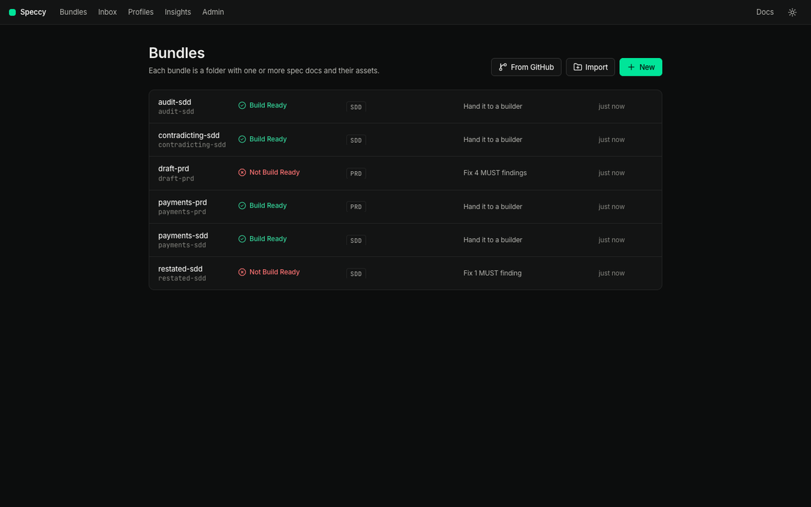

## 2. Make a bundle

A bundle is a folder with one or more spec docs and their assets. A spec doc is a markdown file that names its type in its frontmatter.

<Steps>

1. On the Bundles screen, click **New**. The **New bundle** dialog opens.

2. Under **Doc type**, pick **Product Requirements Document**.

3. In **Title**, type `Payment retries`. Speccy fills **Folder name** with `payment-retries`.

4. Click **Create**.

</Steps>

Speccy writes `payment-retries/SPEC.md` from the PRD template, and opens the bundle.

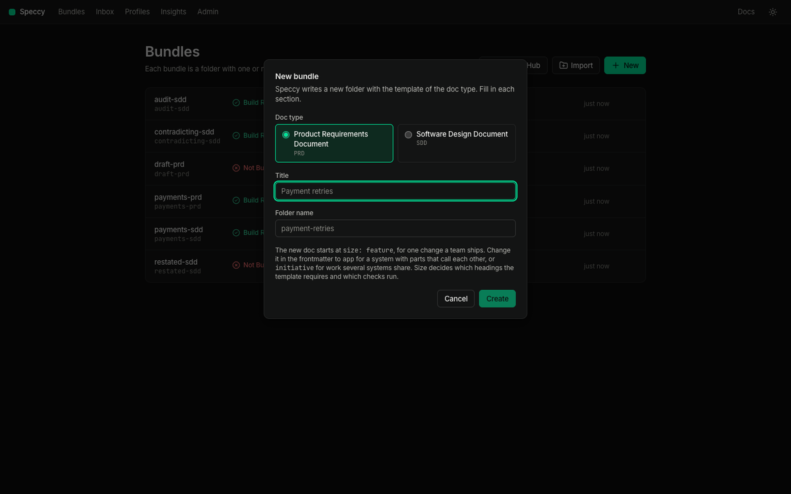

The new doc starts with this frontmatter:

```markdown
---
type: prd
title: Payment retries
size: feature
---
```

`size` says the scale the doc covers. `feature` is one change a team ships. `app` is a system with parts that call each other. `initiative` is work that several systems share. The profile asks for less of a feature doc than of an initiative doc. Change the value in the frontmatter if your doc covers more. [Profiles and size](/concepts/profiles-and-size/) explains what each size changes.

<Aside title="You already have a doc">
**Import** on the Bundles screen takes a markdown file or a `.zip` file. It lists each markdown file with a doc type picker, prefilled with the type the file names or the profile its headings fit. Speccy writes one line, `type: <key>`, into each file you give a type, and changes nothing else.


A markdown file in the served folder that names no type appears under **Markdown files that are not spec docs yet**. Pick a type and click **Adopt**.


[Review docs you already have](/how-to/review-docs-you-already-have/) covers each way in, including a doc in GitHub.
</Aside>

## 3. Write the doc

The bundle screen has one row at the top: the control row. It holds the title, the verdict in words, and one button that names the next action. **More** holds everything else. The screen shows only what this doc has earned, so a new doc has no Findings tab and no file tree.


The preview opens first. **Split** puts the markdown beside the preview, and **Code** shows the markdown alone. Speccy remembers your choice in this browser.

The preview is an editable preview. The template holds placeholders in angle brackets, such as `<Who has the problem, and what happens to them today.>`. Replace each one:

<Steps>

1. Click the text of a paragraph, a heading, a list item or a table. The markdown of that block opens where you clicked.

2. Type your text. `Esc` closes the block and drops your change.

3. Click outside the block to keep the change.

4. Click **Save**. Speccy writes the file as one new version, and the header says "Saved as v2".

</Steps>

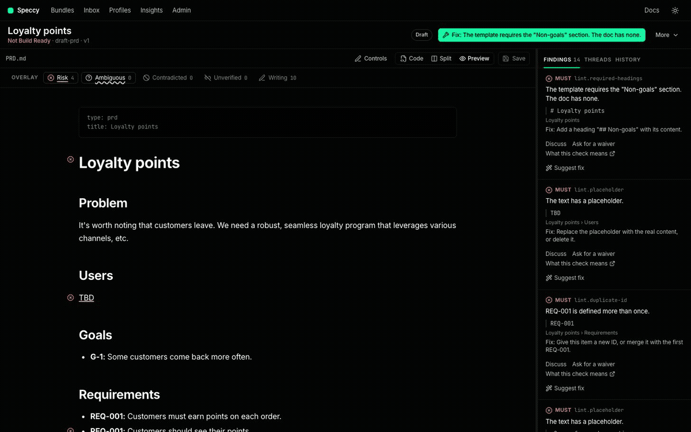

In every view, `⌘S` or `Ctrl+S` also saves. An open block in the preview goes into the save.

**Controls** shows the control bar above the preview. Its markdown group writes headings, lists, links, tables and code blocks. Its profile group applies what the profile knows. It inserts a missing required heading, the next free trace ID, or a requirement with an acceptance criterion. It also moves a long block into `assets/`.

Lint runs on each new version. Lint needs no model, so the first findings appear before any model runs.

## 4. Add a model

Lint alone gives a lint verdict. The other stages of the review need a model.

<Steps>

1. Click **Admin** in the top bar. The page holds the **Models** section.

2. Under **Backends**, click **Add backend**. Pick a **Kind**: Anthropic, OpenAI, OpenRouter, DeepSeek, or Agent CLI.

3. For an API key kind, paste the key. For **Agent CLI**, pick the CLI: `claude`, `cursor-agent`, `opencode` or `pi`. Click **Add**.

4. Type a model name in **Model to test**, and click **Test**. Speccy makes one short call, and says "Works" with the time and the tokens.

5. Under **Roles**, give each role a backend and a model: `reviewer`, `reader_1`, `reader_2`, `reader_3`, `judge` and `writer`.

</Steps>


[Add a model backend](/how-to/add-a-model-backend/) covers each kind, the prices, and the monthly token budget.

## 5. Run the review

Go back to your bundle, and click **More → Run a review**. The **Run a full review** dialog shows the model calls, the tokens and the estimated cost before anything runs. Click **Run review**.

When the doc has no current verdict, the next action says **Check this doc**, and it opens the same dialog.

The review runs five stages:

| Stage | What it asks | Needs a model |
|---|---|---|
| Lint | Is the writing clear, and are the headings, links and trace IDs in order? | No |
| Rubric | Does the doc answer what its profile requires? | Yes |
| Grounding | Does each factual claim hold, and what source says so? | Yes |
| Divergence | Do independent readers get the same meaning from each build question? | Yes |
| Coherence | Does the doc agree with the docs it links to, and cover their IDs? | Yes |

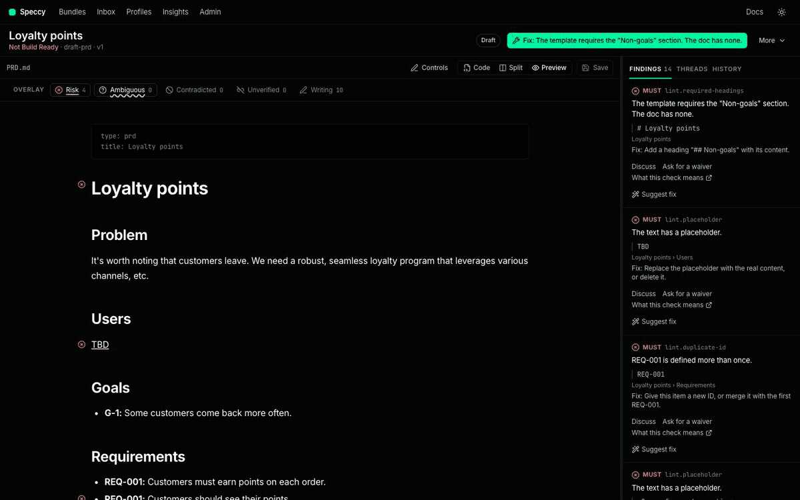

The verdict sits under the title, in words. Build Ready means four things together:

- No MUST finding is open.
- Every required link or acknowledgement is there.
- No blocking thread is open.
- The run read the current version.


The verdict of an older version is stale. The control row says "Stale", and the next action asks for a new check.

An edit keeps the AI review of the sections you did not change. Lint runs again on the new version. The AI findings of the last full review stay for each unchanged section, and they still count in the verdict. A finding in a changed section drops out, because the model never read the new text. The control row says so, for example "AI review from v2 · 1 section changed". Run the review again to cover the changed sections. The unchanged ones come from the cache.

[The review pipeline](/concepts/review-pipeline/) and [the verdict](/concepts/verdict/) explain each rule.

## 6. Follow the next action

The button in the control row always names one thing. It is the only primary button on the screen. Click it, and Speccy takes you to the place where you do that thing.

Speccy picks the next action in this order:

1. A waiver that waits for your decision.
2. A point of the tour.
3. The first MUST finding.
4. A check of the current version.
5. The type and the size, when Speccy guessed them.
6. The reviews the profile needs, in hosted mode.
7. The handoff.

The Bundles screen shows the same next action on each row, so you can pick the work before you open a bundle.

## 7. Read the findings

Open the **Findings** tab in the rail. Each finding names its check, its level and the text that failed the check. A click on a finding scrolls the preview to that text.


The overlay marks the failed text in the preview, one layer per kind: Risk, Ambiguous, Contradicted, Unverified and Writing. Risk and Ambiguous are on by default. Click a layer name above the preview to turn it on or off.

Each finding has these controls:

- **Suggest fix** asks the writer model for a patch. You see the old and the new text, and **Accept** writes it.
- **Ask for a waiver** asks for an exception for this check in this section.
- **Discuss** opens a thread on the finding.
- **What this check means** opens the entry of the check in the [Check catalog](/reference/checks/).

The **Evidence** tab appears after a full review. It holds the claims the grounding stage checked, and the build questions. A build question is a question an implementer must answer to build the thing. "Not in the doc" is a gap: every reader answered that the doc does not say. "Readers disagree" is a divergence: the readers gave different meanings.

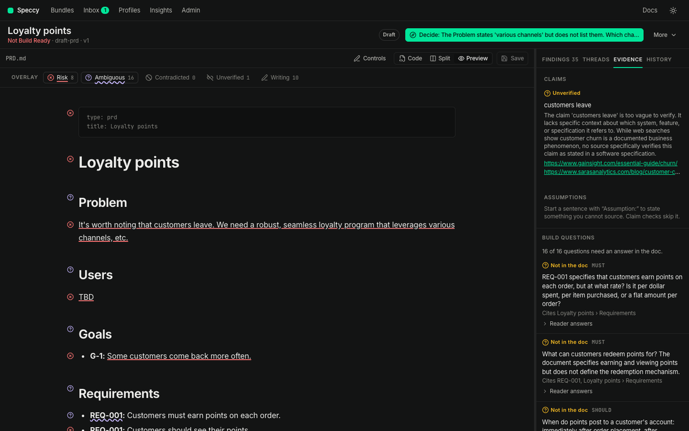

**More → Run report** shows the stages, their timings, the scores and the findings by category.

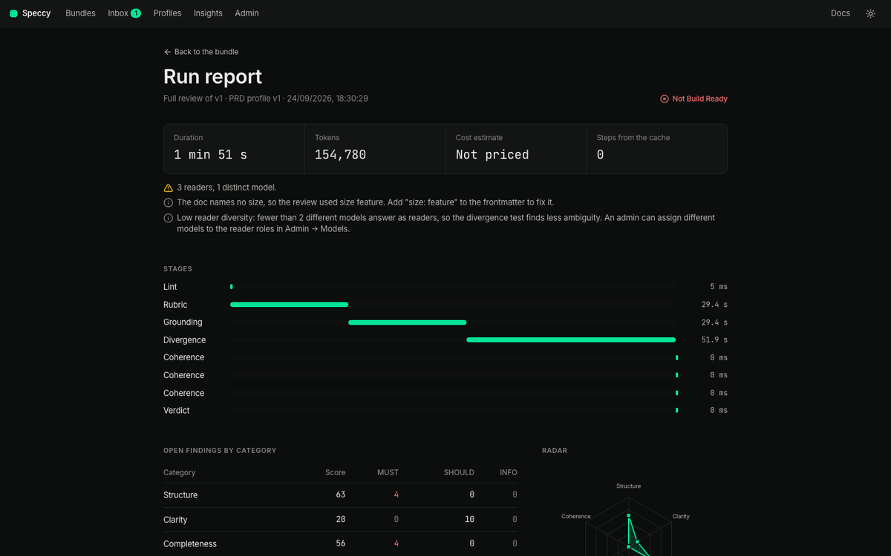

## 8. Take the tour

Open **More → Tour**. The tour lists the points that need a decision from a person. Blocking threads come first, then MUST findings that need a decision, then waiver requests, then open decisions. The doc dims around the section of each point.

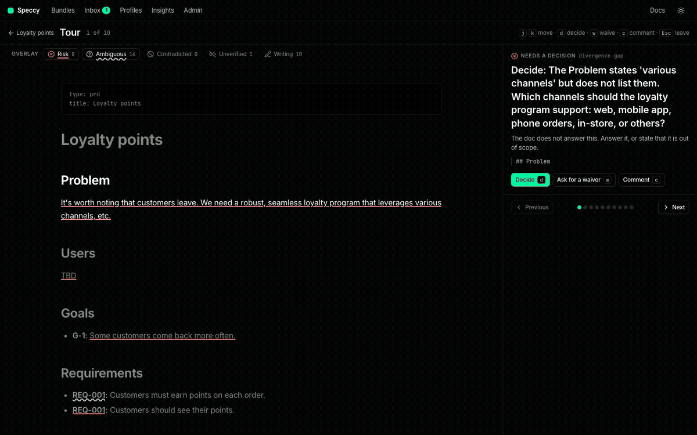

Use the keys:

- `j` and `k` move to the next and the previous point.
- `d` records a decision.
- `w` asks for a waiver.
- `c` opens a comment.
- `Esc` leaves the tour.

A waiver is an approved exception for one check in one section, with a reason of at least 20 characters. The profile's waiver policy says who can approve it. On approval, Speccy writes the waiver into the doc's sidecar, `.speccy/decisions/<doc path>.yaml`. The waiver travels with the repo in git, and the doc text does not change. An edit of that section ends the waiver, and the check runs again.

An acknowledgement uses the same mechanism for a link or a trace item that you leave out on purpose. [Ask for and approve a waiver](/how-to/ask-for-and-approve-a-waiver/) shows both.

## 9. Send it to a reviewer

A reviewer reads the spec, and answers the questions you have for them. They see no findings, no waivers and no author tools. This is reviewer mode.

To see reviewer mode yourself, add `?as=reviewer` to the bundle's URL.

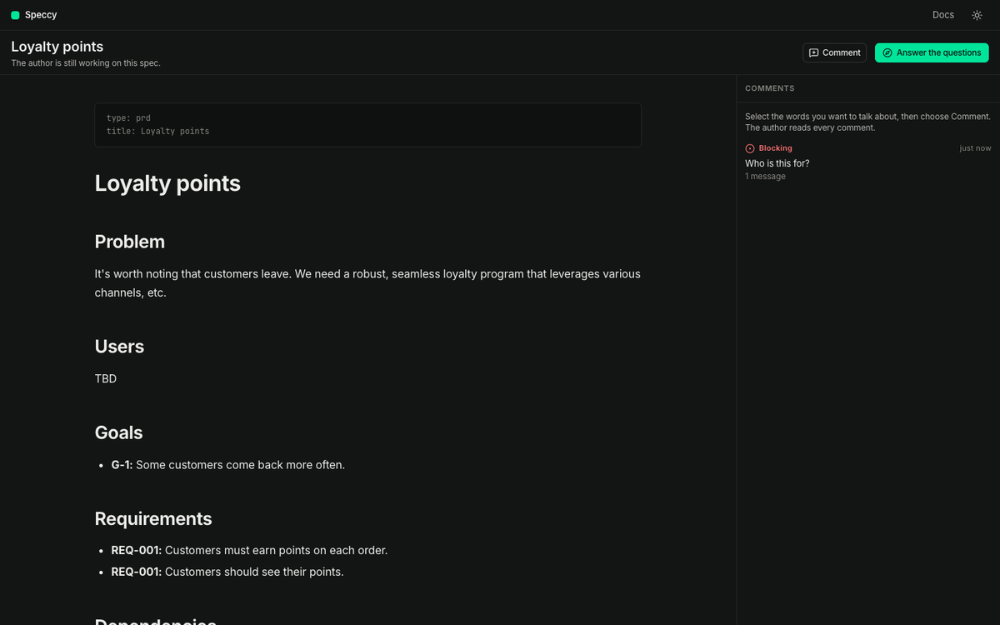

The status line under the title says in words whether you are still working or the spec is ready. The reviewer selects any words and clicks **Comment** to start a thread on that text. **Answer the questions** opens the points that wait for them.

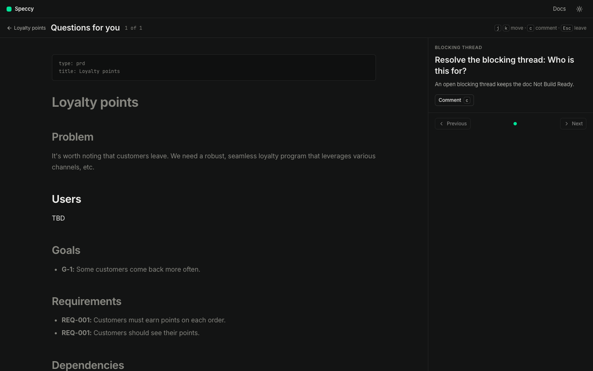

In hosted mode, **Share** in the control row sets who can see the bundle. **Link** lets a guest open it with a share link, and **Make a share link** makes one. Local mode has one person, so it has no Share control. [Run hosted mode](/how-to/run-hosted-mode/) covers teams.

## 10. Reach Build Ready

Fix what the findings and the tour raised. Click **Save**. Run the review again. Repeat until the control row says Build Ready.

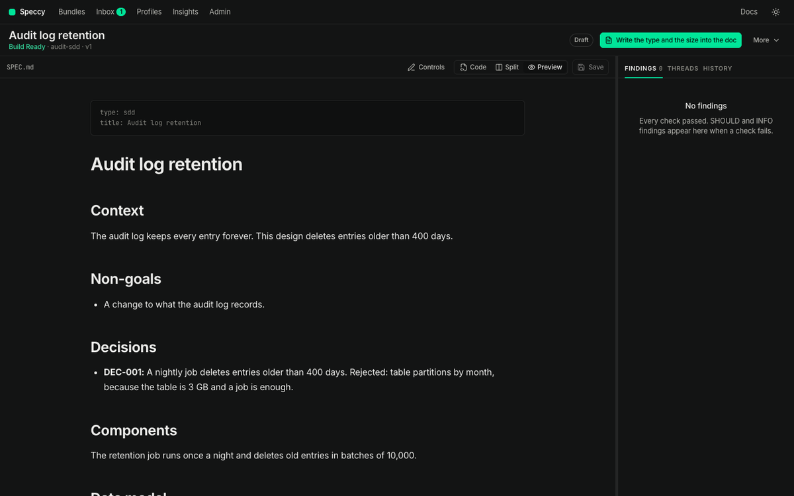

**More → Traceability** shows the links of the doc, and the coverage of each upstream trace ID. A cell says Referenced, Covered by another doc, Out of scope, or Not covered.

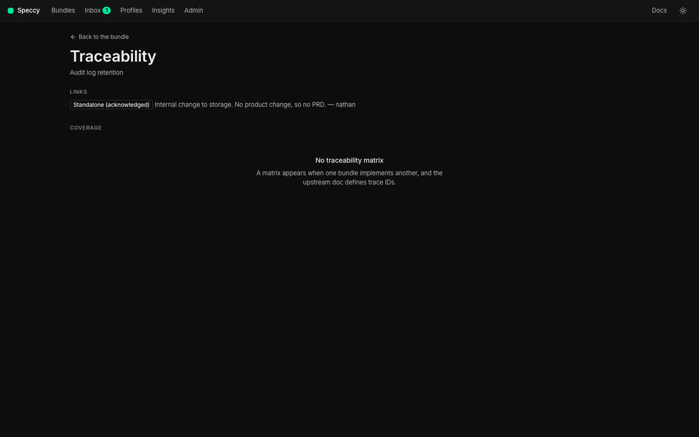

A PRD and the SDD that implements it also have to agree with each other. [Link an SDD to a PRD](/tutorials/link-an-sdd-to-a-prd/) follows two docs through the matrix, the gaps, the contradictions and the stale verdict.

In hosted mode, a bundle also needs the approvals its profile requires. An author cannot approve their own bundle. A change to the spec doc or its assets revokes the approvals.

## 11. Hand it to a builder

A build packet holds the spec doc, the bundle's assets, the linked spec docs and the trace IDs. It also holds the build questions with their agreed answers.

<Steps>

1. The next action now says **Hand it to a builder**. Click it. The dialog opens.

2. In **Label**, type `payment-retries-build`. The label is optional.

3. Click **Download the build packet**.

</Steps>

Speccy records the handoff with the verdict at that moment, and your browser saves a .zip file. The .zip holds the packet and `HANDOFF.md`, the re-entry prompt. A coding agent reads it to resume the build after it loses its context. The rail opens **History**, which lists the versions and the handoffs of the bundle.

A coding agent can also take the packet itself. Under **Copy for a coding agent**, the dialog shows a prompt that names the MCP tool `handoff_bundle`. It also shows the command that writes the packet to a folder:

```sh
speccy handoff payment-retries/SPEC.md --out ../payment-retries-build-packet
```


The agent sends back build reports. A blocked report says the agent cannot build a section without an answer, and it opens a blocking thread. A note says the agent built the section, but the doc was unclear. A note changes no verdict.

For one profile, the false-ready rate is the share of Build Ready handoffs that came back blocked. **Insights** in the top bar shows it as "False ready". [Hand a spec to a coding agent](/how-to/hand-a-spec-to-a-coding-agent/) sets up the MCP server and the reports.

## 12. Verify the build

After the build, Speccy checks the code against the spec.

<Steps>

1. Open the **History** tab. Under **Verification**, paste the GitHub URL of the repo, the branch, the commit or the pull request into **Code to verify**. A doc with an `implemented-by` link fills the field for you.

2. Click **Check**. Speccy shows the repo and the commit that it reads.

3. Click **Verify**.

</Steps>

In a terminal, this command does the same:

```sh
speccy verify payment-retries https://github.com/acme/pay/pull/12
```

The verification run reads the whole repo at that commit. It finds the code and the tests of each trace ID, and gives each one outcome:

| Outcome | What it means |
|---|---|
| implemented | A code target holds, a test target holds, and the judge found the requirement in the code. |
| untested | The judge found the requirement in the code, and no test cites it. |
| unproven | A code target holds, and the judge neither found the requirement nor found a contradiction. |
| missing | No target holds. |
| breached | Two judges agreed that the cited code contradicts the requirement. |

Speccy reads the code. It runs no code and no tests. A cited test is a citation, not a pass.

The run has its own result, Verified or Not Verified. A missing or breached MUST requirement opens a blocking thread on the bundle, so the bundle is Not Build Ready until a person answers it. **More → Traceability** shows the code column and the test column. [Verify a build](/how-to/verify-a-build/) covers builder claims, waivers and the pull request gate.

## 13. Keep the verdict in CI

`speccy review` gives the same verdict in a terminal:

```sh
speccy review payment-retries
```

The GitHub Action posts the findings on each pull request, and a reply on the pull request settles one. [Keep the verdict in CI](/how-to/keep-the-verdict-in-ci/) sets it up, and [Adopt a repo](/how-to/adopt-a-repo/) follows a repo end to end.

## What you have now

- A bundle, `payment-retries`, with one spec doc and a Build Ready verdict.
- A sidecar for each waiver or acknowledgement you approved.
- A build packet with its re-entry prompt, and one handoff in History.

## Next

- [Link an SDD to a PRD](/tutorials/link-an-sdd-to-a-prd/) to review two docs that must agree.
- [Change a profile](/how-to/change-a-profile/) to change what the review asks for.
- Read [the verdict](/concepts/verdict/) to see how Speccy computes it.
