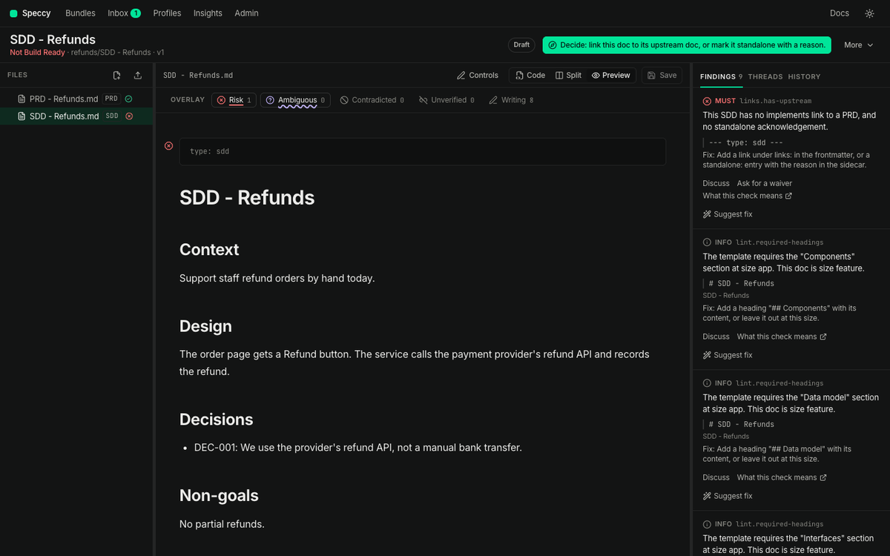
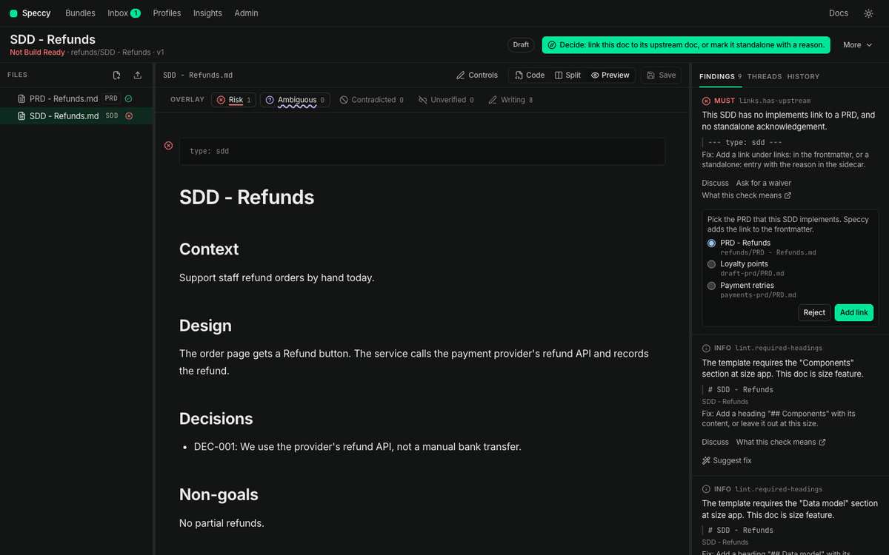
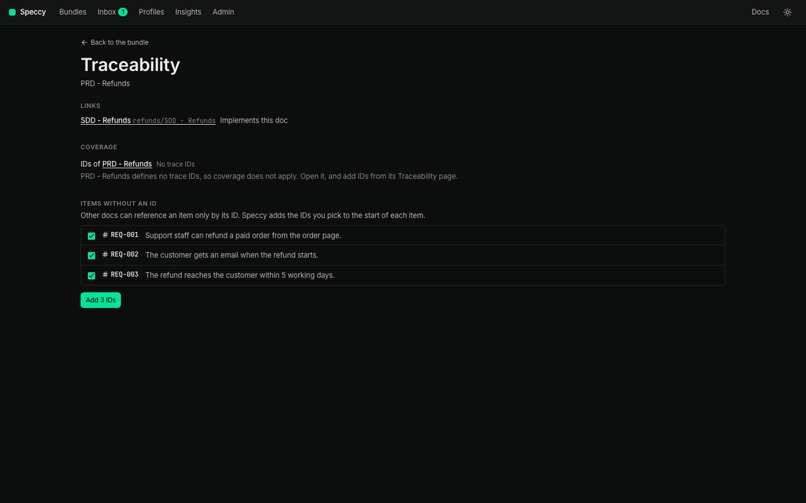
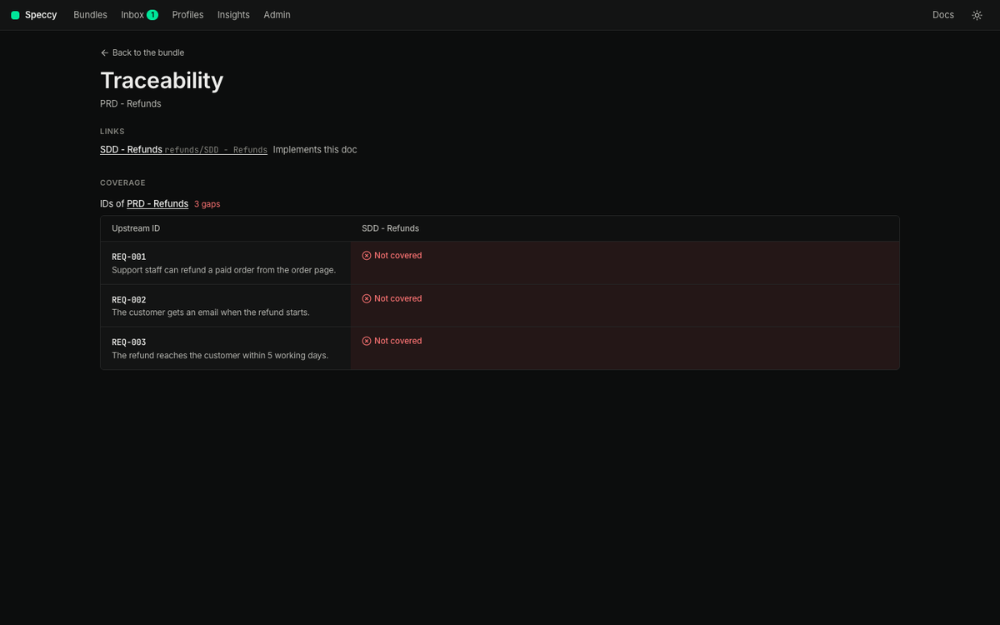
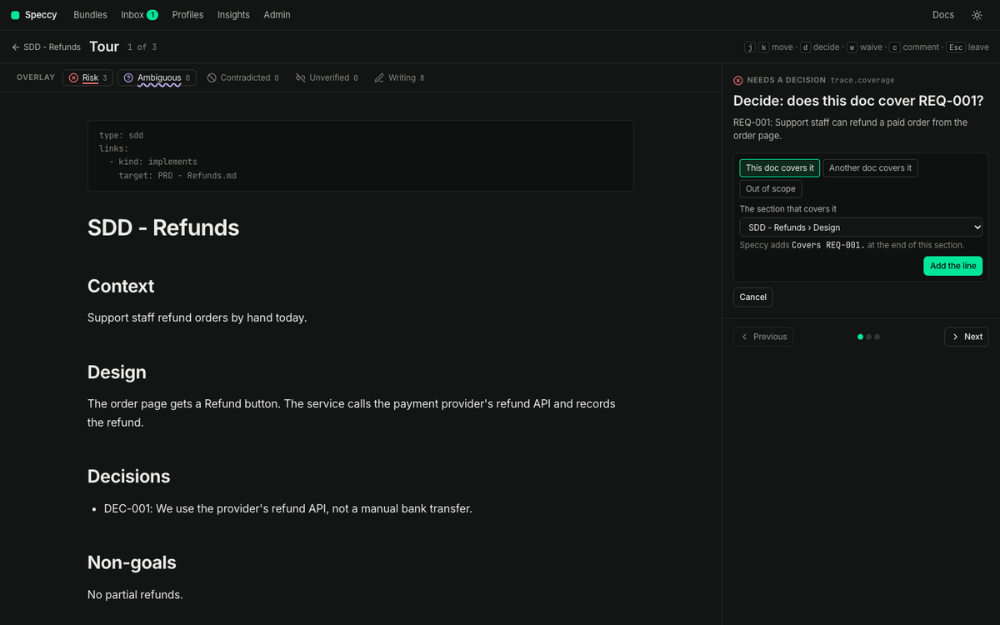
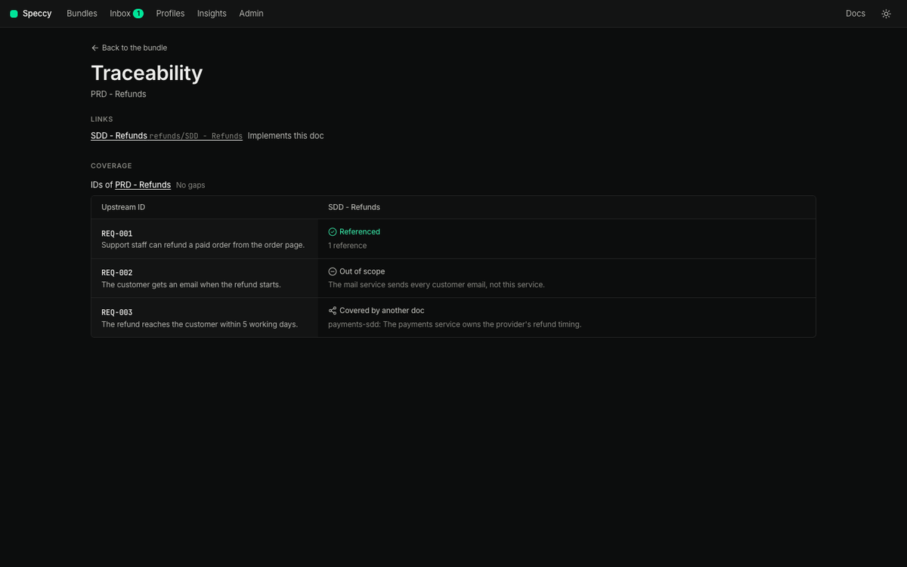
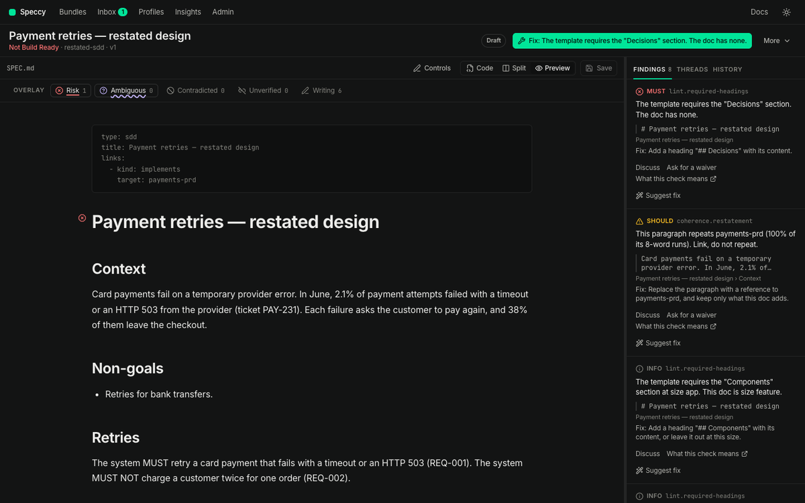
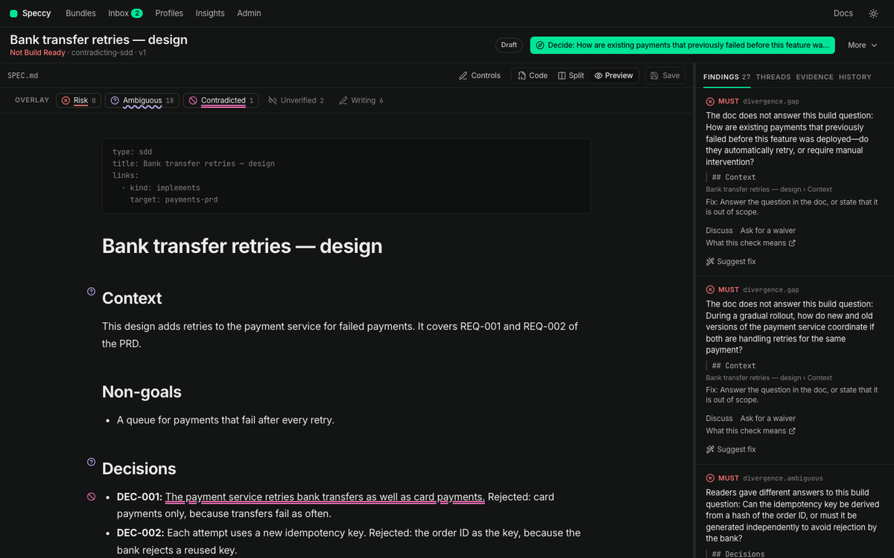
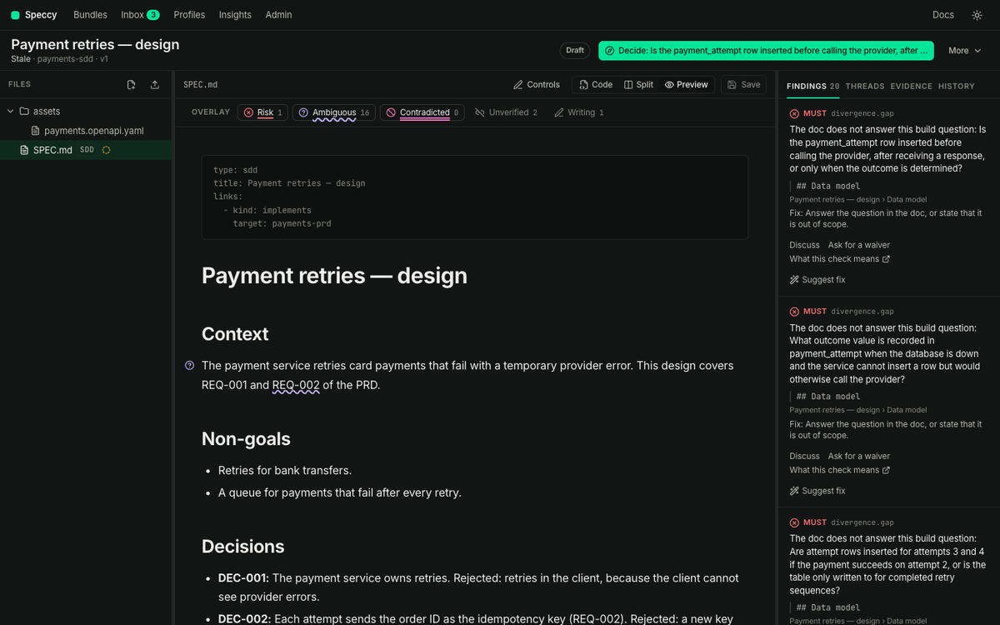

import { Steps, Aside } from '@astrojs/starlight/components';

In this tutorial, you put a PRD and the SDD that implements it in one folder, and make the two docs agree. A PRD says what to build. An SDD says how. Speccy reviews each doc on its own. It also checks that the SDD answers for each requirement of the PRD, repeats none of it, and contradicts none of it.

Do [From a blank page to a build packet](/tutorials/blank-page-to-build-packet/) first. This tutorial uses the same `specs` folder, with `speccy` running in it and a model in **Admin → Models**.

## 1. Put the PRD and the SDD in one folder

A folder is a bundle. A folder with two spec docs is one bundle with two spec docs. Each spec doc has its own profile, findings and verdict.

In your `specs` folder, make a folder `refunds`. Save this file in it as `PRD - Refunds.md`:

```markdown
---
type: prd
---
# PRD - Refunds

## Problem

Support staff refund orders by hand, and each refund takes a day.

## Users

Support staff, and the customers they refund.

## Goals

- Refund a paid order in one click.

## Non-goals

- No partial refunds.

## Requirements

- Support staff can refund a paid order from the order page.
- The customer gets an email when the refund starts.
- The refund reaches the customer within 5 working days.
```

Save this file beside it as `SDD - Refunds.md`:

```markdown
---
type: sdd
---
# SDD - Refunds

## Context

Support staff refund orders by hand today.

## Design

The order page gets a Refund button. The service calls the payment provider's refund API and records the refund.

## Decisions

- DEC-001: We use the provider's refund API, not a manual bank transfer.

## Non-goals

No partial refunds.
```

Local mode reads the folder from disk, and the Bundles screen shows the `refunds` bundle with "2 spec docs: PRD, SDD". Open it, and click **SDD - Refunds.md** in the file tree. The file tree marks each spec doc with its profile and its verdict.



<Aside title="A doc with no type">
A markdown file with no `type` waits under **Markdown files that are not spec docs yet** on the Bundles screen. Pick a type for each file, then click **Adopt all picked types**. When the folder holds one PRD, the SDD row offers "Link: implements" with the PRD's file name. Keep the box ticked, and Speccy writes the link of step 2 for you.
</Aside>

## 2. Link the SDD to the PRD

The SDD profile requires an upstream link. The SDD has none, so it fails [`links.has-upstream`](/reference/checks/#links.has-upstream), a MUST check.

<Steps>

1. On the SDD, open the **Findings** tab in the rail.

2. On the `links.has-upstream` finding, click **Suggest fix**. Speccy lists the PRDs the link can name. The PRD in the same bundle comes first.

3. Pick **PRD - Refunds**, and click **Add link**.

</Steps>



Speccy writes the link into the SDD's frontmatter as a new version:

```yaml frontmatter
type: sdd
links:
  - kind: implements
    target: PRD - Refunds.md
```

The target is the path of the PRD, relative to the SDD. For a doc in a GitHub source, Speccy keeps the link itself as an adopted link, and the repo takes no commit.

If you picked the wrong PRD, open **More → Traceability** on the SDD. Under **Links**, click **Remove** next to the link, then **Remove the link**. Speccy takes the link out of the frontmatter as a new version, or forgets an adopted link. Then use **Suggest fix** again. A link that the repo or a link rule holds shows "(in the repo)" or "(link rule)" and has no **Remove**. Change it in the repo or in `.speccy.yaml`.

A doc with no upstream doc says so once, in its sidecar, and the check passes. Click **Mark it standalone** next to **Suggest fix**, give the reason, and click **Ask for approval**. On approval, Speccy writes the entry:

```yaml sidecar
standalone:
  reason: Internal change to storage. No product change, so no PRD.
  acknowledged_by: nathan
```

## 3. Give the PRD trace IDs

A trace ID is a stable name for one requirement, such as `REQ-001`. The SDD answers for each ID of the PRD. Speccy reads an ID in these places:

| Where | Example |
|---|---|
| The start of a heading | `### REQ-001 Refund a paid order` |
| The first cell of a table row | `\| REQ-001 \| Refund a paid order. \|` |
| The start of a list item or a paragraph, with a colon or a dash after it | `- **REQ-001:** Refund a paid order.` |

The prefix comes from the profile. A PRD reads `REQ` and `NFR`. A number can have any number of digits. An ID-like word with another prefix, such as `FR-001`, gets the INFO finding [`trace.unknown-prefix`](/reference/checks/#trace.unknown-prefix).

Your PRD has no IDs yet. That is not wrong, and a PRD with no IDs can be Build Ready. It gets the INFO finding [`trace.no-ids`](/reference/checks/#trace.no-ids), because no SDD can say which of its items it covers.

<Steps>

1. Click **PRD - Refunds.md** in the file tree, and open **More → Traceability**.

2. Under **Items without an ID**, Speccy suggests an ID for each item under the requirements heading. Keep all three ticked.

3. Click **Add 3 IDs**.

</Steps>



Speccy writes the IDs as a new version, and says how many it added. Each requirement now starts with its ID, such as `- **REQ-001:** Support staff can refund a paid order from the order page.`

## 4. Read the matrix

On the PRD's Traceability page, **Coverage** shows each PRD ID against each doc that implements it.



A cell says one of four things:

- **Referenced**: the SDD names the ID. The cell links to each section that names it, and a click opens the SDD there.
- **Covered by another doc**: an approved acknowledgement names the doc that covers it.
- **Out of scope**: an approved acknowledgement says this doc does not cover it, with a reason.
- **Not covered**: none of the above. This is a gap, and it blocks the verdict.

Your SDD names no PRD ID yet, so the matrix shows three gaps. When a PRD defines no IDs, the matrix says **No trace IDs**, and coverage does not apply to the SDD.

## 5. Close each gap

Each gap is a MUST finding [`trace.coverage`](/reference/checks/#trace.coverage) on the SDD. Open the SDD. Its next action asks about the first gap: "Decide: does this doc cover REQ-001?"

<Steps>

1. Click the next action. The tour opens on the gap.

2. Press `d`. Speccy offers three answers: **This doc covers it**, **Another doc covers it** and **Out of scope**.

3. For REQ-001, pick **This doc covers it**. Pick the **Design** section, and click **Add the line**.

</Steps>



Speccy adds the line `Covers REQ-001.` at the end of the Design section, as a new version. The ID is now in the doc, where a builder reads it. You can also name an ID anywhere in the SDD by hand.

The other two answers are acknowledgements:

- **Another doc covers it**: pick the doc, and give a reason.
- **Out of scope**: give a reason.

Close the other two gaps:

<Steps>

1. Go to the REQ-002 gap. `j` and `k` move between points. Press `d`, pick **Out of scope**, and give the reason "The mail service sends every customer email." Click **Ask for approval**.

2. Go to the REQ-003 gap. Press `d`, pick **This doc covers it**, pick **Design**, and click **Add the line**.

</Steps>

An acknowledgement follows the profile's waiver policy, so a maintainer approves a MUST gap. The request waits in the approver's inbox and in the tour. In local mode you are the admin, so the tour shows **Approve** on the request. Click it.

On approval, Speccy writes the acknowledgement into the SDD's sidecar, `.speccy/decisions/<doc path>.yaml`. The SDD text does not change:

```yaml sidecar
trace:
  - id: REQ-002
    status: out_of_scope
    reason: The mail service sends every customer email.
    acknowledged_by: nathan
```

An acknowledgement is about the ID, not a section. An edit to the SDD does not end it. The matrix shows each answer, with its reason. **Withdraw** in the cell takes the acknowledgement back at once, and the gap opens again. A gap cell has **Answer**, which opens the same three answers as the tour.



[Close a coverage gap](/how-to/close-a-coverage-gap/) covers each answer in more detail.

## 6. Do not repeat the PRD

An SDD that copies its PRD drifts from it the first time either one changes. [`coherence.restatement`](/reference/checks/#coherence.restatement) is a SHOULD check. It fires when more than half of a paragraph's 8-word runs appear in one paragraph of the PRD. It runs on each save, with no model.

Try it. In the SDD, replace the Context paragraph with the PRD's Problem sentence:

```markdown
Support staff refund orders by hand, and each refund takes a day.
```

Click **Save**. The Findings tab shows a SHOULD finding on the paragraph.



The fix is a reference, not a copy. Name the ID, and keep only what the SDD adds. Put the Context paragraph back, and click **Save**.

## 7. Find a contradiction

A full review reads the SDD and the PRD with a model, and looks for statements that conflict. A conflict is the MUST finding [`coherence.contradiction`](/reference/checks/#coherence.contradiction), anchored in both docs.

<Steps>

1. In the SDD's Design section, add the sentence "Refunds reach the customer within 10 working days." Click **Save**.

2. Open **More → Run a review**, and click **Run review**.

3. When the run ends, click **Contradicted** in the overlay legend above the preview. The layer marks the statement that conflicts with the PRD.

</Steps>



The finding names the other doc, and quotes the line it conflicts with. A contradiction needs a decision, not a waiver: one of the two docs is wrong. Here the PRD says 5 working days. Delete the sentence from the SDD, and click **Save**.

## 8. See a PRD edit make the verdict stale

A verdict is about one version of one doc, read against the versions of its linked docs. A change to the PRD means the SDD's verdict no longer describes docs that exist.

Open the PRD, and add a fourth requirement:

```markdown
- **REQ-004:** Support staff can see the refund state on the order page.
```

Click **Save**, and open the SDD.



A lint verdict costs nothing, so Speccy lints the SDD again at once, and the new ID is a new gap. A full verdict keeps its model results and goes stale instead. The control row says "Stale" and names the PRD that changed. Run the review again to replace it. Then close the REQ-004 gap as in step 5.

## 9. Hand the SDD to a builder

Repeat the review and the fixes until the SDD's control row says Build Ready. Then write its build packet, from your `specs` folder:

```sh
speccy handoff "refunds/SDD - Refunds.md" --out ../refunds-build
```

The packet holds the SDD, its assets, and the PRD it links to. `HANDOFF.md`, the re-entry prompt, lists the SDD's own trace IDs, such as `DEC-001`, as the units of work. The SDD names each PRD ID it covers, so the builder reads each requirement next to the design that meets it. [Hand a spec to a coding agent](/how-to/hand-a-spec-to-a-coding-agent/) covers the MCP server and the build reports.

## What you have now

- One bundle, `refunds`, with a PRD and an SDD that implements it.
- A PRD with trace IDs, and an SDD that references or acknowledges each one.
- A sidecar beside the SDD with the out-of-scope acknowledgement.
- A build packet for the SDD.

## Next

- [Link to an issue, a page, or the code](/how-to/link-to-an-issue-a-page-or-the-code/) to trace a doc to things outside Speccy.
- [Verify a build](/how-to/verify-a-build/) to check the code against each trace ID.
- Read [traceability](/concepts/traceability/) to see how Speccy reads links and IDs.
