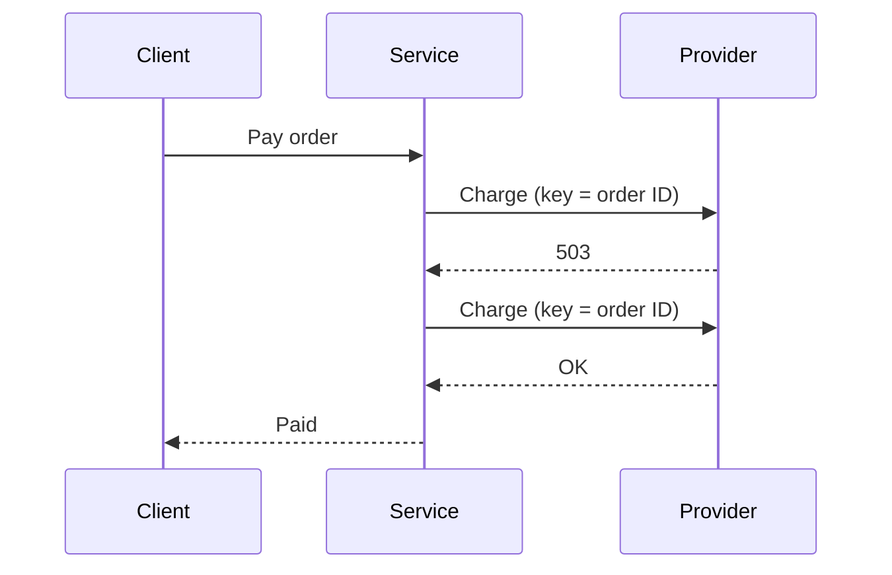

# Payment retries — design

## Decisions

- **DEC-001:** The payment service owns retries. Rejected: retries in the client, because the
  client cannot see provider errors.
- **DEC-002:** Each attempt sends the order ID as the idempotency key (REQ-002).

## Components

The payment service calls the provider and records each attempt. The API contract is in
[the OpenAPI file](assets/payments.openapi.yaml).

## Retries

The service retries a timeout or an HTTP 503 up to 3 times (REQ-001).

### Backoff

The waits are 200 ms, 400 ms, and 800 ms.

## Limits

| Limit | Value |
|---|---|
| Attempts per payment | 4 |
| Timeout per attempt | 10 s |

## Open questions

None.
